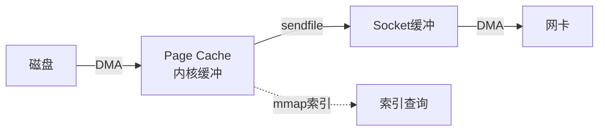

# 零拷贝、MMAP、DMA 详解

> 独立专题笔记，汇总入口见 [java学习笔记汇总](./java学习笔记汇总.md)

---

## 一、背景：为什么 IO 要优化拷贝？

数据从磁盘/网卡到应用程序，通常要经过 **内核态** 和 **用户态** 之间的多次拷贝。  
每次拷贝都消耗 CPU 和内存带宽；高吞吐场景（Kafka、Netty、静态文件服务）下，拷贝成为瓶颈。

```
用户态 (应用程序)          内核态 (操作系统)
┌─────────────┐          ┌─────────────┐
│  App Buffer │ ←拷贝→   │ Kernel Buffer│ ←→ 磁盘/网卡
└─────────────┘          └─────────────┘
```

**优化目标**：减少拷贝次数、减少用户态/内核态切换、让 CPU 少搬运数据。

---

## 二、DMA（Direct Memory Access，直接内存访问）

### 1. 是什么？

DMA 是 **硬件机制**：外设（磁盘、网卡）和内存之间传数据时，由 **DMA 控制器** 完成，**CPU 不参与逐字节搬运**。

### 2. 没有 DMA vs 有 DMA

**无 DMA（早期，已淘汰思路）**：
```
CPU 从磁盘读每个字节 → 写入内存   （CPU 100% 参与搬运，无法做其他事）
```

**有 DMA（现代默认）**：
```
CPU: 发起 IO 请求，告诉 DMA「从磁盘某位置读到内存某地址」
DMA: 硬件自动完成 磁盘 → 内核缓冲区 的数据传输
CPU: 等待中断/完成信号，期间可处理其他任务
```

### 3. 关键理解（面试易错）

| 说法 | 对错 |
|------|------|
| DMA 让 CPU 完全不参与 IO | ✗ CPU 仍要发起请求、处理中断、管理缓冲区 |
| DMA 让 **磁盘→内核缓冲区** 不占用 CPU 搬运 | ✓ 这是 DMA 的核心价值 |
| DMA = 零拷贝 | ✗ DMA 解决的是「外设→内存」；零拷贝解决的是「减少内核↔用户态拷贝」 |
| 所有 IO 都经过 DMA | ✓ 现代磁盘/网卡 IO 基本都靠 DMA 进内核缓冲区 |

### 4. 在整体 IO 链路中的位置

```
磁盘 ──DMA──→ 内核缓冲区(Page Cache) ──CPU拷贝──→ 用户缓冲区 ──CPU拷贝──→ Socket缓冲区 ──DMA──→ 网卡
      ↑                              ↑                    ↑
   DMA负责                         传统瓶颈              sendfile可优化
```

**结论**：DMA 是底层基础能力；**MMAP 和零拷贝是在 DMA 之上，进一步减少内核与用户态之间的拷贝**。

---

## 三、传统 read + write（4 次拷贝，4 次上下文切换）

以「读磁盘文件 → 通过 Socket 发送给客户端」为例：

```
1. DMA:  磁盘        → 内核读缓冲区 (Page Cache)     [拷贝1, CPU不搬运]
2. CPU:  内核读缓冲区 → 用户缓冲区 (read)            [拷贝2]
3. CPU:  用户缓冲区   → Socket 发送缓冲区 (write)     [拷贝3]
4. DMA:  Socket缓冲区 → 网卡                        [拷贝4, CPU不搬运]
```

**上下文切换**（用户态 ↔ 内核态）约 4 次：read 进/出内核 2 次，write 进/出内核 2 次。

```
┌────────┐  read   ┌──────────┐  write  ┌──────────┐  DMA  ┌────┐
│  应用  │ ←────→ │ 内核缓冲  │ ←────→ │Socket缓冲│ ───→ │网卡│
└────────┘         └──────────┘         └──────────┘        └────┘
         ↑ 磁盘经DMA到内核缓冲 ↑
```

---

## 四、MMAP（Memory Mapped File，内存映射）

### 1. 是什么？

将 **文件** 映射到进程的 **虚拟内存地址空间**，应用读写这块内存 ≈ 直接读写文件（由 OS 和 Page Cache 协作完成）。

Java 对应：`FileChannel.map(MapMode mode, long position, long size)` → `MappedByteBuffer`

### 2. 工作原理

```
                    虚拟内存地址空间
                    ┌─────────────────┐
应用进程 ──映射──→  │  Mapped Region  │ ←── 页表关联 ──→ Page Cache ←── 文件
                    └─────────────────┘
读写 Mapped 内存 = 触发缺页/直接访问 Page Cache，无需 read/write 系统调用拷贝到用户 buffer
```

### 3. 优化效果（send 文件场景）

使用 mmap + write 替代 read + write：

```
1. DMA:  磁盘 → 内核 Page Cache              [拷贝1]
2. mmap: 用户态直接访问 Page Cache（共享映射）  [无额外拷贝到独立用户buffer]
3. CPU:  Page Cache → Socket 缓冲区 (write)   [拷贝2]
4. DMA:  Socket缓冲区 → 网卡                  [拷贝3]
```

**从 4 次拷贝降到约 3 次**，减少一次 **内核→用户态** 的大拷贝；仍有一次 CPU 从 Page Cache 到 Socket 缓冲的拷贝。

### 4. 优缺点

| 优点 | 缺点 |
|------|------|
| 读写大文件高效，随机访问方便 | 映射大文件占用虚拟内存 |
| 多进程可共享映射区域 | 文件被改/delete 时需注意一致性 |
| 减少 read/write 系统调用 | 小文件不一定比普通 IO 快 |

### 5. 典型应用

- Kafka：**索引文件**、部分日志读取用 mmap
- Java NIO：`MappedByteBuffer` 读大文件
- 数据库：部分引擎用 mmap 管理数据页

---

## 五、零拷贝（Zero-Copy）

### 1. 「零拷贝」的含义

**严格说**：不是拷贝次数绝对为 0，而是 **CPU 不再参与内核缓冲区 ↔ 用户缓冲区之间的数据拷贝**，数据尽量在内核态完成传递。

Linux 核心实现：**sendfile()** 系统调用。

### 2. sendfile 流程

```
1. DMA:  磁盘 → 内核读缓冲区 (Page Cache)     [拷贝1]
2. CPU:  内核读缓冲区 → Socket 发送缓冲区      [拷贝2, 仍在内核态完成]
3. DMA:  Socket缓冲区 → 网卡                  [拷贝3]
```

**对比传统方式**：
- 拷贝：4 次 → **3 次**
- 上下文切换：4 次 → **2 次**（一次 sendfile 系统调用）
- **数据 never 进入用户态缓冲区**

```
传统:  磁盘 ──→ 内核 ──→ 用户 ──→ Socket ──→ 网卡
sendfile: 磁盘 ──→ 内核 ──────────→ Socket ──→ 网卡
                      ↑ 跳过用户态
```

### 3. Linux 2.4+ 进一步优化

网卡支持 **DMA Gather** 时，sendfile 可让 **Page Cache 直接 DMA 到网卡**，Socket 缓冲区只传描述符（fd + offset + length），拷贝次数可降到 **2 次**（真正的接近零拷贝）。

### 4. Java 中的零拷贝

| API | 底层 | 说明 |
|-----|------|------|
| `FileChannel.transferTo()` | sendfile | 文件 → Socket，最典型零拷贝 |
| `FileChannel.transferFrom()` | sendfile | Socket → 文件 |
| Netty `FileRegion` | transferTo | 大文件发送 |
| Kafka 消费端 | sendfile | 日志文件直接发给 Consumer |

```java
// 伪代码：文件发送到网络
fileChannel.transferTo(0, count, socketChannel);
// 底层 Linux 调用 sendfile，数据不经用户态 buffer
```

### 5. Netty 中的「零拷贝」（广义）

Netty 说的零拷贝还包括 **应用层减少拷贝**（不全是 sendfile）：

| 手段 | 说明 |
|------|------|
| DirectBuffer | 堆外内存，减少 JVM 堆 ↔ 内核拷贝 |
| CompositeByteBuf | 逻辑组合多个 buffer，不物理拷贝合并 |
| slice/duplicate | 共享底层数组，只复制视图 |
| FileRegion + transferTo | OS 级 sendfile |

---

## 六、MMAP vs sendfile（零拷贝）对比

| 对比项 | MMAP | sendfile（零拷贝） |
|--------|------|-------------------|
| **系统调用** | mmap + write | sendfile（一次） |
| **数据是否进用户态** | 映射访问，不拷贝到独立 buffer | 完全不进用户态 |
| **典型场景** | 读文件、建索引、随机访问 | **文件→Socket 转发**（静态资源、Kafka 消费） |
| **拷贝次数（文件发网络）** | 约 3 次 | 约 2~3 次 |
| **上下文切换** | 较多 | 较少 |
| **Kafka 使用** | 索引文件 | 日志发送给 Consumer |

**选型口诀**：
- 要 **读/处理** 文件内容 → mmap 或直接 read
- 要 **原样转发** 文件到网络 → sendfile / transferTo

---

## 七、Kafka 中的综合运用

Kafka 高性能 IO 栈：

```
生产: 顺序写盘(Page Cache) + 批量 + 压缩
消费: sendfile 零拷贝发日志 + 批量拉取
索引: mmap 读索引文件定位 offset
底层: 磁盘/网卡 IO 均依赖 DMA
```



---

## 八、三者关系总结

```
┌─────────────────────────────────────────────────────────┐
│                      一次完整 IO                         │
├─────────────────────────────────────────────────────────┤
│  DMA        : 外设 ↔ 内存 硬件搬运（磁盘/网卡 ↔ 内核缓冲）  │
│  MMAP       : 文件映射到虚拟内存，减少 read 到用户 buffer   │
│  零拷贝      : sendfile，内核缓冲直接到 Socket，不经用户态   │
└─────────────────────────────────────────────────────────┘
         层层叠加，目标都是：少拷贝、少切换、高吞吐
```

| 技术 | 解决什么问题 | 减少什么 |
|------|-------------|----------|
| **DMA** | CPU 逐字节搬外设数据 | 外设→内存的 CPU 参与 |
| **MMAP** | read 把数据拷到用户 buffer | 内核→用户态的一次拷贝 |
| **零拷贝** | write 从用户 buffer 再拷到 Socket | 用户态参与 + 切换次数 |

---

## 九、面试简答模板

**DMA 是什么？**
> 直接内存访问，由 DMA 控制器把外设数据搬到内存，CPU 只发指令和处理中断，不参与逐字节搬运。磁盘、网卡 IO 都依赖它。

**MMAP 原理和作用？**
> 把文件映射到进程虚拟内存，读写映射区等于访问 Page Cache，避免 read 把数据拷贝到独立用户 buffer。适合读文件、索引；Kafka 索引用 mmap。

**零拷贝是什么？和 DMA 区别？**
> 零拷贝指数据不经过用户态缓冲区，Linux 用 sendfile 让内核 Page Cache 直接到 Socket。DMA 是外设到内存的硬件搬运；零拷贝是减少内核与用户态之间的拷贝，两者不同层。

**Kafka 为什么快？和零拷贝关系？**
> 顺序写盘、批量、分区并行；消费端用 sendfile 把日志文件直接发给 Consumer，避免 4 次拷贝和多次上下文切换；索引用 mmap。

**Java 怎么用零拷贝？**
> `FileChannel.transferTo()` 底层调用 sendfile；Netty FileRegion 同样基于 transferTo。

---

[← 返回 java学习笔记汇总](./java学习笔记汇总.md)
