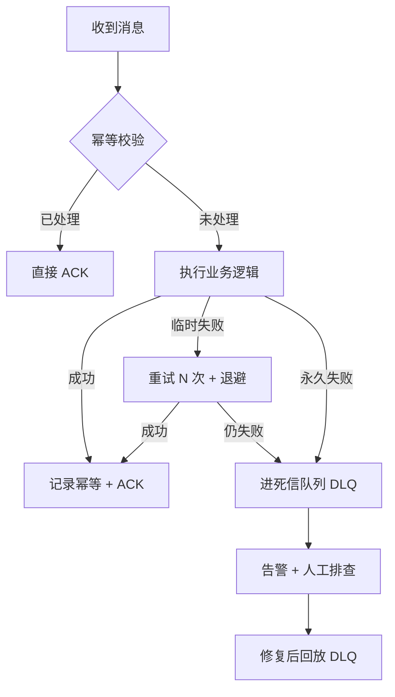
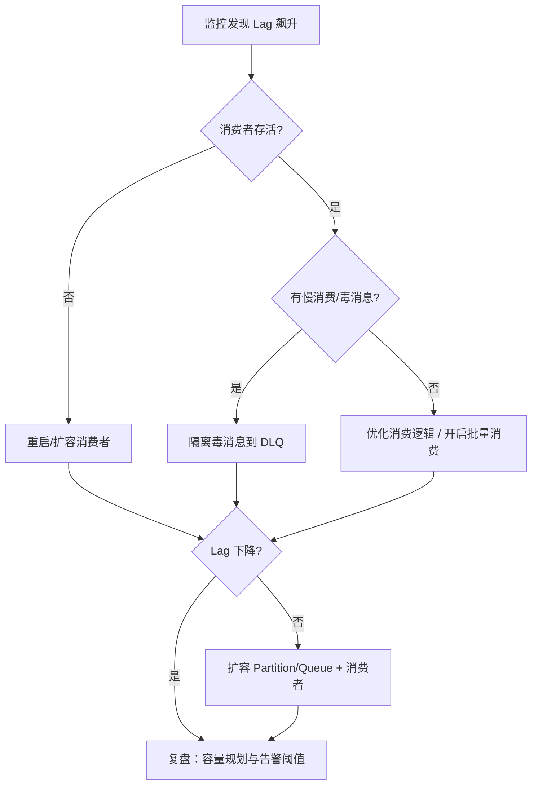

# MQ 消费失败与消息积压处理

> 独立专题笔记，汇总入口见 [java学习笔记汇总](./java学习笔记汇总.md)

---

## 一、背景：MQ 落地后的两大难题

引入消息队列后，生产端「发出去」往往不难，真正考验在消费侧：


| 问题       | 本质                              |
| -------- | ------------------------------- |
| **消费失败** | 业务处理异常，消息不能被正确 ACK              |
| **消息积压** | 生产速度持续 > 消费速度，Broker 堆积量（Lag）飙升 |


与 MQ 四大经典问题的关系：

```
消息丢失  → 生产/存储/消费任一环节未 ACK
重复消费  → 重试、Rebalance 导致再次投递（必须幂等）
顺序消费  → 失败重试可能打乱局部顺序
消息积压  → 消费能力不足或消费阻塞
```

---

## 二、消费失败怎么处理？

### 1. 先区分失败类型


| 类型       | 典型原因                   | 处理思路                   |
| -------- | ---------------------- | ---------------------- |
| **临时失败** | 下游超时、DB 连接池满、依赖服务短暂不可用 | 有限重试 + 指数退避            |
| **永久失败** | 数据格式错误、业务规则不满足、代码 Bug  | 少量重试后进死信，人工介入          |
| **半失败**  | 部分逻辑已成功（如已扣库存），后续步骤失败  | 幂等 + 状态机 + 补偿，不能无脑全量重试 |


**核心原则**：消费端必须**幂等**，因为重试、Rebalance、网络抖动都会导致**重复消费**。

幂等常见方案（与汇总笔记一致）：


| 方案          | 适用                    |
| ----------- | --------------------- |
| 数据库唯一索引     | 插入型业务（orderId + 操作类型） |
| 状态机         | 订单状态只能单向流转            |
| Redis SETNX | 短时去重，带过期时间            |
| 乐观锁版本号      | 更新型业务                 |


---

### 2. 标准处理链路

```
消费消息
   │
   ├─ 成功 → ACK / commit offset
   │
   ├─ 临时失败 → 延迟重试（指数退避）
   │       │
   │       ├─ 重试成功 → ACK
   │       └─ 超过最大次数 → 死信队列（DLQ）
   │
   └─ 永久失败 → 直接进 DLQ + 告警 + 人工/脚本修复后回放
```




---

### 3. 各 MQ 的失败重试机制

#### RocketMQ

```
消费失败（RECONSUME_LATER）
  → Broker 自动延迟重试
  → 默认最多 16 次
  → 延迟等级：10s、30s、1m、2m、3m … 最长约 2h
  → 16 次仍失败 → %DLQ%消费组名 死信 Topic
```


| 要点                 | 说明                                   |
| ------------------ | ------------------------------------ |
| 重试消息回 Broker       | 集群消费下**不阻塞**同 Queue 其他消息（与 Kafka 不同） |
| 返回 RECONSUME_LATER | 触发重试；吞掉异常却返回 SUCCESS 会丢消息            |
| 死信 Topic           | `%DLQ%` + 消费组名，需单独订阅处理               |


#### Kafka

```
消费失败
  → 不 commit offset（或 seek 回当前位点）
  → 应用层重试 + 退避
  → 多次失败 → 写入自建死信 Topic
  → 或暂停该分区消费，人工处理
```


| 要点          | 说明                                           |
| ----------- | -------------------------------------------- |
| 无内置 DLQ     | 死信 Topic 需业务自行设计和投递                          |
| 分区阻塞风险      | 单条毒消息反复失败会**卡住整个 Partition**                 |
| offset 提交时机 | 处理成功后再 commit；自动提交可能导致「处理了但 offset 已提交」丢消息假象 |


#### RabbitMQ

```
消费失败 + basicNack(requeue=false)
  → 路由到死信交换机（DLX）
  → 进入绑定的死信队列
  → 人工处理 / 修复后重新 publish
```


| 要点        | 说明                |
| --------- | ----------------- |
| TTL + DLX | 也可实现延迟重试          |
| 手动 ACK    | 处理成功再 ack，失败 nack |


---

### 4. 消费端代码最佳实践

```java
public void onMessage(Message msg) {
    String bizKey = msg.getKeys();  // 幂等键：orderId + 操作类型

    // 1. 幂等校验（已处理则直接 ACK）
    if (idempotentService.isProcessed(bizKey)) {
        return;
    }

    try {
        // 2. 业务处理
        orderService.process(msg);

        // 3. 记录幂等 + ACK
        idempotentService.markProcessed(bizKey);

    } catch (RetryableException e) {
        // 临时失败：抛出让框架重试
        throw e;

    } catch (BizException e) {
        // 永久失败：记日志 + 告警 + 进 DLQ
        log.error("不可重试: {}", bizKey, e);
        dlqService.send(msg, e.getMessage());
        // RocketMQ 返回 SUCCESS，避免无限重试
    }
}
```


| 要点      | 说明                        |
| ------- | ------------------------- |
| 幂等先行    | 重复消费不产生副作用                |
| 区分异常    | 可重试 vs 不可重试分开处理           |
| 有限重试    | 必须有上限，避免重试风暴              |
| 死信 + 告警 | 进 DLQ 同时触发监控告警            |
| 可观测     | 记录 msgId、业务 key、失败原因、重试次数 |


---

### 5. 消费失败决策表


| 场景          | 做法                 |
| ----------- | ------------------ |
| 下游 503 / 超时 | 自动重试 3~16 次，指数退避   |
| 参数校验失败      | 不重试，直接 DLQ         |
| DB 唯一键冲突    | 视为幂等成功，直接 ACK      |
| 部分步骤已成功     | 状态机 + 补偿，不能简单重放全链路 |
| 代码 Bug      | 修代码后，从 DLQ 回放消息    |
| 半失败（已扣库存）   | 查状态后决定补偿或跳过        |


---

## 三、消息积压怎么办？

### 1. 积压的本质

```
积压（Lag）= 生产 TPS > 消费 TPS（持续一段时间）
```

Broker 中未消费消息越来越多，最终导致：

- 消费延迟变大（用户感知「下单很久才发短信」）
- Broker 磁盘打满
- 下游系统被突发流量冲垮（积压释放时）

---

### 2. 先定位：积压在哪里？

```
                    消息积压
                        │
        ┌───────────────┼───────────────┐
        ▼               ▼               ▼
   生产端 TPS↑     消费端 TPS↓      Broker 瓶颈
   流量突发         最常见原因        磁盘/网络
                        │
            ┌───────────┼───────────┐
            ▼           ▼           ▼
        消费者宕机   慢消费逻辑   毒消息阻塞
        Rebalance   慢SQL/RPC   单分区卡住
```

排查清单：


| 检查项            | 说明                  |
| -------------- | ------------------- |
| 消费者是否存活        | 进程宕机、OOM、卡死         |
| 消费 TPS 是否骤降    | 对比历史基线              |
| 是否有慢消费         | 慢 SQL、外部 RPC 超时、大事务 |
| 是否有毒消息         | 单条反复失败，占住线程或分区      |
| 是否频繁 Rebalance | 消费者上下线导致消费暂停        |
| Lag 是否集中在部分分区  | 数据热点 / 分片不均         |


---

### 3. 应急手段（先止血）

```
消息积压告警
      │
      ├─ 1. 扩容消费者实例（最快）
      │
      ├─ 2. 临时降级非核心消费逻辑
      │
      ├─ 3. 跳过/隔离毒消息（进 DLQ）
      │
      ├─ 4. 提高单消费者并行度
      │      RocketMQ: consumeThreadMin / Max
      │      Kafka: 增加分区 + 消费者
      │
      └─ 5. 限流生产端（最后手段，保护 Broker）
```


| 手段        | 效果           | 注意                           |
| --------- | ------------ | ---------------------------- |
| **加消费者**  | 立竿见影         | 并行度上限 = Queue/Partition 数    |
| **批量消费**  | 提高吞吐         | `consumeMessageBatchMaxSize` |
| **异步化消费** | 减少 IO 等待     | 注意顺序与幂等                      |
| **跳过毒消息** | 解开阻塞         | Kafka 单分区一条卡住会拖死整分区          |
| **生产限流**  | 防止 Broker 打满 | 业务有损，慎用                      |


---

### 4. 并行度上限（面试常考）

#### Kafka

```
Topic 有 6 个 Partition
  → 同一消费组最多 6 个消费者并行
  → 第 7 个消费者空闲

要更快消费 → 先加 Partition（需提前规划），再加消费者
```

#### RocketMQ

```
Topic 有 8 个 Queue
  → 同一消费组最多 8 个消费者并行
  → 一个 Queue 同一时刻只分配给一个消费者
```

```
❌ 错误：积压了直接加 20 个消费者，但只有 6 个 Partition → 14 个闲置
✅ 正确：Partition/Queue 数 ≥ 目标消费者数，或先扩分区再扩消费者
```

---

### 5. 根本治理（中长期）

```
积压根因
   │
   ├─ 消费太慢 → 优化 SQL / 加缓存 / 减少 RPC / 批量写库
   │
   ├─ 容量不够 → 扩容 Broker / 增加 Queue 或 Partition
   │
   ├─ 热点分区 → 优化分片 key，避免数据倾斜
   │
   ├─ 流量突发 → 削峰（MQ 本身就是缓冲层）+ 弹性扩容
   │
   └─ 架构问题 → 核心与非核心消息拆 Topic，独立消费组
```


| 治理方向 | 具体措施                            |
| ---- | ------------------------------- |
| 消费性能 | 批量写库、本地缓存、减少同步 RPC              |
| 容量规划 | 按峰值 TPS 预留 Partition/Queue 和消费者 |
| 热点打散 | 消息 key 加随机后缀（牺牲局部有序）            |
| 架构拆分 | 核心链路独立 Topic + 独立消费组，互不影响       |
| 监控告警 | Lag 阈值、消费延迟、消费 TPS 同比骤降         |


---

### 6. 积压处理流程




---

## 四、消费失败 vs 积压：如何联动

两类问题常常互相放大：

```
消费变慢（慢 SQL）
    → 单条处理耗时增加
    → 消费 TPS 下降
    → 消息积压

毒消息反复失败
    → Kafka：卡住 Partition，该分区 Lag 飙升
    → RocketMQ：重试占资源，间接拖慢整体消费

无限重试
    → 下游压力放大
    → 消费更慢
    → 积压更严重（重试风暴）
```

**联动原则**：


| 原则    | 说明                    |
| ----- | --------------------- |
| 有限重试  | 必须有上限 + 退避，不能无限打下游    |
| 毒消息隔离 | 尽快进 DLQ，不要占着消费线程/分区   |
| 幂等兜底  | 重试和回放 DLQ 都安全         |
| 监控先行  | Lag、失败率、重试次数、消费耗时四维监控 |


---

## 五、RocketMQ vs Kafka 对比速查


| 维度         | RocketMQ                | Kafka              |
| ---------- | ----------------------- | ------------------ |
| 内置重试       | ✅ Broker 自动延迟重试         | ❌ 应用层实现            |
| 内置死信       | ✅ 16 次后进 %DLQ%          | ❌ 需自建 DLQ Topic    |
| 失败阻塞       | 重试消息回 Broker，不阻塞同 Queue | 毒消息可卡住整 Partition  |
| 并行上限       | Queue 数                 | Partition 数        |
| 积压扩容       | 加消费者（≤ Queue 数）         | 先扩 Partition，再加消费者 |
| offset/ACK | 消费成功返回 CONSUME_SUCCESS  | 手动 commit offset   |


---

## 六、生产级 checklist

### 消费失败

- [ ] 消费逻辑幂等（唯一键 / 状态机）
- [ ] 区分可重试与不可重试异常
- [ ] 配置最大重试次数 + 退避策略
- [ ] 死信队列有独立消费/人工处理流程
- [ ] 失败告警（钉钉/短信/监控平台）
- [ ] 日志含 msgId、业务 key、重试次数

### 消息积压

- [ ] 监控 Lag / 消费延迟 / 消费 TPS
- [ ] 消费者数 ≤ Partition/Queue 数（或已扩分区）
- [ ] 毒消息能快速进 DLQ
- [ ] 核心与非核心 Topic 拆分
- [ ] 压测验证峰值消费能力
- [ ] 积压应急预案（扩容脚本、降级开关）

---

## 七、面试高频 Q&A


| 问题             | 答案要点                                    |
| -------------- | --------------------------------------- |
| 消费失败怎么办？       | 幂等 → 区分临时/永久失败 → 有限重试+退避 → 死信 → 告警+人工修复 |
| 为什么要幂等？        | 重试、Rebalance、网络抖动会导致重复消费                |
| RocketMQ 死信机制？ | 默认重试 16 次，延迟等级递增，最终进 `%DLQ%消费组`         |
| Kafka 有死信队列吗？  | 无内置，需自建 DLQ Topic 并自行投递                 |
| 消息积压怎么办？       | 扩容消费者 → 查慢消费/毒消息 → 优化逻辑 → 扩分区 → 必要时限流生产 |
| 加消费者一定能消积压吗？   | 不一定，并行度上限 = Queue/Partition 数           |
| 为什么不能无限重试？     | 阻塞消费、放大下游压力、引发更严重积压                     |
| Kafka 毒消息危害？   | 单条失败不 commit offset，整分区消费卡住             |
| 半失败怎么处理？       | 状态机记录进度，补偿而非全量重放                        |
| 积压时能否限流生产？     | 可以但业务有损，通常是保护 Broker 的最后手段              |


---

## 八、复习串联

```
消费失败
  分类：临时 / 永久 / 半失败
  链路：幂等 → 重试(有限+退避) → DLQ → 告警 → 回放
  RocketMQ：16 次重试 → %DLQ%
  Kafka：不 commit + 自建 DLQ（注意分区阻塞）

消息积压
  本质：生产 TPS > 消费 TPS
  应急：扩容消费者 / 隔离毒消息 / 批量消费 / 降级
  根本：优化慢消费 / 扩分区 / 拆 Topic / 热点打散
  上限：消费者数 ≤ Partition/Queue 数

联动
  有限重试防重试风暴
  毒消息快进 DLQ
  Lag + 失败率 + 耗时 四维监控
```

---

> **关联阅读**：[java学习笔记汇总 - MQ](./java学习笔记汇总.md)（应用场景、重复消费、RocketMQ/Kafka 要点）

