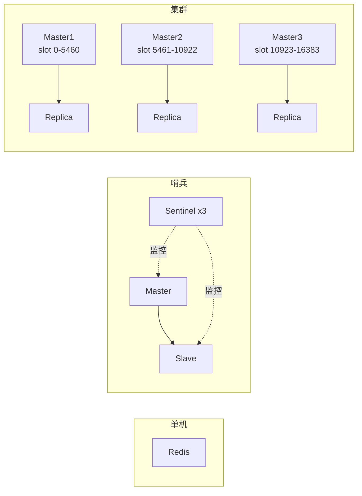
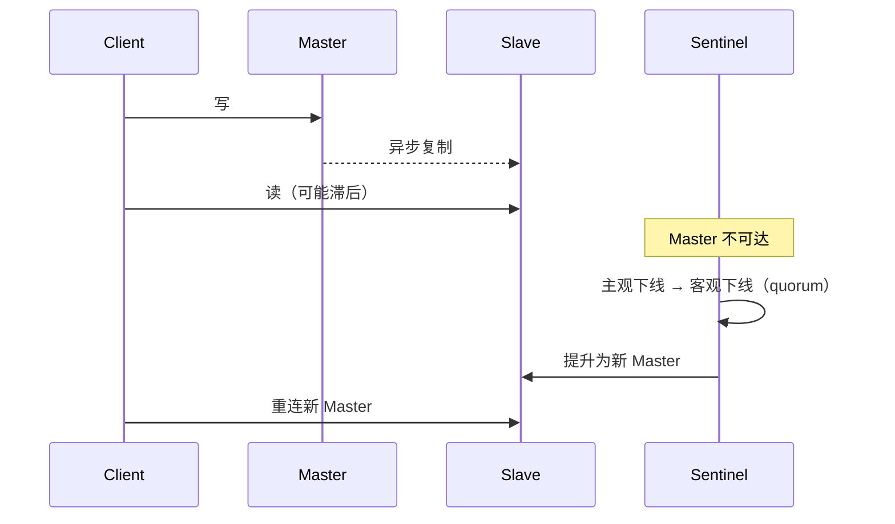
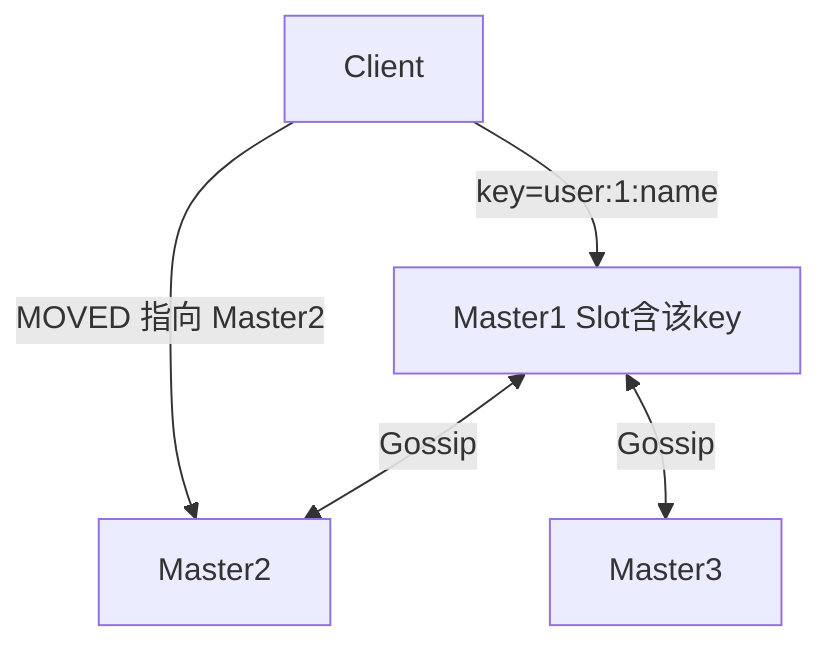
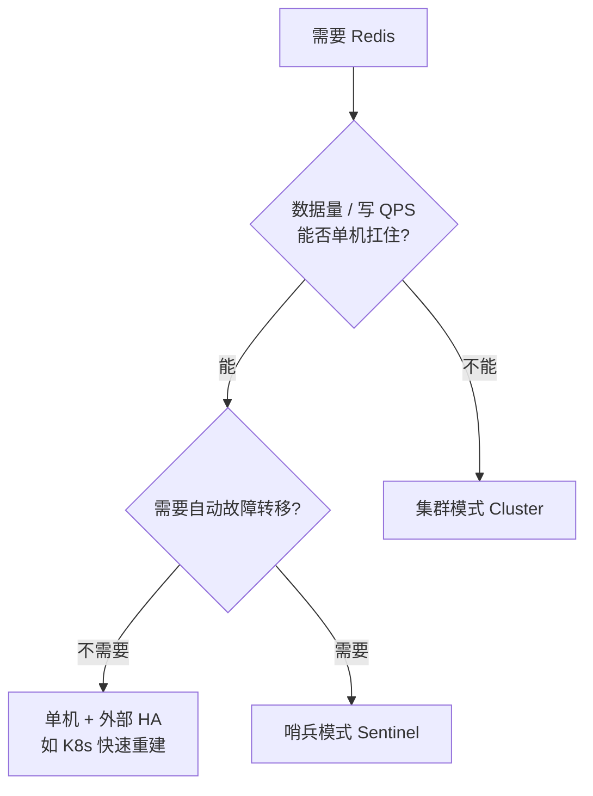

# Redis 部署模式对比：单机 / 哨兵 / 集群

> 独立专题笔记，汇总入口见 [java学习笔记汇总](./java学习笔记汇总.md)

---

## 一、三种模式架构速览

| 维度 | 单机模式 | 哨兵模式（Sentinel） | 集群模式（Cluster） |
|------|----------|----------------------|---------------------|
| **核心目标** | 简单可用 | 高可用（HA） | 高可用 + 水平扩展 |
| **数据分布** | 单节点全量 | 全量复制到 Slave | 按 Slot 分片到多 Master |
| **写能力** | 单节点上限 | 单 Master 上限 | 多 Master 线性扩展 |
| **内存容量** | 单机内存 | 单机内存（Master） | 多节点内存累加 |
| **故障转移** | 无，需人工 | Sentinel 自动选主 | 分片级自动 failover |
| **运维复杂度** | 低 | 中 | 高 |
| **客户端要求** | 普通连接 | Sentinel 感知客户端 | Cluster 感知客户端 |



---

## 二、单机模式

### 1. 架构说明

一个 Redis 进程独立运行，所有数据存储在本机内存中，无复制、无分片、无自动故障转移。

### 2. 优点

| 优点 | 说明 |
|------|------|
| 部署运维最简单 | 一个进程、一份配置，无节点间协调 |
| 延迟最低 | 无复制、无 Gossip、无 Slot 重定向 |
| 功能最全 | 所有命令、事务、Lua、多 Key 操作均无限制 |
| 成本低 | 适合开发、测试、非核心缓存 |

### 3. 缺点

| 缺点 | 说明 |
|------|------|
| 无高可用 | 进程挂掉或机器宕机即全不可用 |
| 无法水平扩展 | 内存和 QPS 都受单机限制 |
| 备份影响可用性 | RDB fork 或 AOF rewrite 时可能抖动 |
| 无读写分离 | 读压力也压在同一节点 |

### 4. 注意事项

| 事项 | 说明 |
|------|------|
| 持久化 | 按业务选 RDB / AOF / 混合；写多读少常 AOF `everysec` |
| 内存规划 | 设置 `maxmemory` + 淘汰策略（如 `allkeys-lru`） |
| 安全 | `bind`、`requirepass`、禁用 `FLUSHALL` 等危险命令 |
| 大 Key | 删除用 `UNLINK`（lazyfree），避免阻塞主线程 |
| 生产慎用 | 核心业务至少上哨兵或集群，或配合 K8s 快速重建 |

### 5. 适用场景

- 开发 / 测试环境
- 小流量、可容忍短暂不可用的非核心缓存
- 配合容器编排做「快速拉起新实例 + 冷启动」的轻量 HA

---

## 三、哨兵模式（主从 + Sentinel）

### 1. 架构说明

- **Redis 节点**：1 个 Master + N 个 Slave（异步复制）
- **Sentinel 节点**：至少 **3 个**（奇数），独立部署，监控 Master / Slave
- **工作机制**：3 个定时任务（10s `info` / 2s 订阅 / 1s `ping`）→ 主观下线 → 客观下线（quorum 过半）→ Raft 选 Leader Sentinel → 故障转移



### 2. 优点

| 优点 | 说明 |
|------|------|
| 自动故障转移 | Master 宕机后 Sentinel 选新主，客户端可自动切连 |
| 读写分离 | 读可走 Slave，减轻 Master 压力 |
| 数据不分片 | 全量数据在 Master，多 Key、事务、Lua 无 Slot 限制 |
| 比 Cluster 简单 | 无需 Slot 迁移、无需处理 MOVED/ASK |
| 生态成熟 | Jedis、Lettuce、Redisson 等对 Sentinel 支持完善 |

### 3. 缺点

| 缺点 | 说明 |
|------|------|
| 无法扩展内存和写能力 | 写仍只有 1 个 Master，容量 = 单机内存 |
| 异步复制丢数据风险 | Master 宕机前未同步到 Slave 的数据会丢 |
| 脑裂风险 | 网络分区可能导致短暂双主或切换后数据不一致 |
| 读一致性问题 | Slave 有复制延迟，读 Slave 可能读到旧数据 |
| 切换窗口 | failover 期间通常有秒级不可用或连接抖动 |
| 运维节点多 | Redis + Sentinel 进程数增加，需统一监控 |

### 4. 故障转移选主规则

过滤不健康节点后，按以下优先级依次比较：

1. `slave-priority`（配置值越小优先级越高）
2. 复制偏移量最大（数据最新）
3. `runid` 最小

### 5. 注意事项

| 事项 | 说明 |
|------|------|
| Sentinel 数量 | **至少 3 个**（奇数），与 Redis 节点分离部署，避免同机全挂 |
| quorum | 客观下线需过半 Sentinel 同意，quorum 通常设为 `(N/2)+1` |
| 防脑裂 | `min-slaves-to-write` + `min-slaves-max-lag`：Slave 不足或延迟过大时 Master 拒绝写 |
| 客户端 | 必须用 **Sentinel 感知客户端**，并处理 failover 后地址变化 |
| 复制延迟 | 读 Slave 需接受最终一致；强一致读必须走 Master |
| 分布式锁 | Redisson `RLock` 可用；RedLock **不能把同一主从里的 Master+Slave 算作两个节点**（详见 [Redis-RedLock红锁详解](./Redis-RedLock红锁详解.md)） |
| 备份 | 可在 Slave 上做 RDB，减少对 Master 影响 |

### 6. 适用场景

- 数据量适中（单机内存够用）
- 需要自动故障转移
- 业务大量使用多 Key 操作、事务、Lua 脚本
- 写 QPS 在单 Master 可承受范围内

---

## 四、集群模式（Redis Cluster）

### 1. 架构说明

- **Slot 分片**：16384 个槽位，`CRC16(key) % 16384` 定位节点
- **最小部署**：至少 **3 个 Master**；要 HA 则每 Master 至少 1 个 Replica（生产常见 3 主 3 从 = 6 节点）
- **节点通信**：Gossip 协议交换状态，无中心元数据节点
- **客户端路由**：Key 不在当前节点时返回 **MOVED**（永久迁移）或 **ASK**（临时迁移）重定向



### 2. 优点

| 优点 | 说明 |
|------|------|
| 水平扩展 | 数据按 Slot 分散，内存和写 QPS 可随节点增加而扩展 |
| 分片级高可用 | 某个 Master 宕机，其 Replica 可提升，其他分片不受影响 |
| 无中心节点 | Gossip 交换状态，无单点元数据服务 |
| 适合大数据量 | TB 级缓存、高并发写场景的首选 Redis 部署方式 |

### 3. 缺点

| 缺点 | 说明 |
|------|------|
| 运维复杂 | 扩容需 Slot 迁移；节点增删、均衡都要规划 |
| 多 Key 操作受限 | `MGET`、事务、Lua 涉及多 Key 时，Key 必须在同一 Slot |
| 客户端要求高 | 需支持 Cluster、处理 MOVED / ASK 重定向 |
| Pipeline 受限 | 跨 Slot 的批量操作会被拆散或失败 |
| 部分命令受限 | `KEYS`、`FLUSHALL` 需对各节点执行；`SCAN` 需遍历所有节点 |
| 迁移期风险 | Slot 迁移中可能出现 ASK 重定向增多、延迟上升 |
| Gossip 开销 | 节点多时心跳和状态同步占用一定带宽 |

### 4. Hash Tag（同 Slot 技巧）

相关 Key 用 `{tag}` 保证落在同一 Slot：

```
{user:1001}:name
{user:1001}:age
{user:1001}:orders
```

只有 `{user:1001}` 部分参与 Slot 计算，三个 Key 必定在同一节点，可安全使用 `MGET`、事务、多 Key Lua。

### 5. 注意事项

| 事项 | 说明 |
|------|------|
| 最小部署 | 至少 3 Master；要 HA 则每 Master 至少 1 Replica |
| 扩容 | 提前规划 Slot 分布；迁移期间监控延迟和 ASK 比例 |
| 客户端 | 开启 Cluster 模式；配置重定向重试策略 |
| 批量操作 | 业务侧按 Slot 分组，或设计上避免跨 Slot 批量 |
| 分布式锁 | 同名 lock key 只落在一个分片，**不能当 RedLock 的多独立节点** |
| 防脑裂 | `min-replicas-to-write` + `min-replicas-max-lag`（Cluster 版配置名） |
| 监控 | 关注 Slot 是否均匀、迁移状态、各节点 memory/key 分布 |
| 一致性 Hash | 扩容时只迁移部分 Slot，减少数据迁移量（相对普通取模） |

### 6. 适用场景

- 数据量超过单机内存
- 写 QPS 超过单 Master 承受能力
- 需要缓存层水平扩展
- 能接受多 Key 操作的 Slot 约束，或业务上可用 Hash Tag 规避

---

## 五、选型决策



| 场景 | 推荐 |
|------|------|
| 开发 / 测试 / 小流量非核心缓存 | 单机 |
| 数据量适中、要 HA、多 Key / 事务多 | **哨兵** |
| 大数据量、高写 QPS、需水平扩展 | **集群** |
| 强一致分布式锁（RedLock） | 多个**独立 Master**（通常不是 Cluster 分片） |
| 常规分布式锁（Redisson） | 单机 / 哨兵 / 集群均可（见 [Redisson分布式锁详解](./Redisson分布式锁详解.md)） |

---

## 六、三种模式共性注意事项

### 1. 持久化与性能

| 事项 | 说明 |
|------|------|
| RDB | fork 子进程写盘，大实例 fork 可能阻塞 |
| AOF | `everysec` 最多丢 1 秒；rewrite 占用 CPU/IO |
| 混合持久化 | 4.0+ RDB 全量 + AOF 增量，重启最快 |
| 监控 | 关注 `latency doctor`、慢查询、阻塞客户端 |

### 2. 内存与过期

| 事项 | 说明 |
|------|------|
| maxmemory | 必须设置上限 + 淘汰策略 |
| 过期策略 | 惰性删除 + 定期删除，过期 Key 不会立即释放 |
| lazyfree | 大 Key 删除放后台线程，主线程只标记 |
| 热 Key | Cluster 下可能打满单个分片，需业务侧打散或本地缓存 |

### 3. 安全

- 生产必须密码、网络隔离（VPC / 防火墙）
- 禁止未授权公网暴露（历史上大量 Redis 被勒索）
- 重命名或禁用危险命令：`FLUSHALL`、`CONFIG`、`DEBUG` 等

### 4. 线程模型（6.0+）

- 多 IO 线程只加速**网络读写**，**命令执行仍单线程**
- 默认 `io-threads-do-reads no`，写路径多线程、读路径单线程
- 单线程也快的原因：纯内存、IO 多路复用、无锁、高效数据结构

### 5. 备份与恢复

- 定期验证备份可恢复（尤其是 Cluster，恢复比哨兵更繁琐）
- 大实例备份优先在 Slave / Replica 上执行

---

## 七、面试速记

| 考点 | 一句话 |
|------|--------|
| 单机 vs 哨兵 vs 集群 | 单机简单无 HA；哨兵 HA 但不扩容量；集群 HA + 水平扩展 |
| 哨兵选主 | 过滤不健康 → slave-priority → 复制偏移量 → runid |
| 哨兵丢数据 | 异步复制，Master 宕机前未同步的数据会丢 |
| 防脑裂 | `min-slaves-to-write` + `min-slaves-max-lag` |
| Cluster Slot | 16384 槽，`CRC16(key) % 16384`；Hash Tag `{tag}` 同 Slot |
| MOVED vs ASK | MOVED 永久迁移；ASK 临时迁移（Slot 迁移进行中） |
| Cluster 限制 | 多 Key 操作必须同 Slot；客户端需 Cluster 感知 |
| RedLock 部署 | 多个独立 Master，不能是 Cluster 分片或主从对 |

---

## 八、相关专题

| 主题 | 链接 |
|------|------|
| Redisson 分布式锁 | [Redisson分布式锁详解](./Redisson分布式锁详解.md) |
| Redis RedLock 红锁 | [Redis-RedLock红锁详解](./Redis-RedLock红锁详解.md) |
| Redis 汇总速记 | [java学习笔记汇总 - Redis](./java学习笔记汇总.md#redis) |
