# Spring Cloud Alibaba GateWay 基础应用（完整笔记）

> 合并自 01~06 课程笔记：网关介绍 → 核心概念与工作流程 → 项目搭建 → 路由配置 → 负载均衡 → 断言 Predicate → 过滤器 Filter

---

## 一、网关介绍

在微服务架构中，一个系统会被拆分为很多个微服务。那么作为客户端要如何去调用这么多的微服务呢？如果没有网关的存在，我们只能在客户端记录每个微服务的地址，然后分别去调用。这样的话会产生很多问题，例如：

- 客户端多次请求不同的微服务，增加客户端代码或配置编写的复杂性
- 认证复杂，每个微服务都有独立认证
- 存在跨域请求，在一定场景下处理相对复杂

为解决上面的问题所以引入了网关的概念：所谓的 API 网关，就是指**系统的统一入口**，提供内部服务的路由中转，为客户端提供统一服务，一些与业务本身功能无关的公共逻辑可以在这里实现，诸如认证、鉴权、监控、路由转发等。

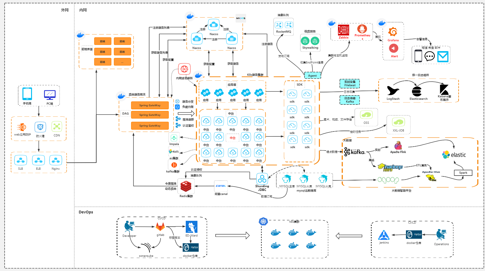

### 网关对比

- **Zuul 1.x**：Netflix 开源的网关，基于 Servlet 框架构建，功能丰富，使用 JAVA 开发，易于二次开发。问题：即一个线程处理一次连接请求，这种方式在内部延迟严重、设备故障较多情况下会引起存活的连接增多和线程增加的情况发生。
- **Zuul 2.x**：Zuul2 采用了 Netty 实现异步非阻塞编程模型，每个 CPU 核一个线程，处理所有的请求和响应，请求和响应的生命周期是通过事件和回调来处理的，这种方式减少了线程数量，因此开销较小。
- **GateWay**：Spring 公司为了替换 Zuul 而开发的网关服务，底层为 Netty，将在下面具体介绍。
- **Nginx+lua**：使用 nginx 的反向代理和负载均衡可实现对 api 服务器的负载均衡及高可用，lua 是一种脚本语言，可以来编写一些简单的逻辑，nginx 支持 lua 脚本。问题在于：无法融入到微服务架构中。
- **Kong**：基于 Nginx+Lua 开发，性能高，稳定，有多个可用的插件（限流、鉴权等等）可以开箱即用。问题：只支持 Http 协议；二次开发，自由扩展困难；提供管理 API，缺乏更易用的管控、配置方式。

### GateWay 简介

Spring Cloud Gateway 基于 Spring Boot 2.x、Spring WebFlux 和 Project Reactor，它旨在为微服务架构提供一种简单有效的统一的 API 路由管理方式。它的目标是替代 Netflix Zuul，其不仅提供统一的路由方式，并且基于 Filter 链的方式提供了网关基本的功能，例如：安全，监控和限流。

特点：

1. **性能强劲**：是 Zuul 的 1.6 倍
2. **功能强大**：内置了很多实用的功能，例如转发、监控、限流等
3. **设计优雅，容易扩展**

> SpringCloud GateWay 使用的是 Webflux 中的 reactor-netty 响应式编程组件，底层使用了 Netty 通讯框架（异步非阻塞模型）。

---

## 二、核心概念与工作流程

核心流程图如下：

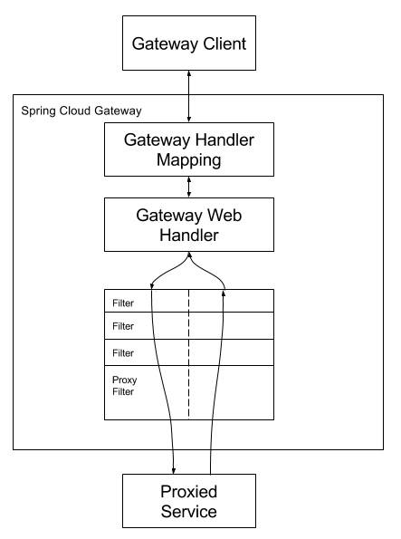

### 三大核心点

- **Route（路由）**：路由是构建网关的基础模块，它由 ID、目标 URI、包括一系列的断言和过滤器组成，如果断言为 true 则匹配该路由。
  - `id`：路由标识、区别于其他 route
  - `uri`：路由指向的目的地 uri，即客户端请求最终被转发到的微服务
  - `order`：用于多个 route 之间的排序，数值越小排序越靠前，匹配优先级越高
  - `predicate`：断言的作用是进行条件判断，只有断言都返回真，才会真正的执行路由
  - `filter`：过滤器用于修改请求和响应信息
- **Predicate（断言）**：参考的是 Java8 的 `java.util.function.Predicate`，开发人员可以匹配 HTTP 请求中的所有内容（例如请求头或请求参数），请求与断言匹配则进行路由。
- **Filter（过滤）**：指的是 Spring 框架中 GateWayFilter 的实例，使用过滤器，可以在请求被路由前或者之后对请求进行修改。

**三个核心点连起来**：当用户发出请求到达 GateWay，GateWay 会通过一些匹配条件，定位到真正的服务节点，并在这个转发过程前后，进行一些细化控制。其中 Predicate 就是我们匹配的条件，而 Filter 可以理解为一个拦截器，有了这两个点，再加上目标 URI，就可以实现一个具体的路由了。

### 工作流程

客户端向 Spring Cloud Gateway 发出请求。如果 Gateway Handler Mapping 确定请求与路由匹配，则将其发送到 Gateway Web Handler 处理程序。此处理程序通过特定于请求的 Filter 链运行请求。Filter 被虚线分隔的原因是 Filter 可以在发送代理请求之前（pre）和之后（post）运行逻辑。执行所有 pre 过滤器逻辑，然后进行代理请求，发出代理请求后，将运行 "post" 过滤器逻辑。

具体执行流程：

1. Gateway Client 向 Gateway Server 发送请求
2. 请求首先会被 HttpWebHandlerAdapter 进行提取组装成网关上下文
3. 然后网关的上下文会传递到 DispatcherHandler，它负责将请求分发给 RoutePredicateHandlerMapping
4. RoutePredicateHandlerMapping 负责路由查找，并根据路由断言判断路由是否可用
5. 如果断言成功，由 FilteringWebHandler 创建过滤器链并调用
6. 请求会依次经过 PreFilter → 微服务 → PostFilter 的方法，最终返回响应

### 过滤器作用

- Filter 在 **pre** 类型的过滤器可以做参数效验、权限效验、流量监控、日志输出、协议转换等。
- Filter 在 **post** 类型的过滤器可以做响应内容、响应头的修改、日志输出、流量监控等。
- 这两种类型的过滤器有着非常重要的作用。

> **总结**：GateWay 核心的流程就是 —— **路由转发 + 执行过滤器链**。

---

## 三、GateWay 项目搭建

了解了整体的基础概念以后，我们来搭建一个 GateWay 项目：`cloudalibaba-gateway-9999`。

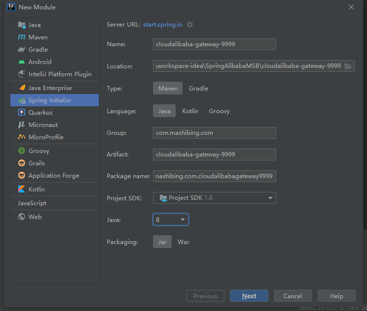

因为 GateWay 属于 SpringCloud，所以我们要导入对应依赖，一定要注意版本关系：

- 版本对应地址：https://spring.io/projects/spring-cloud
- 这里使用的是 SpringBoot 2.2.6 版本，配合 SpringCloud 的 Hoxton.SR5 版本

> **注意：引入 GateWay 一定要删除 spring-boot-starter-web 依赖，否则会有冲突无法启动。**

**父级项目引入：**

```xml
<!--spring cloud Hoxton.SR5-->
<dependency>
    <groupId>org.springframework.cloud</groupId>
    <artifactId>spring-cloud-dependencies</artifactId>
    <version>${spring-cloud-gateway-varsion}</version>
    <type>pom</type>
    <scope>import</scope>
</dependency>
```

**子级项目**（GateWay 也需要注册进 Nacos，所以也需要 Nacos 的依赖）：

```xml
<dependency>
    <groupId>com.alibaba.cloud</groupId>
    <artifactId>spring-cloud-starter-alibaba-nacos-discovery</artifactId>
</dependency>
<dependency>
    <groupId>org.springframework.cloud</groupId>
    <artifactId>spring-cloud-starter-gateway</artifactId>
</dependency>
```

**配置 YML 文件：**

```yaml
server:
  port: 9999
spring:
  application:
    name: cloud-gateway-service
  cloud:
    nacos:
      discovery:
        server-addr: localhost:8848
    gateway:
      discovery:
        locator:
          enabled: true #开启注册中心路由功能
      routes:  # 路由
        - id: nacos-provider #路由ID，没有固定要求，但是要保证唯一，建议配合服务名
          uri: http://localhost:9001/nacos-provider # 匹配提供服务的路由地址
          predicates: # 断言
            - Path=/msb/** # 断言，路径相匹配进行路由
```

更改 9001 的 DemoController，加上一个入口：

```java
@RestController
@RequestMapping("/msb")//路由路径
public class DemoController {

    @Value("${server.port}")
    private String serverPort;

    @GetMapping(value = "/get")
    public String getServerPort(){
        return "库存-1："+serverPort;
    }

}
```

最后测试，启动 Nacos、9001 和 9999 网关，通过网关访问 9001 的 `/msb/get` 接口同时查看 Nacos 控制台。

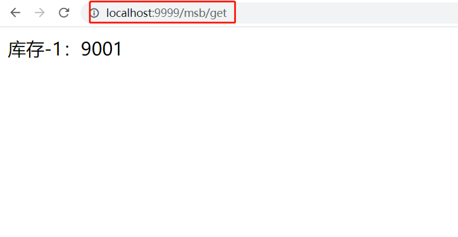

Nacos 控制台成功注册 GateWay 网关：

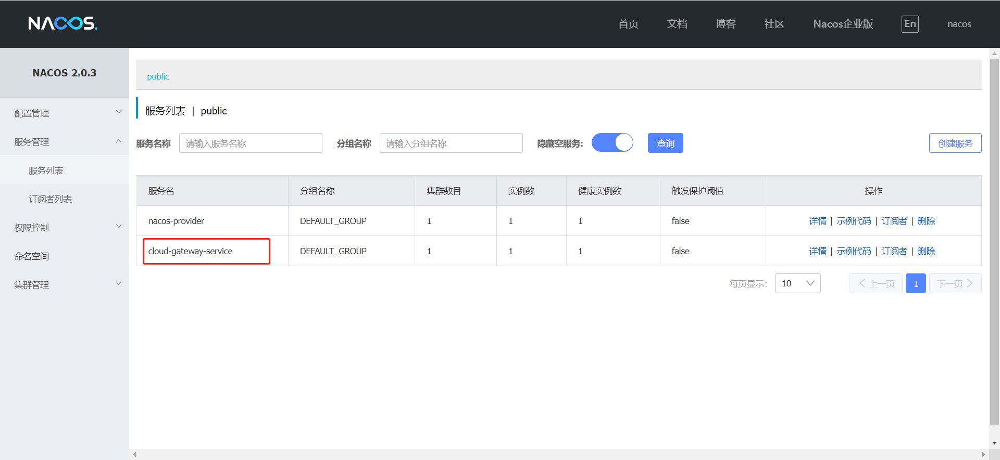

---

## 四、配置路由的两种方式

经过前面的讲解，我们知道了 GateWay 的基本配置路由方式是通过 YML 来完成，但是实际上 GateWay 还提供了另外一种配置方式：**通过代码的方式进行配置，即通过 `@Bean` 注入一个 RouteLocator**。

### 方式一：YML 配置

即上一节使用的 `spring.cloud.gateway.routes` 配置方式。

### 方式二：代码配置（GatewayConfig）

首先新建一个 GateWayConfig，其实这里的配置对应的就是我们之前在 YML 中配置的对应内容：

```java
package com.mashibing.com.cloudalibabagateway9999.config;

import org.springframework.cloud.gateway.route.RouteLocator;
import org.springframework.cloud.gateway.route.builder.RouteLocatorBuilder;
import org.springframework.context.annotation.Bean;
import org.springframework.context.annotation.Configuration;

@Configuration
public class GateWayConfig {
    /*
    配置了一个id为path_msb1的路由规则
    当访问地址 http://localhost:9999/msb/**
    就会转发到 http://localhost:9001/nacos-provider/msb/任何地址
     */

    @Bean
    public RouteLocator customRouteLocator(RouteLocatorBuilder routeLocatorBuilder){
        // 构建多个路由routes
        RouteLocatorBuilder.Builder routes = routeLocatorBuilder.routes();
        // 具体路由地址
        routes.route("path_msb",r -> r.path("/msb/**").uri("http://localhost:9001/nacos-provider")).build();
        // 返回所有路由规则
        return routes.build();
    }
}
```

我们在 9001 的 DemoController 中添加一个控制器：

```java
@GetMapping(value = "/custom")
public String customTest(){
    return "网关配置测试~~costom";
}
```

这个时候我们就可以测试了，启动 9999 网关服务和 9001 微服务，然后访问地址：`http://localhost:9999/msb/custom` 就可以转发到 9001 中具体的接口中了。

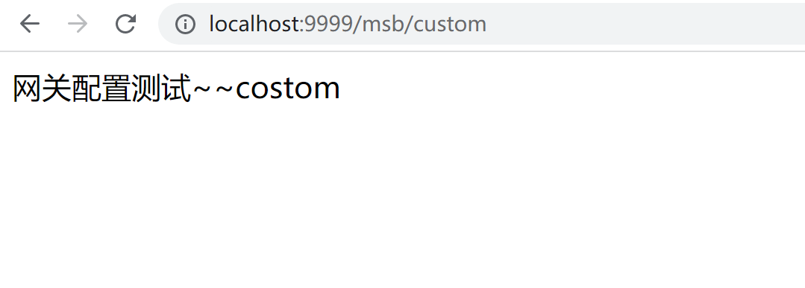

---

## 五、GateWay 实现负载均衡

在之前的学习中，我们已经掌握了 GateWay 的一些基本配置，包括两种配置方法，但其中有很多的配置细节我们没有细讲，包括我们现在的配置是写死的具体端口号，本节要实现通过 GateWay 实现负载均衡的两种方式。

### 自动负载均衡

我们看一下之前网关服务 9999 的 yml 配置，这里有一些配置信息咱们目前是不清楚的，比如：

1. `gateway.discovery.locator.enabled: true` —— 开启自动路由功能
2. routes 中的 uri 其实最后是不需要服务名称的，这个位置其实只需要指定的 `localhost:9001` 即可

所以这个位置我们可以把当前的配置优化为以下情况，它是一样可以启动的，测试启动 9001 和网关 9999，通过网关来访问 `localhost:9999/msb/**`：

```yaml
server:
  port: 9999
spring:
  application:
    name: cloud-gateway-service
  cloud:
    nacos:
      discovery:
        server-addr: localhost:8848
    gateway:
      routes:  # 路由
        - id: nacos-provider #路由ID，没有固定要求，但是要保证唯一，建议配合服务名
          uri: http://localhost:9001 # 匹配提供服务的路由地址
          predicates: # 断言
            - Path=/msb/** # 断言，路径相匹配进行路由
```

GateWay 还提供了和 Zuul 类似的自动路由规则，具体配置如下：

1. `discovery.locator.enabled: true` —— 这个配置默认为 false，但如果为 true，就是开启了通过 serviceId 转发到具体的服务实例，访问形式 `localhost:9999/ServiceID/msb/**`。
2. 在配置好这些以后，我们可以直接通过服务名称来访问 Nacos 中注册的服务和对应的接口。
3. 为了测试可以启动 2 个微服务 9001、9002。
4. GateWay 在开启了自动路由以后，还自带负载均衡。

```yaml
server:
  port: 9999
spring:
  application:
    name: cloud-gateway-service
  cloud:
    nacos:
      discovery:
        server-addr: localhost:8848
    gateway:
      discovery:
        locator:
          enabled: true #是否与服务发现组件进行结合，通过serviceId转发到具体的服务实例。默认为false，设为true便开启通过服务中心的自动根据 serviceId 创建路由的功能。
```

9002 和 9001 保持一致，Controller 保持一致，负载均衡测试：

```java
package com.mashibing.cloudalibabanacos9002.controller;

import org.springframework.beans.factory.annotation.Value;
import org.springframework.web.bind.annotation.GetMapping;
import org.springframework.web.bind.annotation.PathVariable;
import org.springframework.web.bind.annotation.RequestMapping;
import org.springframework.web.bind.annotation.RestController;

@RestController
@RequestMapping("/msb")
public class DemoController {

    @Value("${server.port}")
    private String serverPort;

    @GetMapping(value = "/get")
    public String getServerPort(){
        return "库存-1："+serverPort;
    }

    @GetMapping(value = "custom")
    public String customTest(){
        return "测试网关配置类~~custom";
    }
}
```

测试结果（访问地址 `http://localhost:9999/nacos-provider/msb/get`）：

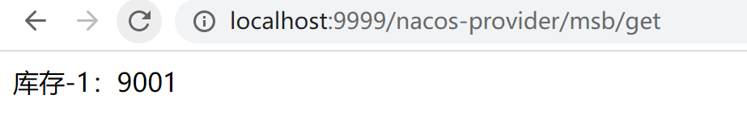

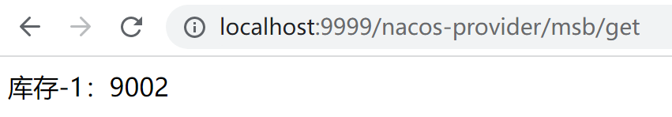

### 手动负载均衡

在以上的配置中其实是有问题的，问题在于当前的服务名称暴露，并且太过于灵活，那么如果想解决的话，可以进行手动配置：

```yaml
server:
  port: 9999
spring:
  application:
    name: cloud-gateway-service
  cloud:
    nacos:
      discovery:
        server-addr: localhost:8848
    gateway:
      discovery:
        locator:
          enabled: true #开启自动路由功能(此时可以关闭)
      routes: # 路由
        - id: nacos-provider #路由ID，没有固定要求，但是要保证唯一，建议配合服务名
          uri: lb://nacos-provider # 匹配提供服务的路由地址
          predicates: # 断言
            - Path=/msb/** 
```

### 测试

我们现在开启 9001/9002 两个服务和 9999 网关服务，然后此时我们可以通过网关去访问：`http://localhost:9999/msb/get`

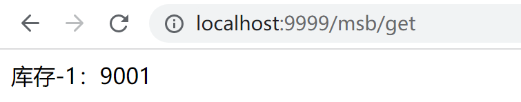

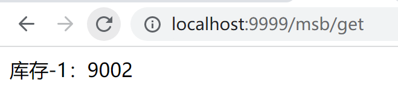

---

## 六、GateWay 断言 Predicate

每一个 Predicate 的使用，可以理解为：**当满足条件后才会进行转发**，如果有多个，那就是满足所有条件才会转发。

### 断言种类

1. **After**：匹配在指定日期时间之后发生的请求。
2. **Before**：匹配在指定日期之前发生的请求。
3. **Between**：需要指定两个日期参数，设定一个时间区间，匹配此时间区间内的请求。
4. **Cookie**：需要指定两个参数，分别为 name 和 regexp（正则表达式），也可以理解 Key 和 Value，匹配具有给定名称且其值与正则表达式匹配的 Cookie。
5. **Header**：需要两个参数 header 和 regexp（正则表达式），也可以理解为 Key 和 Value，匹配请求携带信息。
6. **Host**：匹配当前请求是否来自于设置的主机。
7. **Method**：可以设置一个或多个参数，匹配 HTTP 请求，比如 GET、POST。
8. **Path**：匹配指定路径下的请求，可以是多个用逗号分隔。
9. **Query**：需要指定一个或者多个参数，一个必须参数和一个可选的正则表达式，匹配请求中是否包含第一个参数，如果有两个参数，则匹配请求中第一个参数的值是否符合正则表达式。
10. **RemoteAddr**：匹配指定 IP 或 IP 段，符合条件转发。
11. **Weight**：需要两个参数 group 和 weight（int），实现了路由权重功能，按照路由权重选择同一个分组中的路由。

> 以上断言的具体演示在官网上都有提供，地址：https://docs.spring.io/spring-cloud-gateway/docs/current/reference/html/#gateway-request-predicates-factories

### 常用断言演示

#### After

匹配在指定时间之后发生的请求，可以对应提前上线业务。

```yaml
server:
  port: 9999
spring:
  application:
    name: cloud-gateway-service
  cloud:
    nacos:
      discovery:
        server-addr: localhost:8848
    gateway:
      discovery:
        locator:
          enabled: false # 是否与服务发现进行组合，通过ServiceID转发到具体的服务实例，默认为false，
                        # 设置为true便开启通过服务注册中心来自动根据SeviceID创建路由功能。
      routes:
        - id: nacos-provider # 路由ID，唯一不可重复，最好配合服务名
          uri: lb://nacos-provider # 匹配提供服务的路由地址 lb://代表开启负载均衡
          predicates: # 断言
            - Path=/msb/** # 匹配对应地址
            - After=2022-01-07T14:39:10.529+08:00[Asia/Shanghai] # 在这个时间之后的请求都能通过，当前没有问题以后，故意改为1个小时以后
```

写一个测试类来获取当前时间：

```java
public class TestDateTime {
    public static void main(String[] args) {
        ZonedDateTime zbj = ZonedDateTime.now();//默认时区
        System.out.println(zbj);
    }
}
```

测试：当前时间之后请求没有问题。

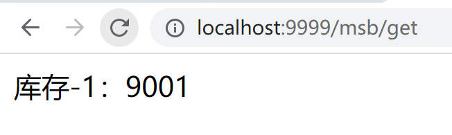

设置为 1 个小时后访问 404：

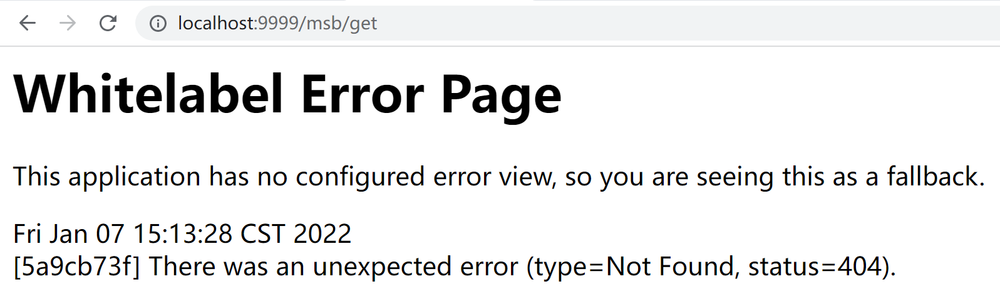

> 当 After 理解了以后，剩下的关于日期时间的设置 Before、Between 道理都是一样的，只不过是限定不同的日期时间区间。

#### Cookie

需要指定两个参数，分别为 name 和 regexp（正则表达式），也可以理解 Key 和 Value，匹配具有给定名称且其值与正则表达式匹配的 Cookie。

简单理解就是路由规则会通过获取 Cookie name 值和正则表达式去匹配，如果匹配上就会执行路由，如果匹配不上则不执行。我们可以分为两种情况演示：Cookie 匹配、Cookie 不匹配。

```yaml
server:
  port: 9999
spring:
  application:
    name: cloud-gateway-service
  cloud:
    nacos:
      discovery:
        server-addr: localhost:8848
    gateway:
      discovery:
        locator:
          enabled: false # 是否与服务发现进行组合，通过ServiceID转发到具体的服务实例，默认为false，
                        # 设置为true便开启通过服务注册中心来自动根据SeviceID创建路由功能。
      routes:
        - id: nacos-provider # 路由ID，唯一不可重复，最好配合服务名
          uri: lb://nacos-provider # 匹配提供服务的路由地址 lb://代表开启负载均衡
          predicates: # 断言
            - Path=/msb/** # 匹配对应地址
            # - After=2022-01-07T14:39:10.529+08:00[Asia/Shanghai] # 在这个时间之后的请求都能通过
            - Cookie=username,[a-z]+ # 匹配Cookie的key和value（正则表达式）
```

通过 postman 来进行测试。

当 Cookie 匹配时：

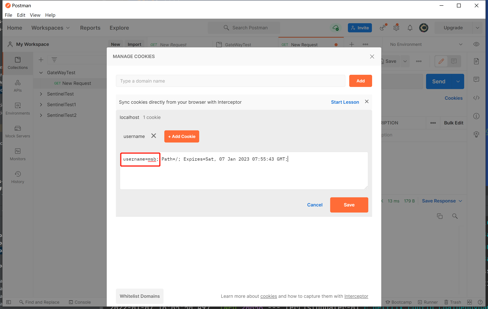

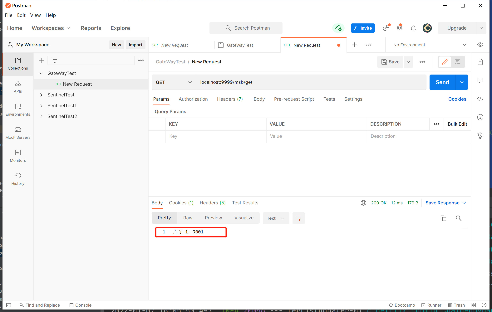

当 Cookie 不匹配时：

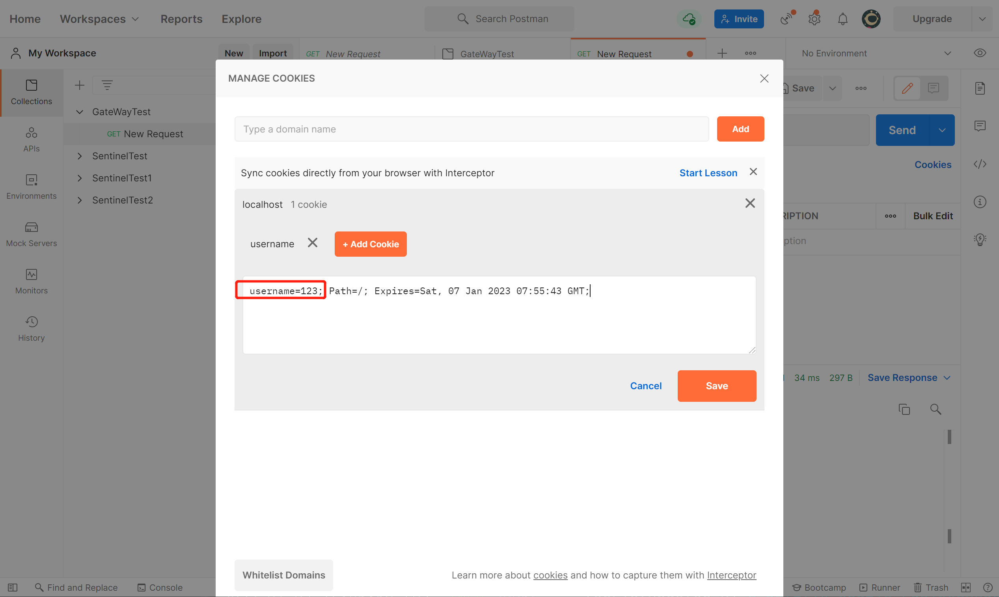

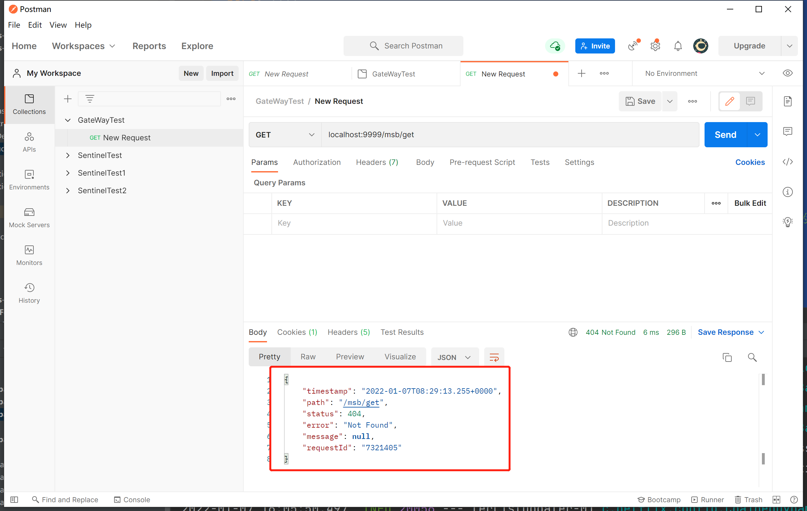

#### Header

需要两个参数 header 和 regexp（正则表达式），也可以理解为 Key 和 Value，匹配请求携带信息。实际上就是请求头携带的信息，官网给出的案例是 X-Request-Id，那我们就用这个做实验。

```yaml
server:
  port: 9999
spring:
  application:
    name: cloud-gateway-service
  cloud:
    nacos:
      discovery:
        server-addr: localhost:8848
    gateway:
      discovery:
        locator:
          enabled: false # 是否与服务发现进行组合，通过ServiceID转发到具体的服务实例，默认为false，
                        # 设置为true便开启通过服务注册中心来自动根据SeviceID创建路由功能。
      routes:
        - id: nacos-provider # 路由ID，唯一不可重复，最好配合服务名
          uri: lb://nacos-provider # 匹配提供服务的路由地址 lb://代表开启负载均衡
          predicates: # 断言
            - Path=/msb/** # 匹配对应地址
            #- After=2022-01-07T14:39:10.529+08:00[Asia/Shanghai] # 在这个时间之后的请求都能通过
            #- Cookie=username,[a-z]+
            - Header=X-Request-Id,\d+ #表示数字
```

测试：

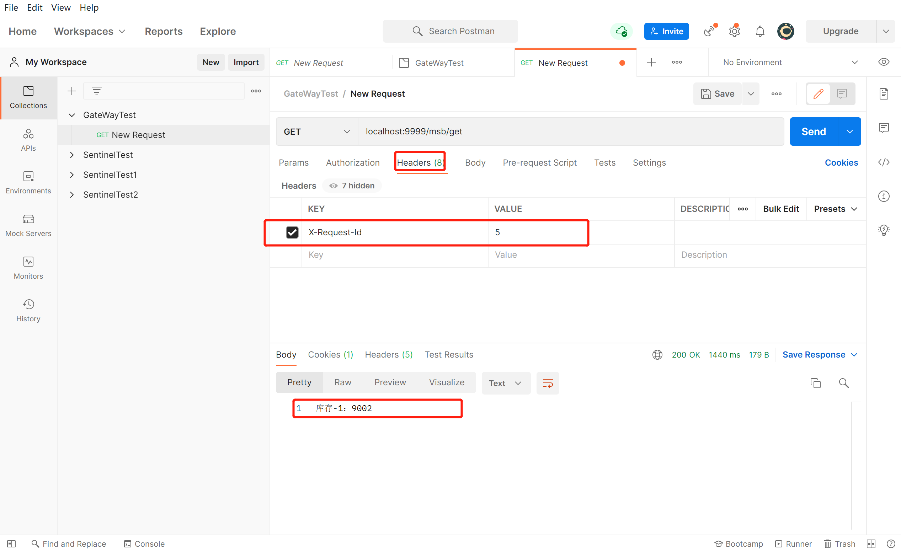

#### Host

匹配当前请求是否来自于设置的主机。这个比较简单，直接来试验。

```yaml
server:
  port: 9999
spring:
  application:
    name: cloud-gateway-service
  cloud:
    nacos:
      discovery:
        server-addr: localhost:8848
    gateway:
      discovery:
        locator:
          enabled: false # 是否与服务发现进行组合，通过ServiceID转发到具体的服务实例，默认为false，
                        # 设置为true便开启通过服务注册中心来自动根据SeviceID创建路由功能。
      routes:
        - id: nacos-provider # 路由ID，唯一不可重复，最好配合服务名
          uri: lb://nacos-provider # 匹配提供服务的路由地址 lb://代表开启负载均衡
          predicates: # 断言
            - Path=/msb/** # 匹配对应地址
            #- After=2022-01-07T14:39:10.529+08:00[Asia/Shanghai] # 在这个时间之后的请求都能通过
            #- Cookie=username,[a-z]+
            #- Header=X-Request-Id,\d+ #表示数字
            - Host=**.mashibing.com #匹配当前的主机地址发出的请求
```

postman：

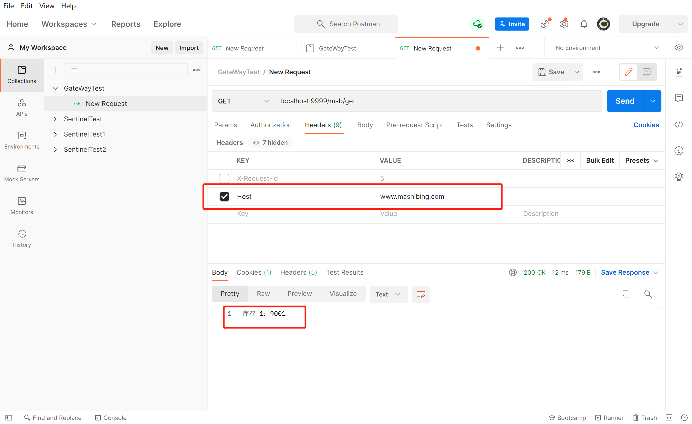

#### Method

可以设置一个或多个参数，匹配 HTTP 请求，比如 GET、POST。

```yaml
server:
  port: 9999
spring:
  application:
    name: cloud-gateway-service
  cloud:
    nacos:
      discovery:
        server-addr: localhost:8848
    gateway:
      discovery:
        locator:
          enabled: false # 是否与服务发现进行组合，通过ServiceID转发到具体的服务实例，默认为false，
                        # 设置为true便开启通过服务注册中心来自动根据SeviceID创建路由功能。
      routes:
        - id: nacos-provider # 路由ID，唯一不可重复，最好配合服务名
          uri: lb://nacos-provider # 匹配提供服务的路由地址 lb://代表开启负载均衡
          predicates: # 断言
            - Path=/msb/** # 匹配对应地址
            #- After=2022-01-07T14:39:10.529+08:00[Asia/Shanghai] # 在这个时间之后的请求都能通过
            #- Cookie=username,[a-z]+
            #- Header=X-Request-Id,\d+ #表示数字
            #- Host=**.mashibing.com #匹配当前的主机地址发出的请求
            - Method=GET,POST # 匹配GET请求或者POST请求
```

#### Query

需要指定一个或者多个参数，一个必须参数和一个可选的正则表达式，匹配请求中是否包含第一个参数，如果有两个参数，则匹配请求中第一个参数的值是否符合正则表达式。

```yaml
server:
  port: 9999
spring:
  application:
    name: cloud-gateway-service
  cloud:
    nacos:
      discovery:
        server-addr: localhost:8848
    gateway:
      discovery:
        locator:
          enabled: false # 是否与服务发现进行组合，通过ServiceID转发到具体的服务实例，默认为false，
                        # 设置为true便开启通过服务注册中心来自动根据SeviceID创建路由功能。
      routes:
        - id: nacos-provider # 路由ID，唯一不可重复，最好配合服务名
          uri: lb://nacos-provider # 匹配提供服务的路由地址 lb://代表开启负载均衡
          predicates: # 断言
            - Path=/msb/** # 匹配对应地址
            #- After=2022-01-07T14:39:10.529+08:00[Asia/Shanghai] # 在这个时间之后的请求都能通过
            #- Cookie=username,[a-z]+
            #- Header=X-Request-Id,\d+ #表示数字
            #- Host=**.mashibing.com #匹配当前的主机地址发出的请求
            #- Method=GET,POST
            - Query=id,.+ # 匹配请求参数，这里如果需要匹配多个参数，可以写多个Query
```

测试：

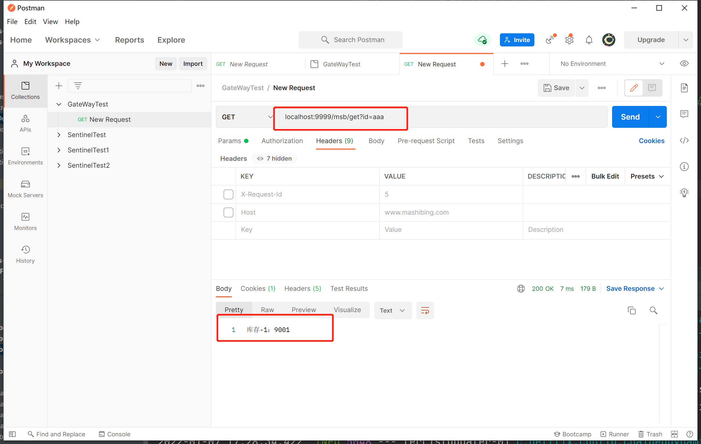

#### Weight

需要两个参数 group 和 weight（int），实现了路由权重功能，按照路由权重选择同一个分组中的路由。

官网提供的演示 yml：

```yaml
spring:
  cloud:
    gateway:
      routes:
      - id: weight_high
        uri: https://weighthigh.org
        predicates:
        - Weight=group1, 8
      - id: weight_low
        uri: https://weightlow.org
        predicates:
        - Weight=group1, 2
```

该路由会将约 80% 的流量转发到 weighthigh.org，将约 20% 的流量转发到 weightlow.org。

> **总结**：Predicate 就是为了实现一组匹配规则，让请求过来找到对应的 Route 进行处理。

---

## 七、GateWay 的 Filter

路由过滤器允许以某种方式修改传入的 HTTP 请求或传出的 HTTP 响应。路由过滤器的范围是特定的路由。Spring Cloud Gateway 包含许多内置的 GatewayFilter 工厂。

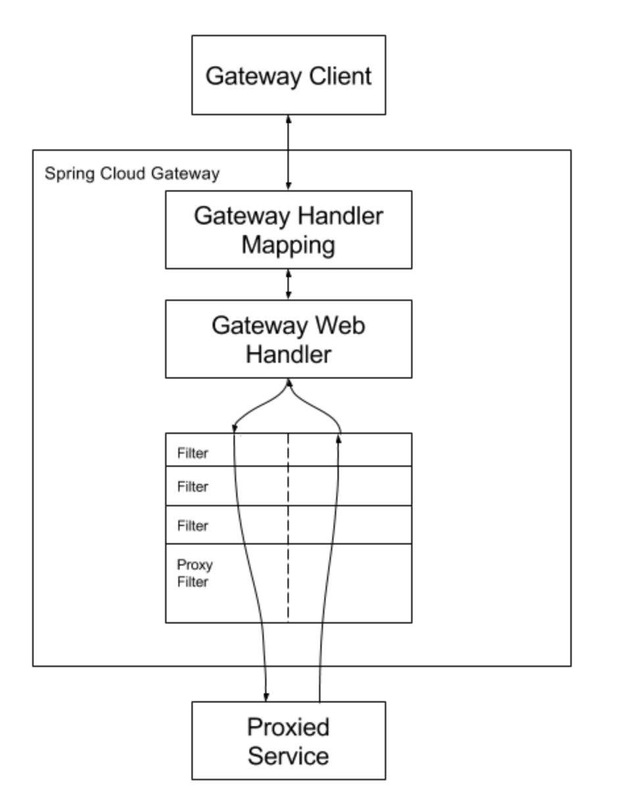

### 内置 Filter

1. GateWay 内置的 Filter 生命周期为两种：**pre**（业务逻辑之前）、**post**（业务逻辑之后）。
2. GateWay 本身自带的 Filter 分为两种：**GateWayFilter**（单一）、**GlobalFilter**（全局）。
3. 单一的有 32 种，全局的有 9 种。
4. 官方网址：https://docs.spring.io/spring-cloud-gateway/docs/current/reference/html/#global-filters

数量较多，用法都比较简单，大家可根据官网给出的演示自行练习，这里举一个例子。

#### StripPrefix

StripPrefix 有一个参数 parts，该参数指示在将请求发送到下游之前要从请求中剥离的路径中的部分数。

案例：比如我们现在在 9001 微服务上加一个 context-path 配置：

```yaml
server:
  port: 9001
  servlet:
    context-path: /nacos-provider
.....
```

现在 9001 的访问路径变为 `http://localhost:9001/nacos-provider/msb/get`。目前网关 9999 配置信息为：

```yaml
server:
  port: 9999
spring:
  application:
    name: cloud-gateway-service
  cloud:
    nacos:
      discovery:
        server-addr: localhost:8848
    gateway:
      discovery:
        locator:
          enabled: false # 是否与服务发现进行组合，通过ServiceID转发到具体的服务实例，默认为false，
                        # 设置为true便开启通过服务注册中心来自动根据SeviceID创建路由功能。
      routes:
        - id: nacos-provider # 路由ID，唯一不可重复，最好配合服务名
          uri: lb://nacos-provider # 匹配提供服务的路由地址 lb://代表开启负载均衡
          predicates: # 断言
            - Path=/msb/** # 匹配对应地址
```

为了保证断言能够匹配，此时通过网关的访问地址应该改为：`http://localhost:9999/msb/nacos-provider/msb/get`，但是出现了 404，因为多了一层路径 `http://localhost:9001/msb/nacos-provider/msb/get`。

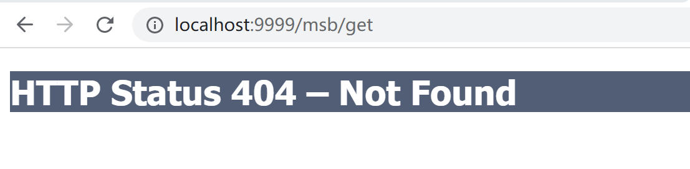

如果想要解决，我们应该在转发的时候去掉地址中最前面的 `/msb`，所以就需要使用 Filter：**StripPrefix**。

```yaml
server:
  port: 9999
spring:
  application:
    name: cloud-gateway-service
  cloud:
    nacos:
      discovery:
        server-addr: localhost:8848
    gateway:
      discovery:
        locator:
          enabled: false # 是否与服务发现进行组合，通过ServiceID转发到具体的服务实例，默认为false，
                        # 设置为true便开启通过服务注册中心来自动根据SeviceID创建路由功能。
      routes:
        - id: nacos-provider # 路由ID，唯一不可重复，最好配合服务名
          uri: lb://nacos-provider # 匹配提供服务的路由地址 lb://代表开启负载均衡
          predicates: # 断言
            - Path=/msb/** # 匹配对应地址
          filters:
            - StripPrefix=1 # 去掉地址中的第一部分
          # http://localhost:9999/msb/nacos-provider/msb/get
          # http://localhost:9999/nacos-provider/msb/get
```

最后效果，成功转发：

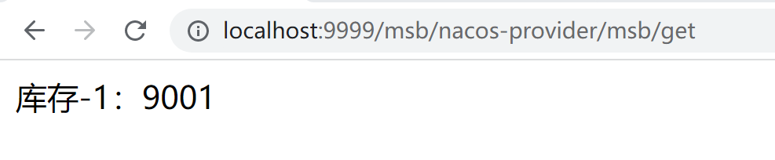

### 自定义 Filter

要实现 GateWay 自定义过滤器，那么我们需要实现两个接口：

- `GlobalFilter`
- `Ordered`

#### 演示

首先新建一个类 MyFilter：

```java
@Component
@Slf4j
public class MyFilter implements Ordered, GlobalFilter {
    /**
     * @param exchange 可以拿到对应的request和response
     * @param chain 过滤器链
     * @return 是否放行
     */
    @Override
    public Mono<Void> filter(ServerWebExchange exchange, GatewayFilterChain chain) {
        String username = exchange.getRequest().getQueryParams().getFirst("username");
        log.info("*************MyFilter:"+new Date());
        if(username == null){
            log.info("**********用户名为null，非法用户，请求被拒绝！");
            //如果username为空，返回状态码为406，不可接受的请求
            exchange.getResponse().setStatusCode(HttpStatus.NOT_ACCEPTABLE);
            return exchange.getResponse().setComplete();
        }
        return chain.filter(exchange);
    }

    /**
     * 加载过滤器的顺序
     * @return 整数数字越小优先级越高
     */
    @Override
    public int getOrder() {
        return 0;
    }
}
```

测试，此时我们的逻辑是在访问同时要传入 username 参数且不能为空，否则不会放行本次请求。

传入正确参数：

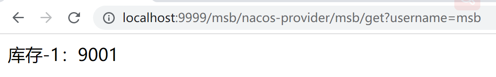

未传入正确参数：

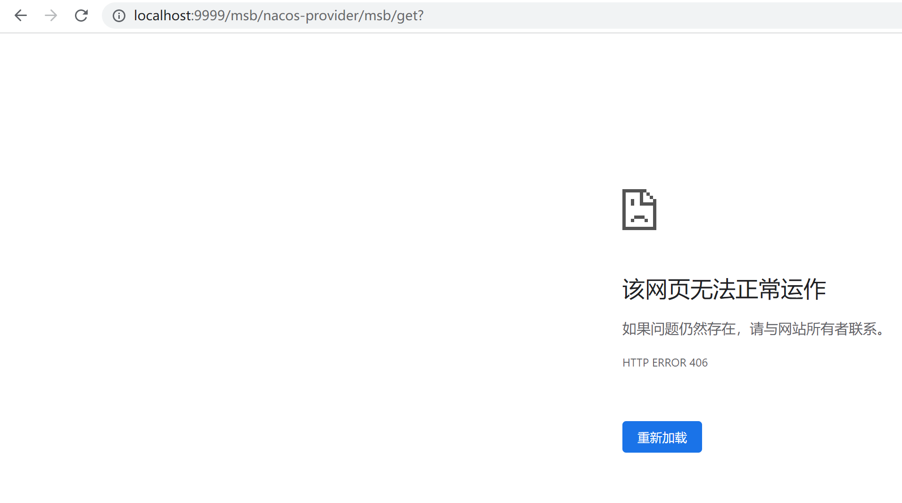
