# Java 学习笔记汇总

> 格式说明：每个知识点含 **说明**（快速理解）和 **面试要点**（高频考点，便于背诵）。带 **📖 专题详解** 链接的条目保留汇总速记；关键知识点附 **示意图** 辅助记忆。

---

## java基础

### JDK、JRE、JVM
- **说明**：JDK = 开发工具包（含 JRE + 编译器 javac 等）；JRE = 运行环境（JVM + 核心类库）；JVM = 虚拟机，负责字节码执行、内存管理、GC

```
┌─────────────── JDK（Java Development Kit）───────────────┐
│  开发工具: javac · javadoc · jar · jdb ...              │
│  ┌──────────── JRE（Java Runtime Environment）────────┐ │
│  │  ┌─────────────┐  ┌──────────────────────────────┐  │ │
│  │  │     JVM     │  │  核心类库（java.lang 等）     │  │ │
│  │  │ 字节码/GC   │  │  rt.jar / modules（JDK9+）  │  │ │
│  │  └─────────────┘  └──────────────────────────────┘  │ │
│  └─────────────────────────────────────────────────────┘ │
└──────────────────────────────────────────────────────────┘
  JDK ⊃ JRE ⊃ JVM     JRE = JVM + 类库     JDK = JRE + 开发工具
```

- **面试要点**：
  - 三者包含关系：JDK ⊃ JRE ⊃ JVM
  - 跨平台靠 JVM：一次编译，到处运行（字节码 + 不同 OS 的 JVM 实现）
  - JDK 8 后 Oracle 收费策略变化，OpenJDK 成为主流

### 字符串常量池
- **说明**：JDK 1.7 起常量池从方法区（永久代）移到堆中；`String s = "abc"` 直接入池；`new String("abc")` 在堆中创建对象，可能引用池中 `"abc"`
- **面试要点**：
  - `String a = "ab"; String b = "a" + "b";` → `a == b` 为 true（编译期常量折叠）
  - `String c = new String("ab");` → `a == c` 为 false（堆 vs 池）
  - `intern()` 作用：将堆中字符串引用放入常量池并返回池引用
  - 拼接：`+` 在循环中效率低，用 `StringBuilder`

### 对象池化
- **说明**：复用已创建对象减少 GC 压力，如 Integer 缓存 -128~127、String 常量池、数据库连接池
- **面试要点**：
  - `Integer.valueOf(127) == Integer.valueOf(127)` → true；128 则 false
  - 池化适用：创建成本高、使用频繁、状态可重置的对象

### == 与 equals
- **说明**：`==` 比较引用地址（基本类型比较值）；`equals` 默认同 `==`，String/包装类重写后比较内容
- **面试要点**：
  - 重写 `equals` 必须同时重写 `hashCode`（HashMap 等依赖）
  - `equals` 满足：自反、对称、传递、一致、非空
  - 比较 String 用 `equals`，不要用 `==`

### hashCode
- **说明**：对象哈希值，用于 HashMap 等散列结构定位桶位置；相同对象 hashCode 必须相同，不同对象可能相同（哈希冲突）
- **面试要点**：
  - 重写规则：equals 相等 → hashCode 必相等；hashCode 相等 ≠ equals 相等
  - HashMap 先比 hashCode 定位桶，再 equals 比 key

### final、finally、finalize
- **说明**：`final` 修饰类不可继承、方法不可重写、变量不可改；`finally` 异常处理中必执行块（除非 JVM 退出）；`finalize` 对象 GC 前回调，已废弃（JDK 9 标记 deprecated）
- **面试要点**：
  - `final` 变量赋值时机：声明时、代码块、构造器（三者选一）
  - `finally` 中 return 会覆盖 try/catch 的 return
  - 不要用 `finalize` 做资源释放，用 try-with-resources

### 反射
- **说明**：运行时动态获取类信息、创建对象、调用方法；核心类：Class、Method、Field、Constructor
- **面试要点**：
  - 获取 Class：`类名.class`、`对象.getClass()`、`Class.forName()`
  - 破坏封装：`setAccessible(true)` 访问 private
  - 缺点：性能低、破坏封装；框架（Spring、MyBatis）大量使用

### 集合
- **说明**：Collection（List/Set/Queue）和 Map 两大体系；ArrayList 数组、LinkedList 双向链表、HashSet 基于 HashMap
- **面试要点**：
  - List 有序可重复，Set 无序不重复，Map 键值对
  - ArrayList 扩容 1.5 倍；LinkedList 增删快查慢
  - HashMap 线程不安全，ConcurrentHashMap 线程安全

### HashMap & ConcurrentHashMap
- **说明**：HashMap 数组+链表+红黑树（链表长度≥8 且数组≥64 转红黑树）；ConcurrentHashMap JDK7 分段锁，JDK8 CAS+synchronized 锁桶头节点

```
数组(桶)          链表              红黑树(≥8且≥64)
┌───┐           ┌──→ [k1,v1]→[k2,v2]
│ 0 │→ null
├───┤           ┌──→ [k3,v3]→ 🌳BST
│ 1 │→ ●────────┘
├───┤
│ 2 │→ ●──→ [k4,v4]
└───┘
put: hash → 桶下标 → 无冲突直插 / 冲突拉链表或树 → 超0.75扩容×2
```

- **面试要点**：
  - **put 流程**：算 hash → 定位桶 → 无冲突直接放 → 有冲突拉链表/树 → 超阈值扩容 2 倍
  - 初始容量 16，负载因子 0.75，容量始终 2 的幂（便于位运算取模）
  - 线程不安全场景：多线程 put 可能死循环（JDK7）或数据丢失
  - ConcurrentHashMap 不允许 null key/value（二义性：无法区分「不存在」和「值为 null」）
  - size 统计：JDK8 用 baseCount + CounterCell 数组求和

### 4 种引用类型
- **说明**：强引用（默认，GC 不回收）、软引用（内存不足才回收，适合缓存）、弱引用（下次 GC 必回收，ThreadLocal key）、虚引用（跟踪 GC，PhantomReference）

```
强引用 ──→ 对象     GC: 永不回收(有强引用时)
软引用 ──→ 对象     GC: 内存不足才回收  → 缓存
弱引用 ──→ 对象     GC: 下次必回收      → ThreadLocal key
虚引用 ──→ 对象     GC: 跟踪回收时机    → 需 ReferenceQueue
```

- **面试要点**：
  - 软引用 → SoftReference，适合做图片/网页缓存
  - 弱引用 → WeakReference，ThreadLocal 内存泄漏根源
  - 虚引用必须配合 ReferenceQueue 使用

---

## 多线程

### 线程与进程概念
- **说明**：进程是资源分配最小单位（独立内存空间）；线程是 CPU 调度最小单位，共享进程内存
- **面试要点**：
  - 一个进程可含多个线程，线程切换开销小于进程
  - 线程共享堆和方法区，各自拥有栈和程序计数器

### 线程的常用方法
- **说明**：`start()` 启动新线程；`run()` 线程体；`sleep()` 不释放锁；`wait()` 释放锁并等待；`notify()/notifyAll()` 唤醒；`join()` 等待线程结束；`yield()` 让出 CPU
- **面试要点**：
  - `start()` vs `run()`：start 创建新线程，run 只是普通方法调用
  - `sleep()` 不释放锁，`wait()` 必须在 synchronized 中且释放锁
  - `notifyAll()` 唤醒所有等待线程，notify 随机唤醒一个

### 线程的生命周期
- **说明**：NEW → RUNNABLE → BLOCKED（等锁）/ WAITING（wait/join）/ TIMED_WAITING（sleep）→ TERMINATED

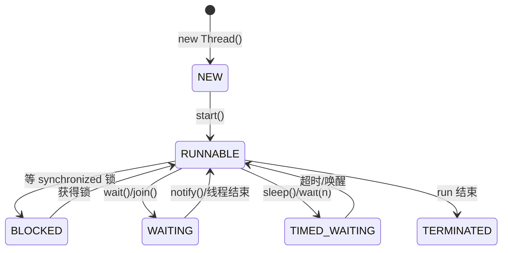

- **面试要点**：
  - RUNNABLE 包含 Running 和 Ready（就绪）
  - BLOCKED 等 synchronized 锁；WAITING 等 notify

### Synchronized 和 ReentrantLock
- **说明**：synchronized JVM 层面，自动加解锁，不可中断；ReentrantLock JDK API，可中断、可公平、可多个 Condition


- **面试要点**：
  - synchronized 锁升级：无锁 → 偏向锁 → 轻量级锁 → 重量级锁
  - ReentrantLock 需手动 lock/unlock，必须在 finally 中 unlock
  - 选 synchronized：简单场景；选 ReentrantLock：需要公平锁、可中断、多条件队列

### 线程的安全划分
- **不可变对象**（String、Integer 等）：状态不可变，天然线程安全
- **绝对线程安全**（CopyOnWriteArrayList/Set）：所有操作都线程安全
- **相对线程安全**（Vector）：单个操作安全，复合操作需额外同步
- **非安全**（ArrayList、LinkedList、HashMap）：多线程需外部同步
- **面试要点**：Vector 的 `if(!contains) add()` 仍不安全，需 synchronized 包裹

### 线程安全三特性
- **原子性**：操作不可分割，要么全做要么不做 → synchronized、Lock、Atomic 类
- **可见性**：一个线程修改对其他线程可见 → volatile、synchronized、final
- **有序性**：禁止指令重排 → volatile（禁止特定重排）、happens-before 规则
- **面试要点**：
  - as-if-serial：单线程内重排不影响结果
  - happens-before 8 条规则：程序次序、锁、volatile、线程 start/join 等

### 常用线程池
- **说明**：Executors 提供 FixedThreadPool、CachedThreadPool、SingleThreadExecutor、ScheduledThreadPool；生产推荐 ThreadPoolExecutor 自定义
- **面试要点**：
  - 不用 Executors 创建：Fixed/Cached 队列或线程数无界，可能 OOM
  - IO 密集型：线程数 ≈ CPU 核数 × 2；CPU 密集型 ≈ CPU 核数 + 1

### Java 21 虚拟线程
- 📖 **专题详解** → [Java21-虚拟线程详解](./Java21-虚拟线程详解.md)
- **说明**：虚拟线程是 Java 21 正式特性（JEP 444），由 JVM 调度到少量载体线程上运行，适合大量 **阻塞型 IO 任务**，强调“一任务一线程”的直观并发模型
- **面试要点**：
  - 虚拟线程擅长 **等待多、计算少** 的场景，不擅长 CPU 密集型任务
  - 阻塞时通常会从载体线程卸载，但 **synchronized + 阻塞**、native 调用等场景可能发生 **Pinning（线程固定）**
  - 虚拟线程不是取消连接池/限流/背压，而是降低线程成本；真正瓶颈仍可能在 DB 连接、下游 QPS、磁盘和网络

### 线程池 7 个参数
- **说明**：corePoolSize、maximumPoolSize、keepAliveTime、unit、workQueue、threadFactory、handler
- **面试要点**：
  - 执行顺序：核心线程 → 队列 → 非核心线程 → 拒绝策略
  - 队列选型：ArrayBlockingQueue 有界、LinkedBlockingQueue 可无界、SynchronousQueue 不存元素

### 线程池工作原理
- **说明**：提交任务 → 核心未满则创建核心线程 → 已满则入队 → 队列满则创建非核心线程 → 达最大则拒绝

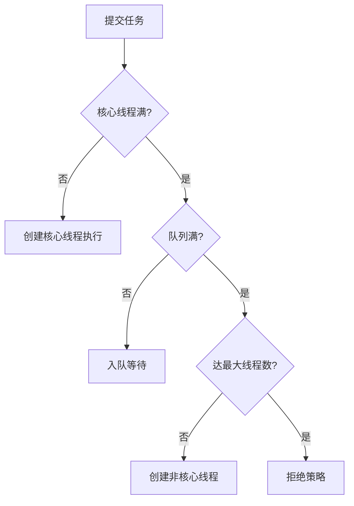

- **面试要点**：能口述完整流程；核心线程默认不回收（allowCoreThreadTimeOut 可改）

### 线程池拒绝策略
- **AbortPolicy**：抛 RejectedExecutionException（默认）
- **CallerRunsPolicy**：调用者线程执行，起到降级/背压作用
- **DiscardOldestPolicy**：丢弃队列最老任务，再提交新任务
- **DiscardPolicy**：静默丢弃
- **面试要点**：CallerRunsPolicy 适合不允许丢任务的场景；AbortPolicy 配合监控告警

### ThreadLocal
- **说明**：每个线程独立副本，底层 ThreadLocalMap 以 ThreadLocal 为 key（弱引用），value 存在 Entry 中

```
Thread                           ThreadLocalMap (在 Thread 内)
┌──────────────┐                ┌─────────────────────────┐
│ threadLocals │──指向────────→│ Entry[弱引用key → value] │
└──────────────┘                │ Entry[弱引用key → value] │
                                └─────────────────────────┘
⚠ key 被 GC 后 value 仍被 Thread 强引用 → 必须 remove()
```

- **面试要点**：
  - 内存泄漏：key 被 GC 但 value 仍被 Thread 强引用 → 用完必须 `remove()`
  - 原理：Thread 持有 ThreadLocalMap，get/set 操作当前线程的 Map
  - InheritableThreadLocal：子线程可继承父线程值（创建子线程时复制）
  - 应用场景：用户信息上下文、SimpleDateFormat 线程安全、数据库连接

### CopyOnWrite 原理
- **说明**：写时复制，写操作加锁并复制新数组，读无锁；适合读多写少
- **面试要点**：
  - 缺点：写开销大、数据短暂不一致
  - 迭代器弱一致性，不会抛 ConcurrentModificationException

### ConcurrentHashMap 读写与红黑树
- **说明**：读无锁（volatile 保证可见）；写 CAS 或 synchronized 锁桶头节点；链表≥8 转红黑树，≤6 退化为链表
- **面试要点**：
  - 为何不用 null：get 返回 null 无法区分「不存在」和「值为 null」
  - size 统计用 LongAdder 思想（CounterCell 分散热点）

### 死锁的检测和定位
- **说明**：两个以上线程互相等待对方持有的锁；条件：互斥、占有且等待、不可抢占、循环等待
- **面试要点**：
  - 排查：`jstack <pid>` 看 "Found one Java-level deadlock"
  - 预防：固定加锁顺序、tryLock 超时、银行家算法
  - 压测指标：吞吐量、响应时间 P99、CPU、内存、GC

---

## 并发编程

### Java 内存可见性
- **说明**：每个 CPU 有独立缓存，线程修改变量可能只更新本地缓存，其他线程不可见
- **面试要点**：
  - 缓存行伪共享：不同变量在同一缓存行，一个核修改导致其他核缓存失效 → @Contended、padding 解决
  - 多核 CPU 缓存不共享，需内存屏障/volatile 保证可见性

### JMM（Java 内存模型）
- **说明**：定义主内存与工作内存交互规则，屏蔽硬件差异，保证并发语义

```
        主内存 (堆/共享变量)
       ┌─────────────────┐
       │    sharedVar    │
       └────────┬────────┘
    read/write  │  read/write
   ┌────────────┼────────────┐
   ▼            ▼            ▼
工作内存T1   工作内存T2   工作内存T3
(线程私有副本)  (CPU缓存)    ...
volatile/CAS/锁 → 保证主内存与工作内存同步
```

- **面试要点**：
  - **volatile**：保证可见性 + 禁止指令重排，不保证原子性（i++ 不安全）
  - **CAS**：Compare And Swap，CPU 原子指令，ABA 问题用版本号解决（AtomicStampedReference）
  - happens-before 是 JMM 对开发者的保证，volatile 写 happens-before 后续读

### 锁的分类
- **可重入/不可重入**：同一线程能否重复获取同一把锁（synchronized、ReentrantLock 可重入）
- **乐观/悲观**：乐观 CAS 无冲突直接改，悲观先加锁（synchronized）
- **公平/非公平**：公平按申请顺序，非公平可插队（ReentrantLock 默认非公平，吞吐更高）
- **互斥/共享**：互斥锁独占，共享锁多读（ReadWriteLock 读锁共享、写锁互斥）

### CAS 与 Java 锁底层实现
- **说明**：synchronized 锁升级（偏向→轻量→重量）；AQS 是 JUC 锁和同步工具的统一底层框架
- **面试要点**：
  - 轻量级锁：CAS 自旋，适合锁竞争少
  - AQS 详见下方专题；ReentrantLock、Semaphore、CountDownLatch 等均基于 AQS

### AQS（AbstractQueuedSynchronizer）
- **说明**：`java.util.concurrent.locks` 包中的抽象队列同步器，JUC 并发工具的核心骨架。通过 **volatile state** 表示同步状态，**CLH 双向队列** 管理阻塞线程，子类只需实现少量模板方法即可定制锁语义

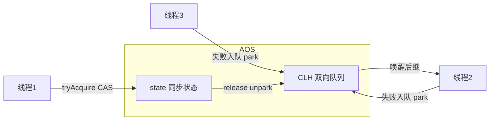

- **核心结构**：
  - **state**：`volatile int`，0 表示未占用；ReentrantLock 中 state=重入次数，Semaphore 中 state=许可数，CountDownLatch 中 state=剩余计数
  - **CLH 队列**：FIFO 双向链表，每个 Node 封装一个等待线程；竞争失败则入队并 `park` 挂起，前驱节点释放锁时 `unpark` 唤醒后继
  - **Node**：含 thread、waitStatus（SIGNAL/CANCELLED/CONDITION/PROPAGATE）、prev/next
- **两种模式**：
  - **独占模式（Exclusive）**：同一时刻只有一个线程能获取 → ReentrantLock、ReentrantReadWriteLock 写锁
  - **共享模式（Shared）**：多个线程可同时获取 → Semaphore、CountDownLatch、ReentrantReadWriteLock 读锁
- **模板方法（子类实现）**：
  - 独占：`tryAcquire` / `tryRelease` / `isHeldExclusively`
  - 共享：`tryAcquireShared` / `tryReleaseShared`
  - AQS 已实现：`acquire`、`release`、`acquireShared`、`releaseShared`（含入队、自旋、挂起/唤醒全流程）
- **acquire 流程（独占）**：
  1. 调用 `tryAcquire` 尝试 CAS 修改 state，成功则直接返回
  2. 失败则封装 Node 入 CLH 队列尾部
  3. 自旋检查前驱是否为 head 且再次 `tryAcquire`
  4. 仍失败则 `LockSupport.park()` 挂起，等待前驱 `unpark` 唤醒
- **Condition 条件队列**：
  - AQS 内部类 `ConditionObject`，每个 Condition 维护独立等待队列
  - `await()`：释放锁 → 加入 Condition 队列 → 挂起；`signal()`：转移节点到 AQS 队列 → 等待获取锁
  - **面试要点**：Condition 实现「等待-通知」，替代 synchronized 的 wait/notify，且支持多个条件变量
- **基于 AQS 的 JUC 组件**：
  | 组件 | 模式 | state 含义 |
  |------|------|-----------|
  | ReentrantLock | 独占 | 0=未锁，>0=重入次数 |
  | ReentrantReadWriteLock | 读共享/写独占 | 高 16 位=读锁计数，低 16 位=写锁计数 |
  | Semaphore | 共享 | 剩余许可数 |
  | CountDownLatch | 共享 | 剩余倒计时 |
  | ReentrantLock 公平 vs 非公平 | — | 公平锁按队列顺序 acquire；非公平锁新线程可直接 CAS 抢锁（默认，吞吐更高） |
- **面试要点**：
  - AQS = **state + CLH 队列 + 模板方法模式**，是 JUC 的「基础设施」
  - 为什么用 CLH 队列：竞争线程入队后本地自旋检查前驱，减少全局同步开销
  - ReentrantLock 与 synchronized 区别：可中断、可超时 tryLock、公平/非公平可选、多 Condition
  - CountDownLatch 原理：`tryAcquireShared` 返回剩余 count，count=0 时所有等待线程通过；**不可重置**
  - Semaphore 原理：共享模式，`tryAcquireShared` 扣减许可，许可不足则入队阻塞
  - 手写追问：如何实现一个简单互斥锁？→ 继承 AQS，tryAcquire 中 CAS state 0→1，tryRelease 中 state 置 0 并 unpark 后继

### ConcurrentHashMap 为何 key/value 不能为 null
- **说明**：`get(key)` 返回 null 时，无法区分 key 不存在还是 value 为 null，ConcurrentHashMap 不允许这种二义性
- **面试要点**：HashMap 允许一个 null key 和多个 null value

### hash 冲突 4 种解决方式
- **链地址法**：拉链表（HashMap 默认）
- **开放地址法**：线性探测、二次探测
- **再哈希法**：多个 hash 函数
- **公共溢出区**：溢出区存冲突元素
- **面试要点**：HashMap 链地址 + 红黑树优化长链表

### FutureTask
- **说明**：RunnableFuture 实现，包装 Callable，get() 阻塞获取结果，可取消
- **面试要点**：state 状态机 NEW → COMPLETING → NORMAL/EXCEPTIONAL；run() 执行 Callable.call()

### CompletableFuture
- **说明**：JDK8 异步编程，支持链式组合（thenApply/thenCompose）、多任务聚合（allOf/anyOf）
- **面试要点**：
  - `supplyAsync` 有返回值，`runAsync` 无返回值
  - 异常处理：`exceptionally`、`handle`
  - 对比 Future：可组合、可回调，不阻塞 get

### 怎么唤醒阻塞的线程
- **说明**：sleep → 时间到自动醒；wait → notify/notifyAll；park → unpark；join → 目标线程结束；IO 阻塞 → IO 就绪
- **面试要点**：interrupt() 可中断 sleep/wait，抛 InterruptedException

### 阻塞队列
| 队列 | 特点 | 场景 |
|------|------|------|
| ArrayBlockingQueue | 有界数组 | 固定容量生产者消费者 |
| LinkedBlockingQueue | 可选有界链表 | 常用，吞吐高 |
| PriorityBlockingQueue | 优先级堆 | 定时任务 |
| DelayQueue | 延迟到期才能取 | 定时消息 |
| SynchronousQueue | 不存元素，直接交接 | CachedThreadPool |

- **面试要点**：SynchronousQueue 每个 put 必须等待 take，适合高吞吐直接传递场景

### JUC 工具类
- **CountDownLatch**：一次性倒计时，await 等 count 归零（主线程等多线程完成）
- **CyclicBarrier**：可重用屏障，多线程互相等待到齐（分批计算）
- **Semaphore**：信号量，控制并发数（连接池、限流）

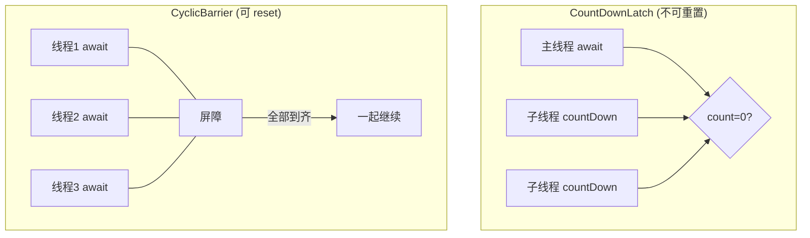

- **面试要点**：
  - CountDownLatch 不可重置，CyclicBarrier 可 reset
  - Semaphore 三个线程轮流打印：acquire(1) + release(1) 控制顺序

---

## IO

### 输入流、输出流
- **说明**：InputStream/Reader 读，OutputStream/Writer 写；字节流处理二进制，字符流处理文本（含编码转换）
- **面试要点**：字节流 InputStream/OutputStream；字符流 Reader/Writer；缓冲流 BufferedXxx 提升性能

### 同步/异步 vs 阻塞/非阻塞
- **说明**：同步/异步看**调用方是否等待结果**；阻塞/非阻塞看**线程是否挂起等待**

```
              │  阻塞(线程挂起)    │  非阻塞(线程不挂起)
──────────────┼──────────────────┼──────────────────
  同步(自己等  │  BIO             │  NIO+Selector
   数据拷贝)  │  read 阻塞等数据  │  轮询/select 就绪后 read
──────────────┼──────────────────┼──────────────────
  异步(回调   │  较少见           │  AIO
   通知结果)  │                  │  提交后立即返回,回调通知
```

- **面试要点**：
  - BIO：同步阻塞（一个连接一个线程）
  - NIO：同步非阻塞（Selector 多路复用，一个线程管多连接）
  - AIO：异步非阻塞（回调通知，Linux 下实际用 epoll 模拟）
  - 四者正交：同步阻塞、同步非阻塞、异步阻塞、异步非阻塞

### BIO / NIO / AIO
- 📖 **专题详解** → [Java-IO模型-NIO与AIO详解](./Java-IO模型-NIO与AIO详解.md)
| 模型 | 特点 | 场景 |
|------|------|------|
| BIO | 一连接一线程，阻塞 IO | 连接数少 |
| NIO | Buffer+Channel+Selector，多路复用 | 高并发（Netty） |
| AIO | 异步回调 | 大文件、连接数多（实际少用） |

- **面试要点**：NIO 核心：Channel 双向、Buffer 缓冲区、Selector 监听多个 Channel 事件；NIO 数据就绪后应用线程自己 read；AIO 由回调通知；Linux 下 Java AIO 用 epoll 模拟，Netty 仍选 NIO

### 设计模式（IO 相关）
- **装饰者**：BufferedInputStream 包装 FileInputStream 加缓冲
- **适配器**：InputStreamReader 字节流→字符流
- **观察者**：NIO 事件监听
- **工厂**：各种 Stream 的工厂方法

---

## 网络

### OSI 七层
- **说明**：应用层→表示层→会话层→传输层（TCP/UDP）→网络层（IP）→链路层→物理层
- **面试要点**：实际常用 TCP/IP 四层：应用层、传输层、网络层、链路层

### Socket
- **说明**：网络通信端点抽象，TCP 用 Socket/ServerSocket，UDP 用 DatagramSocket
- **面试要点**：Socket = IP + 端口，是全双工通信

### TCP
- **说明**：面向连接、可靠、有序、流量控制（滑动窗口）、拥塞控制

**三次握手（建立连接）**
```
客户端                    服务端
  │─── SYN seq=x ────────→│
  │←── SYN+ACK seq=y ─────│
  │─── ACK seq=x+1 ──────→│
  │      连接建立          │
```

**四次挥手（关闭连接）**
```
客户端                    服务端
  │─── FIN ──────────────→│
  │←── ACK ───────────────│
  │←── FIN ───────────────│  (等服务发完)
  │─── ACK ──────────────→│
  │    TIME_WAIT 2MSL     │
```

- **面试要点**：
  - **三次握手**：SYN → SYN+ACK → ACK（确认双方收发能力）
  - **四次挥手**：FIN → ACK → FIN → ACK（全双工需分别关闭）
  - **为什么握手 3 次挥手 4 次**：握手可合并 SYN+ACK；关闭需等数据发完
  - TIME_WAIT 2MSL：防旧包干扰新连接
  - 滑动窗口：接收方告知可接收量，防止发送过快

### UDP
- **说明**：无连接、不可靠、无序、速度快，适合视频、DNS、游戏
- **面试要点**：TCP 可靠慢，UDP 快但不保证送达；选 UDP 场景：实时性 > 可靠性

### DNS 域名解析
- **说明**：域名 → IP 的映射，递归查询（客户端→本地 DNS→根→顶级→权威）
- **面试要点**：浏览器缓存 → 系统 hosts → 本地 DNS → 递归查询

### Java NIO 实现
- 📖 **专题详解** → [Java-IO模型-NIO与AIO详解](./Java-IO模型-NIO与AIO详解.md)
- 📖 **零拷贝 transferTo** → [IO优化-零拷贝-MMAP-DMA详解](./IO优化-零拷贝-MMAP-DMA详解.md)
- **Buffer**：堆内存/直接内存，flip() 切换读写模式，clear() 重置
- **Channel**：双向，FileChannel、SocketChannel；FileChannel.transferTo() 零拷贝
- **Selector**：多路复用，select/poll/epoll；监听 OP_ACCEPT/READ/WRITE/CONNECT
- **面试要点**：DirectBuffer 减少一次拷贝但分配慢，需手动释放防泄漏

### Netty
- **性能优化**：
  - 📖 **零拷贝/MMAP/DMA 详解** → [IO优化-零拷贝-MMAP-DMA详解](./IO优化-零拷贝-MMAP-DMA详解.md)
  - 零拷贝：CompositeByteBuf 组合、DirectBuffer、transferTo/sendfile
  - 内存池化：PooledByteBufAllocator 复用 ByteBuf
  - Reactor 模型：Boss 处理 Accept，Worker 处理 Read/Write

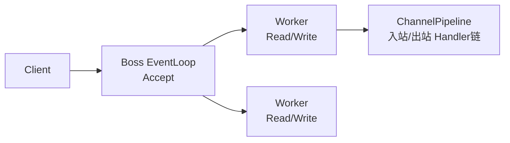

  - 锁优化：细粒度锁、LongAdder、ThreadLocal、CountDownLatch 替代 wait/notify
- **潜在问题**：
  - 空轮询 Bug：JDK epoll 空轮询导致 CPU 100% → Netty 限次后 rebuild Selector
  - DirectBuffer 泄漏：必须 release()，用 leak detector 检测
- **面试要点**：Netty 基于 NIO，异步事件驱动，Pipeline 责任链处理入站/出站

### HTTP / HTTPS
- **说明**：HTTP 无状态请求响应；HTTPS = HTTP + TLS（加密 + 证书认证）
- **面试要点**：
  - HTTP/1.1 长连接；HTTP/2 多路复用；HTTP/3 基于 QUIC(UDP)
  - HTTPS 握手：非对称加密交换对称密钥 → 对称加密传输
  - 状态码：200 成功、301/302 重定向、400 客户端错、401 未认证、403 无权限、404 不存在、500 服务端错

### RPC（gRPC / Dubbo）
- **说明**：远程过程调用，像调本地方法一样调远程服务
- **面试要点**：
  - gRPC：HTTP/2 + Protobuf，跨语言，流式
  - Dubbo：Java 生态，Nacos 注册，支持多种协议（Dubbo/Triple/gRPC）

---

## JVM

### Class 文件结构
- **说明**：魔数 CAFEBABE → 版本号 → 常量池 → 访问标志 → 类/父类/接口索引 → 字段 → 方法 → 属性
- **面试要点**：用 jclasslib 查看；常量池存字面量和符号引用

### 双亲委派机制
- **说明**：类加载：Bootstrap → Extension → Application → 自定义；子加载器先委派父加载器，父无法加载才自己加载

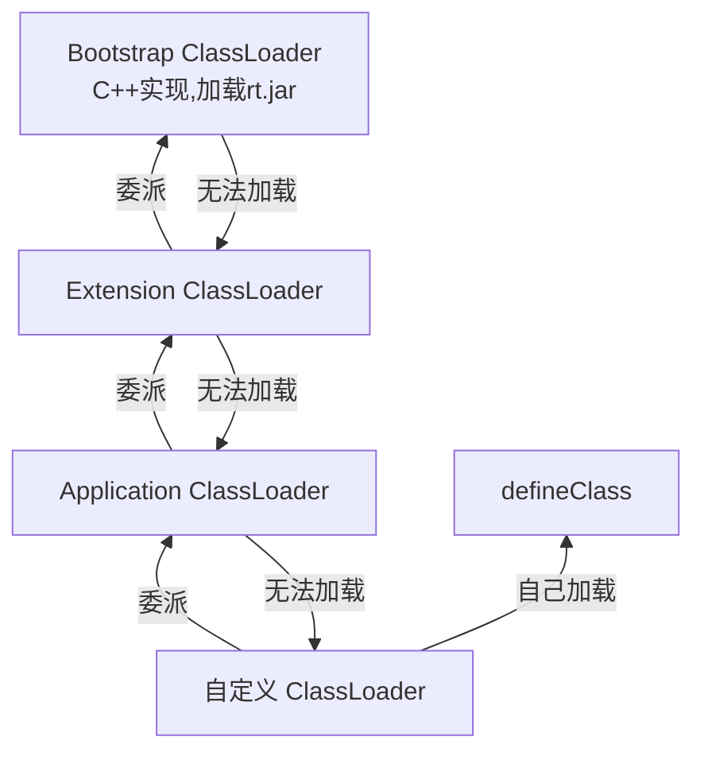

- **面试要点**：
  - 作用：保证核心类不被篡改（如自定义 java.lang.String 无效）
  - 破坏场景：Tomcat 隔离 Web 应用、SPI（线程上下文类加载器）、OSGi
  - 字节码加密：自定义 ClassLoader 解密后 defineClass

### JVM 运行时数据区
- **说明**：
  - 线程共享：堆（对象实例）、方法区/元空间（类信息、常量、静态变量）
  - 线程私有：虚拟机栈（方法帧、局部变量）、本地方法栈、程序计数器

```
┌────────────── 线程共享 ──────────────────┐
│  堆 Heap (对象)   │  方法区/元空间 (类信息)  │
├────────────── 线程私有 ──────────────────┤
│ 虚拟机栈 │ 本地方法栈 │ 程序计数器(PC)      │
│ (每个线程各一份)                          │
└─────────────────────────────────────────┘
JDK8: 永久代 → 元空间(本地内存,默认无上限)
```

- **面试要点**：
  - JDK8 方法区用元空间（本地内存），替代永久代
  - 栈溢出 StackOverflowError（递归过深）；堆溢出 OutOfMemoryError

### JVM OOM 类型
| 区域 | 异常 | 原因 |
|------|------|------|
| 堆 | Java heap space | 对象太多/泄漏 |
| 栈 | StackOverflowError | 递归/栈帧过大 |
| 方法区/元空间 | Metaspace OOM | 类加载过多 |
| 直接内存 | Direct buffer memory | NIO 未释放 |
| 程序计数器 | 不会 OOM | — |

### 对象创建过程
- **说明**：类加载检查 → 分配内存（指针碰撞/空闲列表）→ 初始化零值 → 设置对象头 → `<init>` 构造
- **面试要点**：
  - 并发分配：CAS 或 TLAB（Thread Local Allocation Buffer，线程私有分配缓冲）
  - 栈上分配：逃逸分析 + 标量替换，未逃逸对象可能在栈上分配

### 垃圾判断与回收
- **可达性分析**（Java 采用）：从 GC Roots 不可达则可回收
  - GC Roots：栈中引用、静态变量、常量、JNI 引用、Synchronized 持有的对象
- **引用计数**（Python 等）：循环引用无法回收，Java 不用
- **三色标记**：白（未访问）灰（访问中）黑（已完成）；漏标问题 → 增量更新（CMS）或 SATB（G1）
- **STW**：Stop-The-World，GC 时暂停所有用户线程
- **安全点**：可中断位置（方法调用、循环跳转）；安全区：线程处于 Sleep/Blocked 时的区域
- **面试要点**：空间满触发 GC；finalize 已废弃

### 分代收集理论
- **说明**：弱分代假说：大多数对象朝生夕灭；强分代假说：熬过多次 GC 的对象难消亡

```
新生代 (Minor GC 频繁, 复制算法)          老年代 (Major/Full GC)
┌────────┬──────┬──────┐                ┌──────────────┐
│  Eden  │  S0  │  S1  │  年龄≥阈值 ──→ │   Old Gen    │
│  8     │  1   │  1   │                │ 标记清除/整理  │
└────────┴──────┴──────┘                └──────────────┘
  新对象    Survivor 互换复制存活对象
```

- **新生代**：Eden + 2 Survivor，复制算法，Minor GC 频繁
- **老年代**：标记-清除/整理，Major/Full GC 慢
- **面试要点**：对象优先 Eden 分配 → Minor GC 存活进 Survivor → 年龄达阈值进老年代

### 垃圾回收算法
- **复制**：分两块，存活复制到另一块，适合新生代（Eden+Survivor）
- **标记-清除**：标记存活，清除未标记，产生碎片
- **标记-整理**：标记后移动存活对象，消除碎片，适合老年代
- **面试要点**：没有完美算法，分代组合使用

### 常用垃圾回收器
| 回收器 | 特点 | 场景 |
|--------|------|------|
| Serial | 单线程 STW | 客户端 |
| ParNew | Serial 多线程版 | 配合 CMS |
| Parallel Scavenge | 吞吐量优先 | 后台计算 |
| CMS | 并发标记清除，低延迟，有碎片 | 已废弃 |
| G1 | 分区 Region，可预测停顿，JDK9 默认 | 通用 |
| ZGC | 超低延迟（<10ms），染色指针 | 大堆低延迟 |

- **面试要点**：PS+PO（Parallel Scavenge + Parallel Old）吞吐量；G1 Mixed GC；ZGC 颜色指针标记对象状态

### 线上问题排查
- **CPU 100%**：`top -Hp pid` 找线程 → `jstack pid` 看栈 → 定位热点方法/死循环
- **内存溢出**：`-XX:+HeapDumpOnOutOfMemoryError` → MAT 分析大对象/泄漏
- **死锁**：`jstack` 搜 deadlock
- **面试要点**：常用工具 jps、jstat、jmap、jstack、MAT、Arthas

---

## Tomcat

### Servlet 生命周期
- **说明**：init() 初始化 → service() 处理请求 → destroy() 销毁；由容器管理生命周期
- **面试要点**：service() 根据 HTTP 方法分发到 doGet/doPost 等

### Tomcat 架构
- **Server** → **Service**（Connector + Engine）→ **Host** → **Context** → **Wrapper**（Servlet）
- **Connector**：接收请求（HTTP/AJP），解析协议
- **Engine**：Servlet 引擎，处理请求管道
- **面试要点**：一个 Service 可有多个 Connector 共用一个 Engine；请求链 Valve 管道处理

---

## MySQL

### 事务 ACID
- **A 原子性**：undo log 回滚
- **C 一致性**：业务+数据库约束共同保证
- **I 隔离性**：MVCC + 锁
- **D 持久性**：redo log

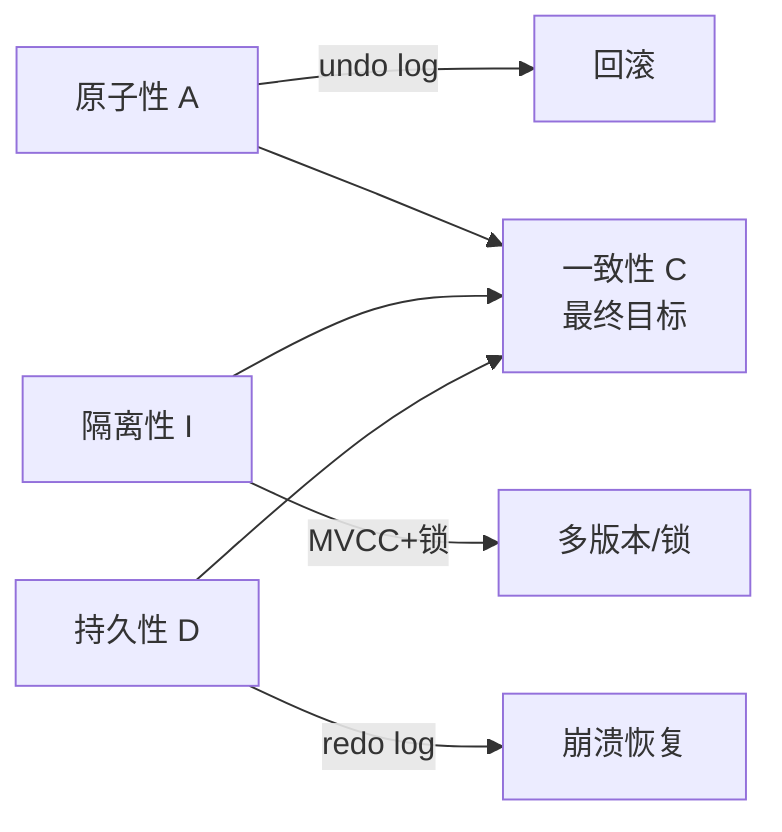

- **面试要点**：ACID 靠 undo/redo/MVCC/锁 实现，一致性是最终目标

### InnoDB 存储结构
- **逻辑**：表空间 → 段 → 区(1MB,64页) → 页(16KB，最小 IO 单元)
- **物理**：8.0 取消 .frm，表结构存数据字典（InnoDB 数据字典）
- **面试要点**：一行记录可能跨页（溢出页）；页内按行存储

### InnoDB vs MyISAM
| 对比 | InnoDB | MyISAM |
|------|--------|--------|
| 事务 | 支持 | 不支持 |
| 锁 | 行锁 | 表锁 |
| 索引 | 聚簇索引 | 非聚簇 |
| 崩溃恢复 | 支持 | 不支持 |
| 面试 | InnoDB 默认引擎，MyISAM 已淘汰 | |

### 索引（B+ 树）
- **聚簇索引**：叶子存完整行数据，InnoDB 主键即聚簇索引
- **二级索引**：叶子存主键值，查非索引列需**回表**
- **覆盖索引**：查询列全在索引中，无需回表（Extra: Using index）
- **最左前缀**：联合索引 (a,b,c) 可匹配 a、ab、abc，不能跳过 a 直接用 b

```
B+ 树 (聚簇索引, 叶子=完整行)        二级索引 (叶子=主键值)
        [10|20|30]                         [name索引]
       /    |    \                        /        \
  [1,10][10,20][20,30]              [张三→id=5] [李四→id=8]
      ↓ 叶子链表                         ↓ 回表: 用 id 再查聚簇索引
  [完整行数据...]                      [完整行数据...]
```

- **三星索引**：① 扫描范围小 ② 排序与查询一致 ③ 覆盖索引不回表
- **面试要点**：
  - 为什么 B+ 树不用 B 树：B+ 树叶子链表便于范围查询，非叶子只存 key 更矮
  - Hash 索引：等值快，不支持范围/排序；Memory 引擎支持

### 锁
- **当前读**（加锁读）：SELECT ... FOR UPDATE / LOCK IN SHARE MODE、UPDATE、DELETE
- **快照读**（普通读）：MVCC 读历史版本，不加锁
- **S 锁**（共享）：可读不可写；**X 锁**（排他）：不可读不可写
- **意向锁**（IS/IX）：表级，快速判断是否有行锁冲突
- **行锁类型**：Record Lock（记录锁）、Gap Lock（间隙锁，防幻读）、Next-Key Lock（Record+Gap）
- **面试要点**：
  - 无索引条件 → 锁全表（表锁）
  - RR 级别 Next-Key Lock 防幻读；RC 只用 Record Lock
  - 死锁：InnoDB 自动检测，回滚代价小的事务

### Explain 执行计划
- **关键列**：type（访问类型，const>ref>range>index>ALL）、key（实际索引）、rows（扫描行数）、Extra（Using index/Using filesort/Using temporary）
- **面试要点**：type=ALL 全表扫描需优化；Extra 出现 filesort/temporary 需关注

### 高性能索引规则
- 不在索引列做函数/运算/类型转换
- 联合索引遵循最左前缀，范围条件放最后
- 尽量覆盖索引；慎用 `!=`、`<>`、`OR`（OR 两侧都有索引才走索引）
- `IS NULL` 可走索引；`IS NOT NULL` 通常不走
- `LIKE 'abc%'` 可走索引，`'%abc'` 不行
- 字符串列不加引号会隐式转换导致索引失效
- 主键自增顺序插入减少页分裂
- **面试要点**：口诀「最左前缀、覆盖索引、避免函数、范围放后」

### Buffer Pool
- **说明**：InnoDB 内存缓存，缓存数据页和索引页；LRU 改进版（Young:Old = 5:3）
- **面试要点**：新页插入 Old 区头部，淘汰 Old 尾部；多实例 Buffer Pool 减少锁竞争

### Change Buffer
- **说明**：二级索引变更时，若目标页不在 Buffer Pool，先缓存在 Change Buffer，下次读取时 merge
- **面试要点**：仅适用于非唯一二级索引；唯一索引需立即读页校验唯一性

### Double Write Buffer
- **说明**：页写入时先写 double write 区域（顺序写），再写数据文件；崩溃时从 double write 恢复
- **面试要点**：解决部分页写入（partial page write）问题

### Redo Log
- **说明**：InnoDB 物理日志，记录页的修改；WAL 先写日志再写盘；环形文件，write pos 和 checkpoint


- **面试要点**：
  - redo log 保证持久性（崩溃恢复）；binlog 保证主从复制
  - 两阶段提交：redo prepare → binlog → redo commit
  - 批量插入：可以排序来优化插入性能。
  - 批量更新：不需要排序

### Undo Log
- **说明**：逻辑日志，记录反向操作；用于回滚和 MVCC 多版本
- **隐藏列**：DB_TRX_ID（事务 ID）、DB_ROLL_PTR（回滚指针）、DB_ROW_ID（隐式主键）

### MVCC
- **说明**：多版本并发控制，快照读不加锁；通过 undo log 链 + Read View 判断可见性
- **Read View 四属性**：creator_trx_id、trx_ids（活跃事务）、min_trx_id、max_trx_id
- **可见性规则**：trx_id < min → 可见；trx_id ≥ max 或在 trx_ids 中 → 不可见；否则可见

```
行记录 ──→ undo log v3 ──→ undo log v2 ──→ undo log v1
           (trx=105)        (trx=102)        (trx=100)

Read View: min_trx=101, max_trx=110, active={102,105,108}
  trx_id < 101  → 可见
  trx_id ≥ 110  → 不可见
  trx_id 在 active 中 → 不可见
  否则 → 可见
RC: 每次读新建 View | RR: 首次读创建, 之后复用
```

- **面试要点**：
  - RC 每次读生成新 Read View；RR 首次读生成，之后复用（解决不可重复读）
  - 幻读：RR + 当前读用 Next-Key Lock 防；快照读靠 MVCC

### Binlog
- **说明**：Server 层逻辑日志，所有引擎通用；三种格式：STATEMENT、ROW、MIXED
- **面试要点**：主从复制、数据恢复靠 binlog；ROW 格式记录行变更，更安全

### 事务隔离级别
| 级别 | 脏读 | 不可重复读 | 幻读 |
|------|------|-----------|------|
| 读未提交 | ✗ | ✗ | ✗ |
| 读已提交 | ✓ | ✗ | ✗ |
| 可重复读（默认） | ✓ | ✓ | 快照读✓/当前读✗ |
| 串行化 | ✓ | ✓ | ✓ |

- **面试要点**：MySQL 默认可重复读；Oracle 默认读已提交

### 主从同步
- **流程**：Master 写 binlog → Slave IO 线程拉取 → relay log → SQL 线程重放

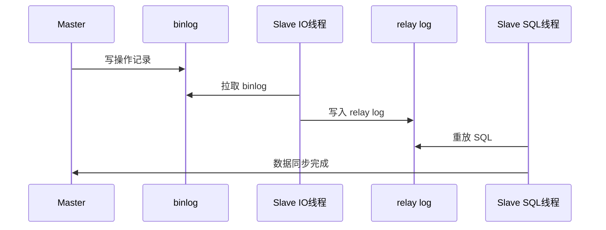

- **延迟优化**：并行复制、避免大事务、半同步复制、从库硬件升级
- **面试要点**：异步复制有延迟；半同步等至少一个从库 ACK

---

## Redis

### 应用场景
- **缓存穿透**：查不存在的数据，绕过缓存直击 DB → 布隆过滤器 / 缓存空值
- **缓存击穿**：热点 key 过期瞬间大量请求 → 互斥锁 / 逻辑过期（不设 TTL，异步更新）
- **缓存雪崩**：大量 key 同时过期或 Redis 宕机 → 过期时间加随机值 / 集群高可用

```
穿透: 请求 ──→ 缓存miss ──→ DB(数据本不存在) ──→ 反复打穿
      防御: 布隆过滤器 / 缓存空值

击穿: 热点key过期 ──→ 大量并发同时 miss ──→ 齐打 DB
      防御: 互斥锁重建 / 逻辑过期(不设TTL)

雪崩: 大量key同时过期 / Redis宕机 ──→ 请求涌向 DB
      防御: TTL加随机 / 集群高可用 / 限流降级
```

- **排行榜/计数器**：ZSet / INCR
- **共享 Session**：集中存储用户会话
- **分布式锁**：SET NX EX + Lua 脚本释放；生产推荐 Redisson（可重入 + 看门狗）
- 📖 **专题详解** → [Redisson分布式锁详解](./Redisson分布式锁详解.md)（lock/tryLock、锁归属、释放、看门狗续约）
- 📖 **专题详解** → [Redis-RedLock红锁详解](./Redis-RedLock红锁详解.md)（主从丢锁、过半加锁、RedissonRedLock、争议与选型）
- **分布式 ID**：INCR / 雪花算法
- **布隆过滤器**：BitMap 实现，判断元素可能存在/一定不存在
- **GEO**：地理位置，GEORADIUS 附近的人
- **面试要点**：穿透 vs 击穿 vs 雪崩 三者区别要能一句话说清
- **Lua脚步**：redis执行lua脚本可以实现批量处理功能，使用lua脚本实现分布式锁
- **面试要点**：生产环境的key的批量操作，建议使用scan命令key的批量操作生产环境建议使用scan命令-

### 数据一致性
- **建议**：先更新 DB，再删缓存（Cache Aside）
- **延迟双删**：删缓存 → 更新 DB → 延迟再删缓存（防脏读）
- **面试要点**：先删后写可能脏读；先写后删可能短暂不一致，最终一致
- **为什么不修改后立即修改缓存**：因为缓存都是查多改少，查询的条件就是redis的key，修改接口没办法很好的管理其它的查询方法，维护起来非常复杂，触发查询接口单一不会扩展和改变。

### 持久化
- **RDB**：快照，fork 子进程写盘；恢复快但可能丢最后一次快照后的数据
- **AOF**：追加写命令，everysec 最多丢 1 秒；AOF 重写压缩体积
- **混合持久化**（4.0+）：RDB 全量 + AOF 增量，重启最快
- **面试要点**：重启加载：AOF 优先 → RDB → 旧版 AOF

### 事务
- **说明**：MULTI → 命令入队 → EXEC 执行；不支持回滚，错误命令入队前发现
- **面试要点**：弱一致性，非 ACID；WATCH 实现 CAS 乐观锁

### 5 大数据类型底层
| 类型 | 底层 | 要点 |
|------|------|------|
| String | SDS | O(1) 取长度，二进制安全，预分配 |
| List | quicklist（双向链表+压缩列表） | 3.2+ 快速列表 |
| Hash | ziplist / hashtable | 元素少且短用 ziplist |
| Set | intset / hashtable | 整数集合用 intset |
| ZSet | ziplist / skiplist+dict | 跳表 O(logN) 范围查询 |

- **面试要点**：SDS 比 C 字符串多 len/free 字段；跳表多层索引类似 B+ 树；

### 主从 & 哨兵
- **主从复制**：全量（RDB 快照）→ 部分（复制偏移量 + 复制缓冲区，默认 1MB）
- **哨兵**：3 个定时任务（10s info / 2s 订阅 / 1s ping）；主观下线 → 客观下线（quorum 过半）→ Raft 选 Leader → 故障转移
- **故障转移选主**：过滤不健康 → slave-priority → 复制偏移量最大 → runid 最小
- **脑裂**：网络分区导致多主；min-slaves-to-write 限制
- **面试要点**：异步复制有丢数据风险；哨兵至少 3 节点防脑裂
- 📖 **专题详解** → [Redis部署模式对比-单机哨兵集群](./Redis部署模式对比-单机哨兵集群.md)（单机/哨兵/集群优缺点、选型、注意事项）

### 集群模式
- **说明**：16384 槽位，CRC16(key) % 16384 定位；Gossip 协议交换状态
- **面试要点**：一致性 Hash 减少扩容迁移；MOVED/ASK 重定向

## 一致性hash
先分一定配数量的点2^n-1、这些点组成一个hash环（圆环），然后通过机器节点的信息计算出每个节点在hash环上的位置，然后操作key时，先算出key对应的hash环位置，然后顺时针找到最接近key的节点。
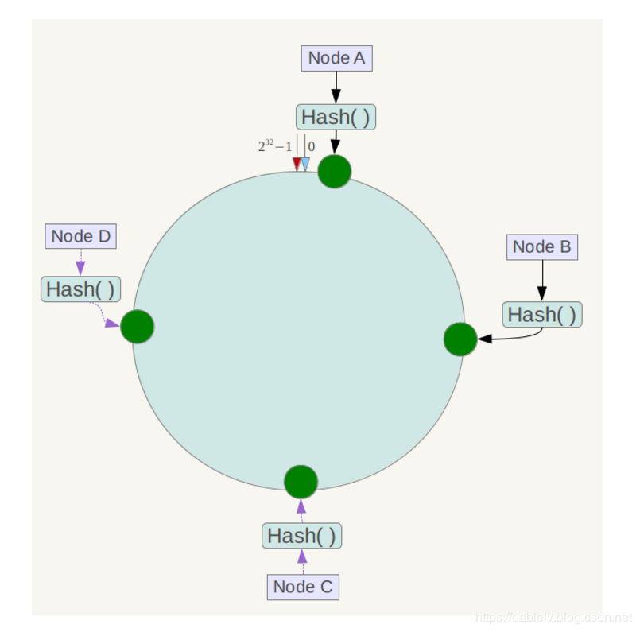
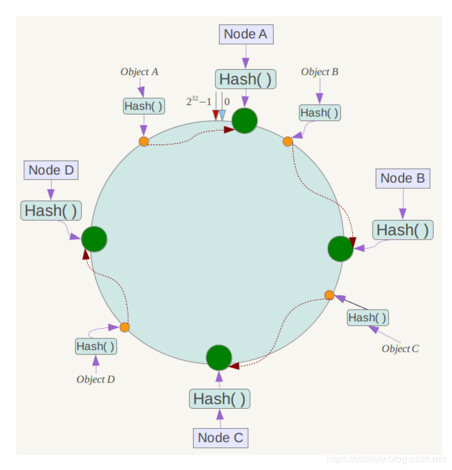

### 线程模型
- **6.0 前**：单线程（命令串行，避免锁）
- **6.0+**：多 IO 线程（读写网络），命令仍单线程（默认 io-threads-do-reads 关闭）
- **面试要点**：单线程也快的原因：纯内存、IO 多路复用、无锁、高效数据结构

### 内存淘汰策略
- **noeviction**：不淘汰，写满报错
- **volatile-xxx**：只淘汰设了过期时间的 key（lru/ttl/random/lfu）
- **allkeys-xxx**：所有 key（lru/random/lfu）
- **近似 LRU**：随机采样 5 个，淘汰最久未访问
- **LFU**：按访问频率，24bit 中 16bit 时间 + 8bit 计数（对数编码）
- **面试要点**：生产常用 allkeys-lru 或 volatile-lru；LFU 4.0+ 适合热点明显场景

### 过期策略
- **定期删除**：每秒 10 次，随机取 20 个 key 检查过期
- **惰性删除**：访问时发现过期才删
- **lazyfree**：大 key 删除放后台线程，主线程只标记
- **面试要点**：过期 key 不会立即删除，占内存直到被访问或定期扫描

---

## MQ

### 应用场景
- **异步解耦**：下单后 MQ 通知库存/积分/短信，主流程不阻塞
- **削峰填谷**：秒杀流量写入 MQ，消费者按能力消费
- **分布式事务**：半事务消息（RocketMQ）/ 本地消息表
- **缓存同步**：Canal 监听 binlog → MQ → 更新 Redis
- **面试要点**：MQ 引入后需考虑：消息丢失、重复、顺序、积压
- 📖 **专题详解** → [三大MQ完整使用教程](./三大MQ-RocketMQ-Kafka-RabbitMQ完整使用教程.md)（RocketMQ/Kafka/RabbitMQ 生产消费代码、配置、注意事项）
- 📖 **专题详解** → [MQ消费失败与消息积压处理](./MQ消费失败与消息积压处理.md)（重试/死信、幂等、Lag 应急与治理）

### 延迟消息
- **RabbitMQ**：TTL + 死信队列（DLX）
- **Kafka**：不支持原生延迟
- **RocketMQ**：18 个延迟等级（1s ~ 2h）
- **面试要点**：延迟消息本质是先存后不立即投递

### 消息有序性
- **全局有序**：单分区/单队列，吞吐低
- **局部有序**：同一业务 key 路由到同一分区（如 orderId hash）
- **面试要点**：前提：生产有序 + 单消费者 + 单分区

### 优化技术
- 📖 **专题详解** → [IO优化-零拷贝-MMAP-DMA详解](./IO优化-零拷贝-MMAP-DMA详解.md)
- **零拷贝**：sendfile，数据不经过用户态
- **MMAP**：内存映射文件，减少 read/write 拷贝
- **DMA**：直接内存访问，CPU 不参与数据拷贝
- **面试要点**：Kafka 高性能 = 顺序写盘 + 零拷贝 + 批量 + 分区并行

### 分布式事务
- **RocketMQ 半事务**：发 half 消息 → 执行本地事务 → commit/rollback → 未决则回查
- **最终一致性**：允许短暂不一致，最终达到一致
- **面试要点**：强一致用 2PC/XA；高吞吐用最终一致 + 补偿

### 重复消费
- **说明**：网络重试、Rebalance 等导致重复，消费端必须幂等
- **方案**：唯一索引 / 状态机 / Redis SETNX / 版本号乐观锁
- **面试要点**：幂等 key = 业务唯一标识（如 orderId + 操作类型）

### Kafka 要点
- **消费策略**：earliest（从头）/ latest（最新）/ none（无 offset 报错）
- **Ack**：0 不等待 / 1 Leader 确认 / all 所有 ISR 确认（最可靠）
- **幂等性**：PID + Sequence Number，需 retries=true + acks=all
- **事务**：transactional.id 唯一，跨分区原子写
- **架构**：Topic → Partition → Leader/Follower（ISR 同步副本集）
- **Rebalance**：消费者组变化时重新分配分区
- **面试要点**：
  - Kafka 不区分主从，Partition 有 Leader 负责读写
  - 消费者 offset 存 __consumer_offsets 或外部（Kafka 0.9+ 内置）
  - 丢消息：producer acks=0 / broker 异步刷盘 / consumer 自动提交后崩溃

### RocketMQ 要点
- **vs Kafka**：Topic 逻辑分散在多个 Broker 的 Queue；Kafka Partition 全量复制
- **消费模式**：集群（负载均衡）/ 广播（每个消费者都收到）
- **高可用**：同步/异步刷盘 + 主从同步 + Dledger 自动选主
- **零丢失**：同步发送 + 同步刷盘 + 同步复制 + 手动 ACK
- **面试要点**：
  - NameServer 轻量注册中心（无选举）
  - 死信队列：重试 16 次后进入 DLQ（详见 [消费失败与积压专题](./MQ消费失败与消息积压处理.md)）
  - 事务消息：Half Message → 本地事务 → Commit/Rollback → 回查
  - 消费失败：幂等 + 有限重试 + DLQ；积压：先扩容消费者，并行度 ≤ Queue/Partition 数

---

## MyBatis

### 核心流程
- **说明**：加载配置 → 解析 Mapper XML → SqlSessionFactory 创建 SqlSession → Executor 执行 SQL → 结果映射
- **面试要点**：MyBatis 是对 JDBC 的封装，非 ORM（不管理对象生命周期）

### SqlSessionFactory vs SqlSession
- **SqlSessionFactory**：工厂，线程安全，应用级单例
- **SqlSession**：会话，线程不安全，请求级；封装 CRUD 和事务
- **面试要点**：Spring 集成后 SqlSession 由 SqlSessionTemplate 管理，线程安全

### Executor 三种实现
- **SimpleExecutor**：每次新建 Statement
- **ReuseExecutor**：复用 Statement（同 SQL）
- **BatchExecutor**：批量提交，flushStatements() 执行
- **面试要点**：BatchExecutor 适合批量 insert/update

### #{} vs ${}
- **#{}**：预编译占位符，防 SQL 注入（PreparedStatement）
- **${}**：字符串拼接，用于动态表名/列名/ORDER BY
- **面试要点**：能用 #{} 不用 ${}；${} 需白名单校验

### 缓存
- **一级缓存**：SqlSession 级别，默认开启；同一 Session 相同查询走缓存
- **二级缓存**：Mapper 命名空间级别，需 `<cache/>` 开启；跨 Session 共享
- **面试要点**：
  - 一级缓存：update/insert/delete/commit 后清空
  - 二级缓存：序列化存储，注意脏读；分布式环境用 Redis 替代

### 插件机制
- **说明**：Interceptor 接口，基于 JDK 动态代理，可拦截 Executor/StatementHandler/ParameterHandler/ResultSetHandler
- **面试要点**：分页插件 PageHelper 就是 Interceptor 实现

### 设计模式
- **建造者**：SqlSessionFactoryBuilder、XMLConfigBuilder
- **工厂**：SqlSessionFactory
- **代理**：Mapper 接口 JDK 动态代理
- **装饰器**：CachingExecutor 包装 BaseExecutor
- **适配器**：日志模块适配 Log4j/Logback
- **模板方法**：BaseExecutor 定义流程，子类实现 doUpdate/doQuery
- **面试要点**：Mapper 接口无实现类，运行时动态代理生成

---

## Spring 系列

### IOC & DI
- **IOC**：控制反转，对象创建交给容器
- **DI**：依赖注入，容器注入依赖（构造器/@Autowired/setter）
- **面试要点**：IOC 是思想，DI 是实现方式；好处：解耦、便于测试

### refresh 方法（容器启动 12 步）
1. prepareRefresh → 2. obtainFreshBeanFactory → 3. prepareBeanFactory → 4. postProcessBeanFactory → 5. invokeBeanFactoryPostProcessors → 6. registerBeanPostProcessors → 7. initMessageSource → 8. initApplicationEventMulticaster → 9. onRefresh → 10. registerListeners → 11. finishBeanFactoryInitialization（实例化单例 Bean）→ 12. finishRefresh
- **面试要点**：BeanFactoryPostProcessor 在 Bean 实例化**前**修改 BeanDefinition；BeanPostProcessor 在 Bean 实例化**后**加工

### Bean 生命周期
- 实例化 → 属性填充 → Aware 回调 → BeanPostProcessor.before → @PostConstruct / InitializingBean → init-method → BeanPostProcessor.after → 使用 → @PreDestroy / DisposableBean → destroy-method

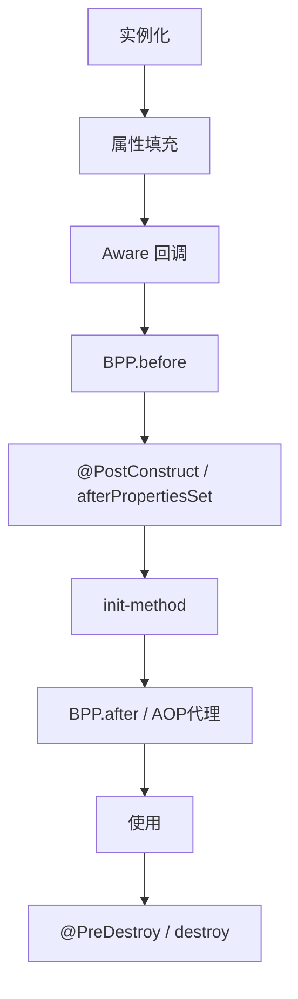

- **面试要点**：
  - 循环依赖：单例 + 属性注入可通过三级缓存解决；构造器注入无法解决
  - 三级缓存：

```
① singletonObjects      成品 Bean
② earlySingletonObjects  早期暴露(未完成初始化)
③ singletonFactories     ObjectFactory 可生成早期引用

A依赖B, B依赖A: B创建中放③ → A从③拿B早期引用 → B完成 → A完成
```

### AOP
- **核心概念**：切面(Aspect)、切点(Pointcut)、通知(Advice)、连接点(JoinPoint)、织入(Weaving)
- **通知类型**：@Before、@After、@Around、@AfterReturning、@AfterThrowing
- **实现**：JDK 动态代理（有接口）/ CGLIB（无接口，继承目标类）

```
有接口:  JDK动态代理                无接口: CGLIB
Client → Proxy(接口)               Client → 子类(继承目标类)
           ↓                                  ↓
        Target                            Target
        拦截→Advice                      拦截→Advice
```

- **面试要点**：
  - @Transactional 基于 AOP，同类内部调用不生效（未走代理）
  - CGLIB 不能代理 final 方法和类

### 事务传播 7 种
| 传播 | 行为 |
|------|------|
| REQUIRED（默认） | 有则加入，无则新建 |
| SUPPORTS | 有则加入，无则非事务 |
| MANDATORY | 有则加入，无则抛异常 |
| REQUIRES_NEW | 总是新建，挂起当前 |
| NOT_SUPPORTED | 非事务，挂起当前 |
| NEVER | 非事务，有则抛异常 |
| NESTED | 嵌套事务（Savepoint） |

- **面试要点**：REQUIRES_NEW 适合日志记录（不受外层回滚影响）；NESTED 外层回滚内层也回滚，内层回滚不影响外层

### Spring MVC
- **九大组件**：HandlerMapping、HandlerAdapter、HandlerExceptionResolver、ViewResolver 等
- **doDispatch 流程**：请求 → 找 Handler → 找 Adapter → 拦截器 pre → 执行 Handler → 拦截器 post → 渲染视图 → afterCompletion
- **面试要点**：DispatcherServlet 是前端控制器；@Controller + @RequestMapping

### Spring Boot 自动配置
- **@EnableAutoConfiguration** → @Import(AutoConfigurationImportSelector) → 读取 META-INF/spring/org.springframework.boot.autoconfigure.AutoConfiguration.imports（2.7+）或 spring.factories
- **@Conditional**：@ConditionalOnClass/MissingBean/Property 等条件装配
- **DeferredImportSelector**：延迟加载，等用户配置处理完再导入
- **面试要点**：starter = 依赖 + 自动配置类；自定义 starter 写 Configuration + spring.factories

### Spring 扩展点（常考）
- **BeanFactoryPostProcessor**：修改 BeanDefinition（最早）
- **BeanPostProcessor**：Bean 初始化前后加工
- **ApplicationListener**：事件监听
- **Aware 系列**：BeanNameAware、BeanFactoryAware、ApplicationContextAware
- **InitializingBean / DisposableBean**：init/destroy 回调
- **FactoryBean**：生产复杂 Bean（如 MyBatis SqlSessionFactoryBean）
- **ApplicationRunner / CommandLineRunner**：启动后执行
- **面试要点**：MyBatis 集成靠 FactoryBean + MapperScannerConfigurer(BDRPP)

### 配置加载顺序
`./config/` → `./` → `classpath:/config/` → `classpath:/`（后加载的覆盖先加载的）

---

## 微服务

### 注册中心
- **Nacos**：AP（Distro 协议，最终一致）+ CP（Raft，临时实例）；客户端 5s 心跳，服务端 15s 不健康 / 30s 剔除
- **Zookeeper**：CP；Leader 选举（ZXID 大优先，SID 大优先）；Watcher 推送变更
- **面试要点**：Nacos 支持 AP+CP 切换；ZK 节点多时 Watcher 性能差

### 配置中心（Nacos）
- **说明**：配置三要素 `dataId`（配置 ID）+ `group`（分组，默认 DEFAULT_GROUP）+ `namespace`（命名空间/租户隔离）；客户端本地缓存 + 故障时使用 snapshot 兜底

#### 1.x 监听机制（HTTP 长轮询）
- **核心接口**：`POST /nacos/v1/cs/configs/listener`（监听）+ `GET /nacos/v1/cs/configs`（拉取详情）
- **流程**：客户端携带本地配置 **MD5 列表** 发起长轮询 → 服务端对比 MD5：
  - 有变更 → 立即返回变更的 groupKey 列表
  - 无变更 → Servlet AsyncContext **挂起请求**（默认 30s，实际 hang 29.5s 防超时）→ 期间变更则 `LocalDataChangeEvent` 唤醒推送
- **客户端**：`ClientWorker` 每 10ms 检查监听列表，每 **3000 个** CacheData 一组发起长轮询；收到变更后按 dataId 拉取全量配置
- **早期辅助**：1.x 早期有 UDP 推送加速，**不可靠仅辅助**，客户端仍以轮询为准

```
1.x 配置监听（推拉结合）
客户端                          Nacos Server
  │  POST /listener + MD5列表      │
  ├──────────────────────────────→│  MD5 一致 → 挂起 29.5s
  │                               │  MD5 不一致 → 立即返回 groupKey
  │←──────────────────────────────┤  挂起期间变更 → 推送 groupKey
  │  GET /configs 拉取变更项详情    │
  ├──────────────────────────────→│
  │←──────────────────────────────┤  返回最新配置内容
  │  更新本地缓存，再次长轮询       │
```

#### 2.x 监听机制（gRPC 长连接）
- **通信升级**：废弃 UDP 推送，改用 **gRPC 双向流** 长连接；一条连接多路复用心跳、查询、监听、推送
- **流程**：启动时建立 gRPC 长连接 → 服务端配置变更后 **主动推送变更通知**（groupKey 列表）→ 客户端仅拉取**变更项**（非全量轮询）
- **连接层**：新增 Connection Layer 统一管理连接、请求路由；集群节点间同步也改 gRPC，只同步变更部分
- **优势**：推送延迟 **秒级 → 毫秒级**；减少 TIME_WAIT 堆积；KeepAlive 替代频繁心跳，降低 TPS
- **兼容**：2.x Server 同时支持 gRPC（2.x 客户端）和 HTTP OpenAPI（1.x 客户端），可平滑升级

```
2.x 配置监听（长连接推送）
客户端                          Nacos Server
  │  建立 gRPC 双向流长连接         │
  ├═══════════════════════════════→│  连接复用（HTTP/2 多路复用）
  │  订阅配置 + 上报 MD5           │
  ├──────────────────────────────→│
  │                               │  配置变更
  │←──────── 推送变更 groupKey ────┤  服务端主动推（无需等轮询）
  │  仅拉取变更的配置项             │
  ├──────────────────────────────→│
  │←──────────────────────────────┤
```

| 维度 | 1.x | 2.x |
|------|-----|-----|
| 通信协议 | HTTP 1.1 长轮询 | gRPC 双向流长连接 |
| 推送方式 | 挂起等待，变更时响应 | 服务端主动推送变更通知 |
| 推送延迟 | 最长 30s（轮询周期） | 毫秒级 |
| 连接模型 | 每次请求可能不同节点 | 同一客户端固定连接同一节点 |
| 心跳 | 依赖长轮询间接保活 | KeepAlive 轻量维持 |
| 集群同步 | HTTP | gRPC，增量同步 |

#### Spring Cloud 集成
**1.x 时代（bootstrap 模式）**：
- 配置写在 `bootstrap.yml` / `bootstrap.properties`（优先于 application 加载）
- 多配置：`spring.cloud.nacos.config.shared-configs`（共享）、`extension-configs`（扩展）
- 加载优先级：profile 配置 > 默认 `${spring.application.name}` > extensionConfigs > sharedConfigs
- 动态刷新：`@RefreshScope` + `@Value`；变更后 **销毁重建 Bean**，注意状态丢失

**2.x 时代 / SCA 2023.0.1.3+（spring.config.import 模式）**：
- `shared-configs` / `extension-configs` **已废弃**，改用 `spring.config.import`
- `bootstrap.yml` 在 SCA **2025.1.x 起不再支持**，统一用 `application.yml`
- 示例：
  ```yaml
  spring:
    config:
      import:
        - nacos:application.yml?refreshEnabled=true          # 默认 group
        - nacos:db.yml?group=DB_GROUP&refreshEnabled=true   # 指定 group
        - optional:nacos:feature.yml?refreshEnabled=false     # 拉取失败不阻塞启动
    cloud:
      nacos:
        config:
          server-addr: 127.0.0.1:8848
  ```
- **refreshEnabled=true** 才会监听变更；否则仅启动时加载一次
- 刷新链路：NacosClient 回调 → SCA 发 `RefreshEvent` → `ContextRefresher` 更新 Environment → `@RefreshScope` / `@ConfigurationProperties` Bean 重建
- 新注解（SCA 较新版本）：`@NacosConfig`（直接注入，默认支持动态更新）、`@NacosConfigListener`（变更回调）

#### 灰度发布
- **Beta 版（IP 灰度）**：控制台发布 Beta 配置，仅指定 IP 的客户端收到灰度版本；优先级最高
- **标签灰度（2.3.2+ Client）**：客户端设置 `nacos.config.gray.label=key=value`（properties > JVM > 环境变量），按标签匹配灰度配置，解决 IP 灰度在 K8s 下 IP 不固定的问题
- **优先级**：IP 灰度 > 标签灰度 > 正式版；多标签灰度按 `priority` 字段排序
- **流程**：发布灰度 → 观察监控 → 扩大标签范围 → 全量发布 / 停止灰度回滚

- **面试要点**：
  - 1.x 长轮询 = **MD5 比对 + 挂起等待**；2.x = **gRPC 长连接 + 服务端主动推**
  - 配置变更检测靠 **MD5**，不是逐字段比较
  - `@RefreshScope` Bean 刷新时销毁重建，有状态 Bean 慎用；`@ConfigurationProperties` 也会刷新
  - SCA 新版本用 `spring.config.import` + `refreshEnabled=true`，别再用 bootstrap + shared-configs
  - 2.x Server 兼容 1.x 客户端，但 2.x 客户端连 1.x Server 不可用

### 网关
- **Gateway**：WebFlux + Netty，Route（路由）+ Predicate（断言）+ Filter（过滤器）
- **Filter 顺序**：pre 越小越先执行，post 越小越后执行
- **面试要点**：Gateway 异步非阻塞；Zuul 1.x 同步阻塞（已停更）

### 负载均衡
- **客户端**：Ribbon / Spring Cloud LoadBalancer（替代 Ribbon）
- **服务端**：Nginx / SLB
- **策略**：轮询、随机、加权响应时间、一致性 Hash
- **面试要点**：@LoadBalanced RestTemplate / OpenFeign 内置负载均衡

### 容错（Sentinel / Hystrix）
- **手段**：隔离、超时、限流、熔断、降级
- **限流算法**：固定窗口、滑动窗口、令牌桶、漏桶
- **Sentinel**：信号量/线程数限流，规则动态推送
- **Hystrix**：线程池/信号量隔离（已停更）
- **面试要点**：令牌桶允许突发流量；漏桶平滑输出

### CAP & BASE
- **CAP**：分区容错 P 必选，C 和 A 只能二选一
- **BASE**：基本可用、软状态、最终一致

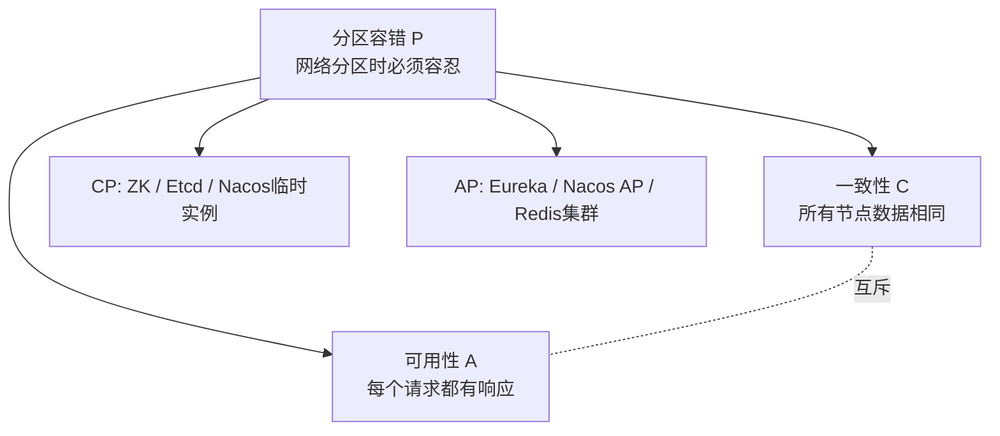

- **面试要点**：CP 系统（ZK、Etcd）；AP 系统（Nacos AP、Eureka）；实际都是 PA + 弱 C 或弱 A

### 分布式事务
- 📖 **专题详解** → [分布式事务-2PC与3PC详解](./分布式事务-2PC与3PC详解.md)
- **2PC**：Prepare → Commit/Rollback；缺点：阻塞、单点、数据不一致
- **3PC**：CanCommit → PreCommit → DoCommit；增加超时减少阻塞
- **Seata AT 模式**：一阶段业务 SQL + undo log 提交；二阶段异步删 undo log 或回滚
- **TCC**：Try（预留）→ Confirm（确认）→ Cancel（取消）；侵入式
- **Saga**：长事务拆多个本地事务 + 补偿
- **最大努力通知**：支付回调，多次重试
- **面试要点**：AT 无侵入靠 undo log；TCC 性能高但代码侵入大

### 分布式 ID
- **UUID**：无序，不适合索引
- **数据库自增**：简单，单点瓶颈
- **号段模式**：批量取 ID（Leaf-segment、TinyId）
- **雪花算法**：1bit符号 + 41bit时间 + 10bit机器 + 12bit序列号；趋势递增

```
雪花算法 64 bit
┌1bit┬────── 41bit 时间戳 ──────┬─10bit 机器ID ─┬─12bit 序列号─┐
│ 0  │ 毫秒级,约69年             │ 5datacenter   │ 4096/ms     │
│    │                          │ +5worker      │             │
└────┴──────────────────────────┴───────────────┴─────────────┘
趋势递增, 适合索引 | 注意: 时钟回拨问题
```

- **面试要点**：雪花时钟回拨问题 → 等待/借用未来 ID；美团 Leaf 双 Buffer 号段

### 一致性协议
- **Raft**：选主 + 日志复制，过半确认（Redis Sentinel、Etcd）
- **ZAB**：ZK 原子广播，崩溃恢复 + 消息广播
- **Gossip**：Redis Cluster 节点间交换状态
- **Distro**：Nacos AP 模式，责任节点 + 异步校验

---

## 23 种设计模式

### 创建型
| 模式 | 说明 | 面试例子 |
|------|------|----------|
| 工厂方法 | 定义创建接口，子类决定实例化哪个类 | Calendar.getInstance() |
| 抽象工厂 | 创建一系列相关对象 | Spring BeanFactory |
| 单例 | 全局唯一实例 | Runtime、Spring Bean 默认单例 |
| 建造者 | 分步构建复杂对象 | StringBuilder、Lombok @Builder |
| 原型 | clone 复制对象 | Object.clone() |

- **面试要点**：单例写法（饿汉/懒汉/双重检查/枚举/静态内部类）；枚举单例防反射和序列化破坏

### 结构型
| 模式 | 说明 | 面试例子 |
|------|------|----------|
| 代理 | 控制对象访问 | Spring AOP、MyBatis Mapper |
| 装饰器 | 动态添加职责 | IO 流 BufferedXxx、Spring Cache |
| 适配器 | 接口转换 | Spring MVC HandlerAdapter |
| 桥接 | 抽象与实现分离 | JDBC Driver |
| 门面 | 统一入口 | SLF4J |
| 组合 | 树形结构统一处理 | Java File 系统 |
| 享元 | 共享细粒度对象 | Integer 缓存、String 常量池 |

### 行为型
| 模式 | 说明 | 面试例子 |
|------|------|----------|
| 观察者 | 一对多通知 | Spring Event、MQ |
| 模板方法 | 骨架固定，步骤可变 | JdbcTemplate、HttpServlet |
| 策略 | 算法可替换 | Comparator、ThreadPoolExecutor 拒绝策略 |
| 迭代器 | 顺序访问集合 | Iterator |
| 状态 | 行为随状态变化 | Thread 状态 |
| 责任链 | 请求沿链传递 | Filter、Interceptor、Netty Pipeline |
| 命令 | 请求封装为对象 | Runnable |
| 中介者 | 对象间解耦通信 | MQ |
| 备忘录 | 保存/恢复状态 | Git |
| 访问者 | 数据结构与操作分离 | 编译器 AST |
| 解释器 | 语法解析 | SpEL、正则 |

- **面试要点**：Spring 中常用：工厂、单例、代理、模板方法、观察者、装饰器、适配器

---

## 架构设计

### 好架构的设计原则
- **说明**：架构是系统中相对稳定的代码结构、设计模式、规范与组件通信方式；好架构让系统安全、稳定、可快速迭代，并统一团队开发规范
- **五大目标**（Clean Architecture / 阿里殷浩）：
  1. **独立于框架**：不绑死 Spring/Dubbo 等，业务逻辑不被框架结构束缚
  2. **独立于 UI**：Web/App/Console 可换，底层不变
  3. **独立于数据源**：MySQL/Redis/Mongo 切换不影响核心业务
  4. **独立于外部依赖**：第三方升级/替换时，核心逻辑不大改
  5. **可测试**：不启动 DB/中间件也能验证核心业务
- **面试要点**：架构关注「边界」与「依赖方向」——外层依赖内层，内层不依赖外层；防腐层隔离外部变化

### DDD 与四层应用架构
- 📖 **专题详解** → [四层应用架构](./四层应用架构.md)
- **说明**：DDD（领域驱动设计）以业务领域为核心建模；四层架构将代码按职责分层，领域层承载核心业务，基础设施层通过 Gateway 防腐

```
┌─────────────────────────────────────────────────────────────┐
│  启动层 server    main 入口、配置、单元测试                  │
├─────────────────────────────────────────────────────────────┤
│  应用服务层 app   provider/consumer/task，编排+校验+DTO转换  │
├─────────────────────────────────────────────────────────────┤
│  领域服务层 domain  核心业务逻辑、Gateway 接口、错误码       │  ← 核心，不依赖外层
├─────────────────────────────────────────────────────────────┤
│  基础设施层 infra   GatewayImpl、DO/Mapper、RPC/HTTP 适配    │  ← 防腐层
└─────────────────────────────────────────────────────────────┘
         api 模块：对外暴露 Dubbo 接口 + Req/DTO 协议
```

| 层次 | 职责 | 关键约束 |
|------|------|----------|
| api | 对外协议（Req/DTO/Provider 接口） | 供客户端依赖，无实现 |
| app | 入参校验、上下文组装、调用 domain | provider/consumer/task 互不调用 |
| domain | 领域服务、实体、Gateway 接口 | 不依赖其他层；service 互不调用 |
| infrastructure | GatewayImpl、DO↔领域对象转换 | 实现防腐；gatewayimpl 互不调用 |
| server | 启动、配置、测试 | 依赖 app + infrastructure |

- **面试要点**：
  - Gateway 接口定义在 **domain**，实现在 **infrastructure**（Repository 同理）
  - DO（数据对象）只在 infrastructure；DTO 在 api；领域对象在 domain——**三层对象不混用**
  - app 层做「薄编排」，复杂业务放 domain；足够简单时可 app 直调 gateway

### 领域划分原则
- **说明**：按业务能力划分子域，每个子域有清晰边界（Bounded Context），内部高内聚、外部低耦合
- **子域分类**：
  - **核心域**：竞争优势所在，投入最多（如电商的订单/交易）
  - **支撑域**：必需但非差异化（如用户、权限）
  - **通用域**：可采购/外包（如短信、支付通道）
- **划分依据**：
  - 业务语义一致（同一 Ubiquitous Language 通用语言）
  - 变更频率相近（一起改的一起放）
  - 团队 ownership 清晰（康威定律：架构反映组织）
  - 数据强一致边界（跨域用事件/最终一致，避免分布式大事务）
- **面试要点**：
  - 限界上下文之间通过 **领域事件 / 消息 / API** 协作，不共享数据库表
  - 大泥球反模式：所有逻辑堆一个服务 → 改一处牵全局
  - 聚合根（Aggregate Root）保证域内一致性，外部只通过聚合根 ID 引用

### 系统拆分原则
- **说明**：从单体到微服务的拆分，核心是在「独立部署收益」与「分布式复杂度」之间权衡
- **何时该拆**：
  - 团队规模扩大，需要独立迭代/发布
  - 某模块资源需求差异大（计算密集 vs IO 密集）
  - 某模块故障需隔离，不能拖垮全局
  - 技术栈需要差异化（如推荐用 Python、交易用 Java）
- **拆分维度**：
  - **按业务能力**（推荐）：订单、库存、支付各一服务
  - **按子域边界**：与 DDD 限界上下文对齐
  - **按读写分离**：CQRS，查询服务与命令服务分开
  - **按流量特征**：热点模块独立扩容
- **拆分禁忌**：
  - 为拆而拆（团队 < 10 人、业务简单时单体更合适）
  - 按技术层拆（「DAO 服务」「Service 服务」——分布式单体）
  - 循环依赖（A 调 B、B 调 A）
  - 共享数据库（拆服务不拆库 = 伪微服务）
- **面试要点**：
  - 拆分粒度口诀：**高内聚、低耦合、独立部署、独立数据**
  - 先模块化（单体内分模块），再服务化；避免一步到位过度拆分
  - 跨服务调用用 **异步消息** 解耦强依赖；同步 RPC 仅用于实时查询

### 高并发架构设计
- **说明**：高并发 = 高 QPS + 低延迟 + 高可用；核心思路是「减少同步等待、分摊压力、快速失败」
- **分层手段**：

```
用户请求
   │
   ▼
CDN / 静态资源 ──→ 减少回源
   │
   ▼
网关（限流·熔断·鉴权）──→ 入口防护
   │
   ▼
缓存（本地 Caffeine → Redis 集群）──→ 读多写少
   │
   ▼
异步化（MQ 削峰填谷）──→ 写操作解耦
   │
   ▼
读写分离 / 分库分表 ──→ 数据库扩展
   │
   ▼
无状态服务水平扩展（K8s HPA）──→ 计算扩展
```

| 手段 | 作用 | 典型组件 |
|------|------|----------|
| 缓存 | 减少 DB 压力 | 本地缓存 + Redis |
| 异步 | 削峰、解耦 | MQ（RocketMQ/Kafka） |
| 读写分离 | 读扩展 | MySQL 主从 |
| 分库分表 | 写扩展 | ShardingSphere-JDBC / Proxy |
| 池化 | 复用昂贵资源 | 连接池、线程池 |
| 限流降级 | 过载保护 | Sentinel、令牌桶 |
| 无状态 | 水平扩容 | 会话存 Redis |

- 📖 **专题详解** → [ShardingSphere-Sharding-JDBC详解](./ShardingSphere-Sharding-JDBC详解.md)（分片路由、绑定表/广播表、读写分离、分布式主键与事务）
- **面试要点**：
  - 先优化单机（SQL、索引、缓存），再考虑分布式；避免过早分库分表
  - 热点数据：**本地缓存 + Redis 多级缓存**；注意一致性与穿透/击穿/雪崩
  - 写路径异步化：下单 → 发 MQ → 异步扣库存/发短信，接口快速返回
  - 幂等设计：唯一键 / Token / 状态机，防 MQ 重复消费
  - 分库分表：查询**必须带分片键**，否则全库路由；关联表用**绑定表**避免笛卡尔积

### 高可用架构设计
- **说明**：系统在部分组件故障时仍能提供服务；目标通常 99.9%（三个九）~ 99.99%
- **核心手段**：
  - **冗余**：多实例部署、多机房/多 AZ、主从/集群
  - **故障转移**：健康检查 + 自动摘除（K8s/SLB/哨兵）
  - **限流熔断降级**：过载时保核心功能，非核心功能降级
  - **超时与重试**：设合理超时；重试加退避+幂等，避免重试风暴
  - **隔离**：线程池/舱壁隔离，慢调用不拖垮全局
  - **灰度发布**：金丝雀/蓝绿，控制爆炸半径
- **面试要点**：
  - 单点消除：注册中心集群、DB 主从、Redis Sentinel/Cluster
  - 雪崩：一个服务慢 → 线程池打满 → 上游级联 → 熔断+超时+隔离
  - CAP 已在微服务章节；高可用侧重 **AP + 最终一致 + 补偿**

### 单体 vs 微服务
| 维度 | 单体 | 微服务 |
|------|------|--------|
| 部署 | 一个包 | 多服务独立部署 |
| 复杂度 | 低（进程内调用） | 高（网络、分布式事务、链路追踪） |
| 扩展 | 整体扩容 | 按服务弹性扩容 |
| 适用 | 初创、小团队、业务未定型 | 大团队、业务边界清晰、高并发 |
| 技术栈 | 统一 | 可异构 |

- **面试要点**：
  - 没有银弹：微服务解决组织与扩展问题，但引入分布式复杂度
  - 演进路径：单体 → 模块化单体 → 核心服务拆分 → 逐步服务化
  - 配套能力：注册发现、配置中心、网关、链路追踪（SkyWalking）、CI/CD

---

## 专题详解索引

| 主题 | 链接 |
|------|------|
| 分布式事务 2PC / 3PC | [分布式事务-2PC与3PC详解](./分布式事务-2PC与3PC详解.md) |
| Java IO 模型 NIO / AIO | [Java-IO模型-NIO与AIO详解](./Java-IO模型-NIO与AIO详解.md) |
| Java 21 虚拟线程 | [Java21-虚拟线程详解](./Java21-虚拟线程详解.md) |
| 零拷贝 / MMAP / DMA | [IO优化-零拷贝-MMAP-DMA详解](./IO优化-零拷贝-MMAP-DMA详解.md) |
| DDD 四层应用架构 | [四层应用架构](./四层应用架构.md) |
| Redisson 分布式锁 | [Redisson分布式锁详解](./Redisson分布式锁详解.md) |
| Redis RedLock 红锁 | [Redis-RedLock红锁详解](./Redis-RedLock红锁详解.md) |
| Redis 部署模式（单机/哨兵/集群） | [Redis部署模式对比-单机哨兵集群](./Redis部署模式对比-单机哨兵集群.md) |
| ShardingSphere / Sharding-JDBC | [ShardingSphere-Sharding-JDBC详解](./ShardingSphere-Sharding-JDBC详解.md) |
| MQ 消费失败与消息积压 | [MQ消费失败与消息积压处理](./MQ消费失败与消息积压处理.md) |

---

> **复习建议**：每个模块先扫 **面试要点**，再回看 **说明** 加深理解。高频串联题：HashMap 原理 → ConcurrentHashMap → 线程池 → JMM/CAS → **AQS** → ReentrantLock → MySQL 索引/MVCC → Redis 缓存三兄弟 → Spring 循环依赖/AOP/事务 → 分布式 CAP/事务 → **DDD 四层架构 / 领域划分 / 高并发分层设计**。
