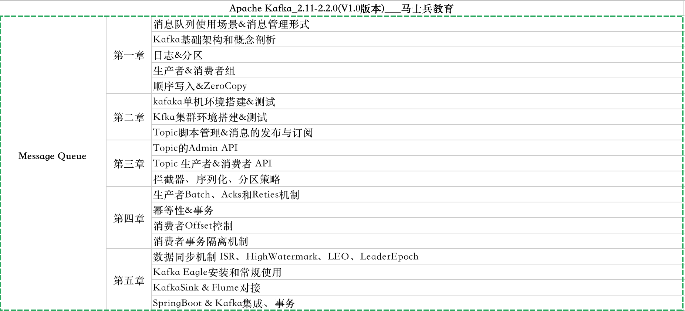
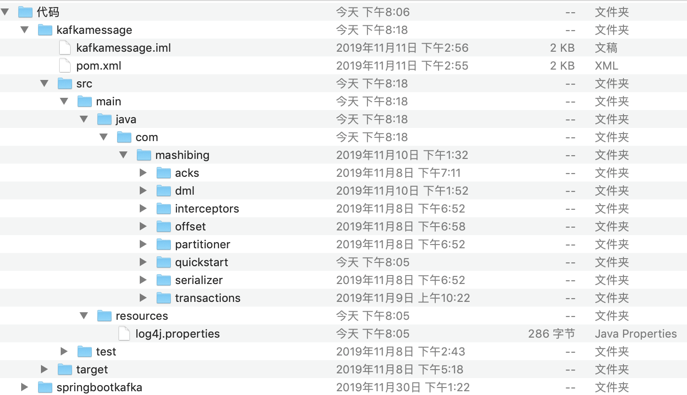
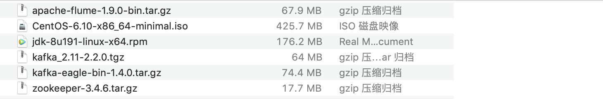

# #课程内容一览表




# 章节一、初识Kafka

## kafka简介

> Apache Kafka是Apache软件基金会的开源的流处理平台，该平台提供了消息的订阅与发布的消息队列，一般用作系统间解耦、异步通信、削峰填谷等作用。同时Kafka又提供了Kafka streaming插件包实现了实时在线流处理。相比较一些专业的流处理框架不同，Kafka Streaming计算是运行在应用端，具有简单、入门要求低、部署方便等优点。
>
> - 消息队列Message Queue 
> - Kafka Streaming 流处理 


## 什么是消息队列

> 消息队列是一种在分布式和大数据开发中不可或缺的中间件。在分布式开发或者大数据开发中通常使用消息队列进行缓冲、系统间解耦和削峰填谷等业务场景，常见的消息队列工作模式大致会分为两大类：
>
> - 至多一次：消息生产者将数据写入消息系统，然后由消费者负责去拉去消息服务器中的消息，一旦消息被确认消费之后 ，由消息服务器主动删除队列中的数据，这种消费方式一般只允许被一个消费者消费，并且消息队列中的数据不允许被重复消费。
> - 没有限制:同上诉消费形式不同，生产者发不完数据以后，该消息可以被多个消费者同时消费，并且同一个消费者可以多次消费消息服务器中的同一个记录。主要是因为消息服务器一般可以长时间存储海量消息。

## 消息的管理形式

Kafka集群以Topic形式负责分类集群中的Record每一个Record属于一个Topic。每个Topic底层都会对应一组分区的日志用于持久化Topic中的Record。同时在Kafka集群中，Topic的每一个日志的分区都一定会有1个Borker担当该分区的Leader，其他的Broker担当该分区的follower，Leader负责分区数据的读写操作，follower负责同步改分区的数据。这样如果分区的Leader宕机，改分区的其他follower会选取出新的leader继续负责该分区数据的读写。其中集群的中Leader的监控和Topic的部分元数据是存储在Zookeeper中.


## Topic

Kafka中所有消息是通过Topic为单位进行管理，每个Kafka中的Topic通常会有多个订阅者，负责订阅发送到该Topic中的数据。Kafka负责管理集群中每个Topic的一组日志分区数据。

生产者将数据发布到相应的Topic。负责选择将哪个记录分发送到Topic中的哪个Partition。例如可以round-robin方式完成此操作，然而这种仅是为了平衡负载。也可以根据某些语义分区功能（例如基于记录中的Key）进行此操作。

每组日志分区是一个有序的不可变的的日志序列，分区中的每一个Record都被分配了唯一的序列编号称为是offset，Kafka 集群会持久化所有发布到Topic中的Record信息，改Record的持久化时间是通过配置文件指定,默认是168小时。

log.retention.hours=168

Kafka底层会定期的检查日志文件，然后将过期的数据从log中移除，由于Kafka使用硬盘存储日志文件，因此使用Kafka长时间缓存一些日志文件是不存在问题的。

在消费者消费Topic中数据的时候，每个消费者会维护本次消费对应分区的偏移量，消费者会在消费完一个批次的数据之后，会将本次消费的偏移量提交给Kafka集群，因此对于每个消费者而言可以随意的控制改消费者的偏移量。因此在Kafka中，消费者可以从一个topic分区中的任意位置读取队列数据，由于每个消费者控制了自己的消费的偏移量，因此多个消费者之间彼此相互独立。

Kafka中对Topic实现日志分区的有以下目的：

- 首先，它们允许日志扩展到超出单个服务器所能容纳的大小。每个单独的分区都必须适合托管它的服务器，但是一个Topic可能有很多分区，因此它可以处理任意数量的数据。
- 其次每个服务器充当其某些分区的Leader，也可能充当其他分区的Follwer，因此群集中的负载得到了很好的平衡。

## 消费者组

消费者使用Consumer Group名称标记自己，并且发布到Topic的每条记录都会传递到每个订阅Consumer Group中的一个消费者实例。如果所有Consumer实例都具有相同的Consumer Group，那么Topic中的记录会在改ConsumerGroup中的Consumer实例进行均分消费；如果所有Consumer实例具有不同的ConsumerGroup，则每条记录将广播到所有Consumer Group进程。

更常见的是，我们发现Topic具有少量的Consumer Group，每个Consumer Group可以理解为一个“逻辑的订阅者”。每个Consumer Group均由许多Consumer实例组成，以实现可伸缩性和容错能力。这无非就是发布-订阅模型，其中订阅者是消费者的集群而不是单个进程。这种消费方式Kafka会将Topic按照分区的方式均分给一个Consumer Group下的实例，如果ConsumerGroup下有新的成员介入，则新介入的Consumer实例会去接管ConsumerGroup内其他消费者负责的某些分区，同样如果一下ConsumerGroup下的有其他Consumer实例宕机，则由改ConsumerGroup其他实例接管。

由于Kafka的Topic的分区策略，因此Kafka仅提供分区中记录的有序性，也就意味着相同Topic的不同分区记录之间无顺序。因为针对于绝大多数的大数据应用和使用场景， 使用分区内部有序或者使用key进行分区策略已经足够满足绝大多数应用场景。但是，如果您需要记录全局有序，则可以通过只有一个分区Topic来实现，尽管这将意味着每个ConsumerGroup只有一个Consumer进程。

## Kafka的特性

Kafka的特性之一就是高吞吐率，但是Kafka的消息是保存或缓存在磁盘上的，一般认为在磁盘上读写数据是会降低性能的，但是Kafka即使是普通的服务器，Kafka也可以轻松支持每秒百万级的写入请求，超过了大部分的消息中间件，这种特性也使得Kafka在日志处理等海量数据场景广泛应用。Kafka会把收到的消息都写入到硬盘中，防止丢失数据。为了优化写入速度Kafka采用了两个技术顺序写入和MMFile 。

因为硬盘是机械结构，每次读写都会寻址->写入，其中寻址是一个“机械动作”，它是最耗时的。所以硬盘最讨厌随机I/O，最喜欢顺序I/O。为了提高读写硬盘的速度，Kafka就是使用顺序I/O。这样省去了大量的内存开销以及节省了IO寻址的时间。但是单纯的使用顺序写入，Kafka的写入性能也不可能和内存进行对比，因此Kafka的数据并不是实时的写入硬盘中 。

### Memory Mapped Files（mmap）

Kafka充分利用了现代操作系统分页存储来利用内存提高I/O效率。Memory Mapped Files(后面简称mmap)也称为内存映射文件，在64位操作系统中一般可以表示20G的数据文件，它的工作原理是直接利用操作系统的Page实现文件到物理内存的直接映射。完成MMP映射后，用户对内存的所有操作会被操作系统自动的刷新到磁盘上，极大地降低了IO使用率。

### ZeroCopy（零拷贝）

Kafka服务器在响应客户端读取的时候，底层使用ZeroCopy技术，直接将磁盘无需拷贝到用户空间，而是直接将数据通过内核空间传递输出，数据并没有抵达用户空间。

**传统IO操作**

1. 用户进程调用read等系统调用向操作系统发出IO请求，请求读取数据到自己的内存缓冲区中。自己进入阻塞状态。
2. 操作系统收到请求后，进一步将IO请求发送磁盘。
3. 磁盘驱动器收到内核的IO请求，把数据从磁盘读取到驱动器的缓冲中。此时不占用CPU。当驱动器的缓冲区被读满后，向内核发起中断信号告知自己缓冲区已满。
4. 内核收到中断，使用CPU时间将磁盘驱动器的缓存中的数据拷贝到内核缓冲区中。
5. 如果内核缓冲区的数据少于用户申请的读的数据，重复步骤3跟步骤4，直到内核缓冲区的数据足够多为止。
6. 将数据从内核缓冲区拷贝到用户缓冲区，同时从系统调用中返回。完成任务

###  DMA读取（Direct Memory Access）

> DMA用来提供在**外设和存储器之间**或者**存储器和存储器之间**的**高速数据传输**
> 无须CPU的干预，通过DMA数据可以快速地移动，这就节省了CPU的资源来做其他操作

1. 用户进程调用read等系统调用向操作系统发出IO请求，请求读取数据到自己的内存缓冲区中。自己进入阻塞状态。

2. 操作系统收到请求后，进一步将IO请求发送DMA。然后让CPU干别的活去。

3. DMA进一步将IO请求发送给磁盘。

4. 磁盘驱动器收到DMA的IO请求，把数据从磁盘读取到驱动器的缓冲中。当驱动器的缓冲区被读满后，向DMA发起中断信号告知自己缓冲区已满。

5. DMA收到磁盘驱动器的信号，将磁盘驱动器的缓存中的数据拷贝到内核缓冲区中。此时不占用CPU。这个时候只要内核缓冲区的数据少于用户申请的读的数据，内核就会一直重复步骤3跟步骤4，直到内核缓冲区的数据足够多为止。

6.  当DMA读取了足够多的数据，就会发送中断信号给CPU。

7. CPU收到DMA的信号，知道数据已经准备好，于是将数据从内核拷贝到用户空间，系统调用返回。

   > 跟IO中断模式相比，DMA模式下，DMA就是CPU的一个代理，它负责了一部分的拷贝工作，从而减轻了CPU的负担。DMA的优点就是：中断少，CPU负担低。

**DMA传输方式**

> DMA的作用就是实现数据的直接传输，而去掉了传统数据传输需要CPU寄存器参与的环节，主要涉及四种情况的数据传输，但本质上是一样的，都是从内存的某一区域传输到内存的另一区域（外设的数据寄存器本质上就是内存的一个存储单元）

四种情况的数据传输如下：

- 外设到内存

- 内存到外设
- 内存到内存
- 外设到外设（仅限于一些高级的DMA可以实现 ，传统DMA可以实现以上三种）

### **一般方案**

> 1、文件在磁盘中数据被copy到内核缓冲区
>
> 2、从内核缓冲区copy到用户缓冲区
>
> 3、用户缓冲区copy到内核与socket相关的缓冲区。
>
> 4、数据从socket缓冲区copy到相关协议引擎发送出去

### **Zero拷贝**

> 1、文件在磁盘中数据被copy到内核缓冲区
>
> 2、从内核缓冲区copy到内核与socket相关的缓冲区。
>
> 3、数据从socket缓冲区copy到相关协议引擎发送出去

------


# 第二章、Kafka环境搭建 & Topic管理

## Kafka环境搭建

- 安装JDK，配置JAVA_HOME  (CentOS 6.10 64bit)  
- 配置主机名和IP映射
- 关闭防火墙&防火墙开机自启动
- 同步时钟 ntpdate cn.pool.ntp.org | ntp[1-7].aliyun.com
- 安装&启动Zookeeper
- 安装&启动|关闭Kafka

## Topic管理

### 创建

```
[root@CentOSA kafka_2.11-2.2.0]# ./bin/kafka-topics.sh 
                    --bootstrap-server CentOSA:9092,CentOSB:9092,CentOSC:9092 
                    --create 
                    --topic topic02 
                    --partitions 3 
                    --replication-factor 3

```

### 查看

```
[root@CentOSA kafka_2.11-2.2.0]# ./bin/kafka-topics.sh 				
                                                --bootstrap-server CentOSA:9092,CentOSB:9092,CentOSC:9092 
			       --list

```

### 详情

```
[root@CentOSA kafka_2.11-2.2.0]# ./bin/kafka-topics.sh 
                    --bootstrap-server CentOSA:9092,CentOSB:9092,CentOSC:9092 
                    --describe 
                    --topic topic01
Topic:topic01	PartitionCount:3	ReplicationFactor:3	Configs:segment.bytes=1073741824
	Topic: topic01	Partition: 0	Leader: 0	Replicas: 0,2,3	Isr: 0,2,3
	Topic: topic01	Partition: 1	Leader: 2	Replicas: 2,3,0	Isr: 2,3,0
	Topic: topic01	Partition: 2	Leader: 0	Replicas: 3,0,2	Isr: 0,2,3

```

### 修改

```
[root@CentOSA kafka_2.11-2.2.0]# ./bin/kafka-topics.sh 
                    --bootstrap-server CentOSA:9092,CentOSB:9092,CentOSC:9092 
                    --create 
                    --topic topic03 
                    --partitions 1 
                    --replication-factor 1

[root@CentOSA kafka_2.11-2.2.0]# ./bin/kafka-topics.sh 
                    --bootstrap-server CentOSA:9092,CentOSB:9092,CentOSC:9092 
                    --alter 
                    --topic topic03 
                    --partitions 2

```

### 删除

```
[root@CentOSA kafka_2.11-2.2.0]# ./bin/kafka-topics.sh 
                    --bootstrap-server CentOSA:9092,CentOSB:9092,CentOSC:9092 
                    --delete 
                    --topic topic03

```

### 订阅

```
[root@CentOSA kafka_2.11-2.2.0]# ./bin/kafka-console-consumer.sh 
                  --bootstrap-server CentOSA:9092,CentOSB:9092,CentOSC:9092 
                  --topic topic01 
                  --group g1 
                  --property print.key=true 
                  --property print.value=true 
                  --property key.separator=,

```

### 生产

```
[root@CentOSA kafka_2.11-2.2.0]# ./bin/kafka-console-producer.sh 
                  --broker-list CentOSA:9092,CentOSB:9092,CentOSC:9092 
                  --topic topic01

```

### 消费组

```
[root@CentOSA kafka_2.11-2.2.0]# ./bin/kafka-consumer-groups.sh 
                  --bootstrap-server CentOSA:9092,CentOSB:9092,CentOSC:9092 
                  --list
                  g1

[root@CentOSA kafka_2.11-2.2.0]# ./bin/kafka-consumer-groups.sh 
                  --bootstrap-server CentOSA:9092,CentOSB:9092,CentOSC:9092 
                  --describe 
                  --group g1

TOPIC PARTITION CURRENT-OFFSET LOG-END-OFFSET LAG CONSUMER-ID    HOST            CLIENT-ID
topic01 1                      0                    0                           0     consumer-1-**    /192.168.52.130 consumer-1
topic01 0                      0                    0                          0      consumer-1-**   /192.168.52.130 consumer-1
topic01 2                      1                     1                          0      consumer-1-**   /192.168.52.130 consumer-1

```

# 第三章、Kafka 基础 API

## 1、Topic基本操作 DML管理

## 2、生产者

## 3、消费者 sub/assign

## 4、自定义分区

## 5、序列化

## 6、拦截器

```
<!-- https://mvnrepository.com/artifact/org.apache.kafka/kafka-clients -->
<dependency>
    <groupId>org.apache.kafka</groupId>
    <artifactId>kafka-clients</artifactId>
    <version>2.2.0</version>
</dependency>

<!-- https://mvnrepository.com/artifact/log4j/log4j -->
<dependency>
    <groupId>log4j</groupId>
    <artifactId>log4j</artifactId>
    <version>1.2.17</version>
</dependency>
<!-- https://mvnrepository.com/artifact/org.slf4j/slf4j-api -->
<dependency>
    <groupId>org.slf4j</groupId>
    <artifactId>slf4j-api</artifactId>
    <version>1.7.25</version>
</dependency>
<!-- https://mvnrepository.com/artifact/org.slf4j/slf4j-log4j12 -->
<dependency>
    <groupId>org.slf4j</groupId>
    <artifactId>slf4j-log4j12</artifactId>
    <version>1.7.25</version>
</dependency>

<!-- https://mvnrepository.com/artifact/org.apache.commons/commons-lang3 -->
<dependency>
    <groupId>org.apache.commons</groupId>
    <artifactId>commons-lang3</artifactId>
    <version>3.9</version>
</dependency>

```

```
log4j.rootLogger = info,console

log4j.appender.console = org.apache.log4j.ConsoleAppender
log4j.appender.console.Target = System.out
log4j.appender.console.layout = org.apache.log4j.PatternLayout
log4j.appender.console.layout.ConversionPattern =  %p %d{yyyy-MM-dd HH:mm:ss} %c - %m%n

```


# 第四章、Kafka 高级API

## 消费策略

### offset

Kafka消费者默认对于未订阅的topic的offset的时候，也就是系统并没有存储该消费者的消费分区的记录信息，默认Kafka消费者的默认首次消费策略：latest

auto.offset.reset=latest

- earliest - 自动将偏移量重置为最早的偏移量
- latest - 自动将偏移量重置为最新的偏移量
- none - 如果未找到消费者组的先前偏移量，则向消费者抛出异常

> Kafka消费者在消费数据的时候默认会定期的提交消费的偏移量，这样就可以保证所有的消息至少可以被消费者消费1次,用户可以通过以下两个参数配置：
>
> enable.auto.commit = true  默认
>
> auto.commit.interval.ms = 5000 默认
>
> 如果用户需要自己管理offset的自动提交，可以关闭offset的自动提交，手动管理offset提交的偏移量，注意用户提交的offset偏移量永远都要比本次消费的偏移量+1，因为提交的offset是kafka消费者下一次抓取数据的位置。

### Ack应答

Kafka生产者在发送完一个的消息之后，要求Broker在规定的额时间Ack应答答，如果没有在规定时间内应答，Kafka生产者会尝试n次重新发送消息。

acks=1 默认

- acks=1 - Leader会将Record写到其本地日志中，但会在不等待所有Follower的完全确认的情况下做出响应。在这种情况下，如果Leader在确认记录后立即失败，但在Follower复制记录之前失败，则记录将丢失。
- acks=0 - 生产者根本不会等待服务器的任何确认。该记录将立即添加到套接字缓冲区中并视为已发送。在这种情况下，不能保证服务器已收到记录。
- acks=all - 这意味着Leader将等待全套同步副本确认记录。这保证了只要至少一个同步副本仍处于活动状态，记录就不会丢失。这是最有力的保证。这等效于acks = -1设置。

### reties机制

如果生产者在规定的时间内，并没有得到Kafka的Leader的Ack应答，Kafka可以开启reties机制。

request.timeout.ms = 30000  默认

retries = 2147483647 默认

## 幂等性&事物控制

> HTTP/1.1中对幂等性的定义是：一次和多次请求某一个资源对于资源本身应该具有同样的结果（网络超时等问题除外）。也就是说，其任意多次执行对资源本身所产生的影响均与一次执行的影响相同。
>
> Methods can also have the property of “idempotence” in that (aside from error or expiration issues) the side-effects of N > 0 identical requests is the same as for a single request.
>
> Kafka在0.11.0.0版本支持增加了对幂等的支持。幂等是针对生产者角度的特性。幂等可以保证上生产者发送的消息，不会丢失，而且不会重复。实现幂等的关键点就是服务端可以区分请求是否重复，过滤掉重复的请求。要区分请求是否重复的有两点：
>
> **唯一标识**：要想区分请求是否重复，请求中就得有唯一标识。例如支付请求中，订单号就是唯一标识
>
> **记录下已处理过的请求标识**：光有唯一标识还不够，还需要记录下那些请求是已经处理过的，这样当收到新的请求时，用新请求中的标识和处理记录进行比较，如果处理记录中有相同的标识，说明是重复记录，拒绝掉。

幂等又称为exactly once。要停止多次处理消息，必须仅将其持久化到Kafka Topic中仅仅一次。在初始化期间，kafka会给生产者生成一个唯一的ID称为Producer ID或PID。PID和序列号与消息捆绑在一起，然后发送给Broker。由于序列号从零开始并且单调递增，因此，仅当消息的序列号比该PID / TopicPartition对中最后提交的消息正好大1时，Broker才会接受该消息。如果不是这种情况，则Broker认定是生产者重新发送该消息。

> enable.idempotence= false 默认

> 注意:在使用幂等性的时候，要求必须开启retries=true和acks=all

Kafka的幂等性，只能保证一条记录的在分区发送的原子性，但是如果要保证多条记录（多分区）之间的完整性，这个时候就需要开启kafk的事务操作。

在Kafka0.11.0.0除了引入的幂等性的概念，同时也引入了事务的概念。通常Kafka的事务分为 生产者事务Only、消费者&生产者事务。一般来说默认消费者消费的消息的级别是read_uncommited数据，这有可能读取到事务失败的数据，所有在开启生产者事务之后，需要用户设置消费者的事务隔离级别。

> isolation.level	=  read_uncommitted 

默认该选项有两个值read_committed|read_uncommitted，如果开始事务控制，消费端必须将事务的隔离级别设置为read_committed

开启的生产者事务的时候，只需要指定transactional.id属性即可，**一旦开启了事务，默认生产者就已经开启了幂等性**。但是要求"transactional.id"的取值必须是唯一的，同一时刻只能有一个"transactional.id"存储在，其他的将会被关闭。


# 第五章:Kafka 架构进阶

## Kafka数据同步机制

Kafka的Topic被分为多个分区，分区是是按照Segments存储文件块。分区日志是存储在磁盘上的日志序列，Kafka可以保证分区里的事件是有序的。其中Leader负责对应分区的读写、Follower负责同步分区的数据，0.11 版本之前Kafka使用high water marker机制保证数据的同步，但是基于high water marker的同步数据可能会导致数据的不一致或者是乱序。在Kafka数据同步有以下概念。

- LEO：log end offset 标识的是每个分区中最后一条消息的下一个位置，分区的每个副本都有自己的 LEO.
- HW: high watermarker称为高水位线，所有HW之前的的数据都理解是已经备份的,当所有节点都备 份成功，Leader会更新水位线。
- ISR:In-sync-replicas,kafka的leader会维护一份处于同步的副本集和，如果在`replica.lag.time.max.ms`时间内系统没有发送fetch请求，或者已然在发送请求，但是在该限定时间内没有赶上Leader的数据就被剔除ISR列表。在Kafka-0.9.0版本剔除`replica.lag.max.messages`消息个数限定，因为这个会导致其他的Broker节点频繁的加入和退出ISR。

①：High Watermark Truncation followed by Immediate Leader Election（数据丢失）


 ②:  Replica Divergence on Restart after Multiple Hard Failures（数据不一致）


### kafka-0.11+版本

可以看出0.11版本之前Kafka的副本备份机制的设计存在问题。依赖HW的概念实现数据同步，但是存在数据不一致问题和丢失数据问题，因此Kafka-0.11版本引入了 Leader Epoch解决这个问题，不在使用HW作为数据截断的依据。而是已引入了Leader epoch的概念，任意一个Leader持有一个LeaderEpoch。该LeaderEpoch这是一个由Controller管理的32位数字，存储在Zookeeper的分区状态信息中，并作为LeaderAndIsrRequest的一部分传递给每个新的Leader。Leader接受Producer请求数据上使用LeaderEpoch标记每个Message。然后，该LeaderEpoch编号将通过复制协议传播，并用于替换HW标记，作为消息截断的参考点。


改进消息格式，以便每个消息集都带有一个4字节的Leader Epoch号。在每个日志目录中，会创建一个新的Leader Epoch Sequence文件，在其中存储Leader Epoch的序列和在该Epoch中生成的消息的Start Offset。它也缓存在每个副本中，也缓存在内存中。

### follower变成Leader

当Follower成为Leader时，它首先将新的Leader Epoch和副本的LEO添加到Leader Epoch Sequence序列文件的末尾并刷新数据。给Leader产生的每个新消息集都带有新的“Leader Epoch”标记。

### Leader变成Follower

如果需要需要从本地的Leader Epoch Sequence加载数据，将数据存储在内存中，给相应的分区的Leader发送epoch 请求，该请求包含最新的EpochID,StartOffset信息.Leader接收到信息以后返回该EpochID所对应的LastOffset信息。该信息可能是最新EpochID的StartOffset或者是当前EpochID的Log End Offset信息.

**情形1：Fllower的Offset比Leader的小**


**情形2：用户的Leader Epoch的信息startOffset信息比Leader返回的LastOffset要大，Follower回去重置自己的Leader Epoch文件，将Offset修改为Leader的LastOffset信息，并且截断自己的日志信息。**


Follower在提取过程中，如果关注者看到的LeaderEpoch消息集大于其最新的LeaderEpoch，则会在其LeaderEpochSequence中添加新的LeaderEpoch和起始偏移量，并将Epoch数据文件刷新到磁盘。同时将Fetch的日志信息刷新到本地日志文件。

**High Watermark Truncation followed by Immediate Leader Election（数据丢失）**


 ②:  Replica Divergence on Restart after Multiple Hard Failures（数据不一致）


## Kafka eagle监控

> 这是一个监视系统，监视您的kafka群集以及可视的使用者线程，偏移量，所有者等。当您安装Kafka Eagle时，用户可以看到当前的使用者组，对于每个组，他们正在消耗的Topic以及该组在每个主题中的偏移量，滞后，日志大小和位置。这对于了解用户从消息队列消耗的速度以及消息队列增加的速度很有用。

```
[root@CentOSB ~]# tar -zxf kafka-eagle-web-1.4.0-bin.tar.gz -C /usr/
[root@CentOSB ~]# mv /usr/kafka-eagle-web-1.4.0 /usr/kafka-eagle
[root@CentOSB ~]# vi .bashrc
KE_HOME=/usr/kafka-eagle
JAVA_HOME=/usr/java/latest
PATH=$PATH:$JAVA_HOME/bin:$KE_HOME/bin
CLASSPATH=.
export JAVA_HOME
export PATH
export CLASSPATH
export KE_HOME
[root@CentOSB ~]# source .bashrc 
[root@CentOSB ~]# cd /usr/kafka-eagle/
[root@CentOSB kafka-eagle]# vi conf/system-config.properties 

kafka.eagle.zk.cluster.alias=cluster1
cluster1.zk.list=CentOSA:2181,CentOSB:2181,CentOSC:2181
cluster1.kafka.eagle.offset.storage=kafka
kafka.eagle.metrics.charts=true
kafka.eagle.driver=com.mysql.jdbc.Driver
kafka.eagle.url=jdbc:mysql://192.168.52.1:3306/ke?useUnicode=true&characterEncoding=UTF-8&zeroDateTimeBehavior=convertToNull
kafka.eagle.username=root
kafka.eagle.password=root

[root@CentOSB kafka-eagle]# chmod u+x bin/ke.sh
[root@CentOSB kafka-eagle]# ./bin/ke.sh start

```

### Kafka性能指标

如果需要检测Kafka性能指标需要修改Kafka启动文件

```
vi kafka-server-start.sh
...
if [ "x$KAFKA_HEAP_OPTS" = "x" ]; then
    export KAFKA_HEAP_OPTS="-server -Xms2G -Xmx2G -XX:PermSize=128m -XX:+UseG1GC -XX:MaxGCPauseMillis=200 -XX:ParallelGCThreads=8 -XX:ConcGCThreads=5 -XX:InitiatingHeapOccupancyPercent=70"
    export JMX_PORT="9999"
    #export KAFKA_HEAP_OPTS="-Xmx1G -Xms1G"
fi

```

## Flume和Kakfa Sink集成

**kafka配置文件**

```
# Name the components on this agent
a1.sources = r1
a1.sinks = k1
a1.channels = c1

# Describe/configure the source
a1.sources.r1.type = netcat
a1.sources.r1.bind = CentOS
a1.sources.r1.port = 44444

# Describe the sink
a1.sinks.k1.type = org.apache.flume.sink.kafka.KafkaSink
a1.sinks.k1.kafka.topic = topic01
a1.sinks.k1.kafka.bootstrap.servers = CentOSA:9092,CentOSB:9092,CentOSC:9092
a1.sinks.k1.kafka.flumeBatchSize = 20
a1.sinks.k1.kafka.producer.acks = -1
a1.sinks.k1.kafka.producer.linger.ms = 100
a1.sinks.k1.kafka.producer.compression.type = snappy

# Use a channel which buffers events in memory
a1.channels.c1.type = memory
a1.channels.c1.capacity = 1000
a1.channels.c1.transactionCapacity = 100

# Bind the source and sink to the channel
a1.sources.r1.channels = c1
a1.sinks.k1.channel = c1

```

```
a1.sources = r1
a1.sinks = k1
a1.channels = c1

a1.sources.r1.type = avro
a1.sources.r1.bind = CentOS
a1.sources.r1.port = 44444

a1.channels.c1.type = memory
a1.channels.c1.capacity = 10000
a1.channels.c1.transactionCapacity = 10000
a1.channels.c1.byteCapacityBufferPercentage = 20
a1.channels.c1.byteCapacity = 800000

a1.sinks.k1.type = org.apache.flume.sink.kafka.KafkaSink
a1.sinks.k1.kafka.topic = topic01
a1.sinks.k1.kafka.bootstrap.servers = CentOS:9092
a1.sinks.k1.kafka.flumeBatchSize = 20
a1.sinks.k1.kafka.producer.acks = -1
a1.sinks.k1.kafka.producer.linger.ms = 1
a1.sinks.k1.kafka.producer.compression.type = snappy

a1.sources.r1.channels = c1
a1.sinks.k1.channel = c1
```

## Spring Boot集成Kafka

**pom文件**

```
<parent>
        <groupId>org.springframework.boot</groupId>
        <artifactId>spring-boot-starter-parent</artifactId>
        <version>2.1.5.RELEASE</version>
</parent>
<dependencies>

      <dependency>
           <groupId>org.springframework.boot</groupId>
           <artifactId>spring-boot-starter</artifactId>
       </dependency>

       <dependency>
           <groupId>org.springframework.kafka</groupId>
           <artifactId>spring-kafka</artifactId>
       </dependency>
       <!--测试-->
       <dependency>
           <groupId>org.springframework.boot</groupId>
           <artifactId>spring-boot-starter-test</artifactId>
           <scope>test</scope>
       </dependency>

</dependencies>

```

**spring配置文件**

```
spring.kafka.bootstrap-servers=CentOSA:9092,CentOSB:9092,CentOSC:9092

spring.kafka.producer.retries=5
spring.kafka.producer.acks=all
spring.kafka.producer.batch-size=16384
spring.kafka.producer.buffer-memory=33554432
spring.kafka.producer.transaction-id-prefix=transaction-id-
spring.kafka.producer.key-serializer=org.apache.kafka.common.serialization.StringSerializer
spring.kafka.producer.value-serializer=org.apache.kafka.common.serialization.StringSerializer
spring.kafka.producer.properties.enable.idempotence=true


spring.kafka.consumer.group-id=group1
spring.kafka.consumer.auto-offset-reset=earliest
spring.kafka.consumer.enable-auto-commit=true
spring.kafka.consumer.auto-commit-interval=100
spring.kafka.consumer.properties.isolation.level=read_committed
spring.kafka.consumer.key-deserializer=org.apache.kafka.common.serialization.StringDeserializer
spring.kafka.consumer.value-deserializer=org.apache.kafka.common.serialization.StringDeserializer

```

```
<?xml version="1.0" encoding="UTF-8"?>
<configuration>
    <appender name="STDOUT" class="ch.qos.logback.core.ConsoleAppender">
        <encoder>
            <pattern>%p %d{yyyy-MM-dd HH:mm:ss} - %m%n</pattern>
            <charset>UTF-8</charset>
        </encoder>
    </appender>

    <!-- 控制台输出日志级别 -->
    <root level="ERROR">
        <appender-ref ref="STDOUT" />
    </root>

    <logger name="org.springframework.kafka" level="INFO"  additivity="false">
        <appender-ref ref="STDOUT" />
    </logger>

   <!--事务控制-->
    <logger name="org.springframework.kafka.transaction" level="debug"  additivity="false">
         <appender-ref ref="STDOUT" />
    </logger>

</configuration>

```

```
@Transactional
@Service
public class OrderService implements IOrderService {

    @Autowired
    private KafkaTemplate kafkaTemplate;

    @Override
    public void saveOrder(String id,Object message) {
          //发送消息给服务器
    }
}

```

```
@KafkaListeners(value = {@KafkaListener(topics = {"topic04"})})
@SendTo(value = {"topic05"})
public String listenner(ConsumerRecord<?, ?> cr) {

    return cr.value()+" mashibing edu";
}

```


# #资料说明

**资料结构**


`代码`:kafka消息队列代码 、SpringBoot整合Kafka Message Queue



`install`:常规软件安装包



> kafka_2.11-2.2.0.tgz: 软件安装包、zookeeper-3.4.6.tar.gz：Zookeeper安装包、kafka-eagle-bin-1.4.0.tar.gz：Kafka监控安装包
>
> CentOS-6.10-x86_64-minimal.iso：操作系统安装包、apache-flume-1.9.0-bin.tar.gz：日志采集服务安装包