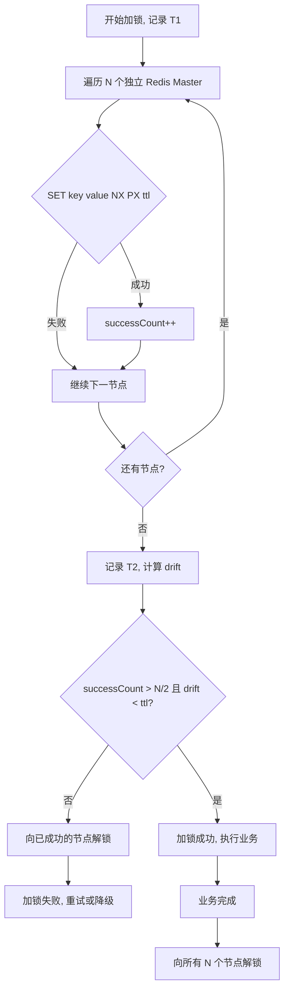

# Redis RedLock（红锁）详解

> 独立专题笔记，汇总入口见 [java学习笔记汇总](java学习笔记汇总.md)  
> 关联阅读：[Redisson 分布式锁详解](Redisson分布式锁详解.md)（单节点 RLock、看门狗、锁归属）

---

## 一、背景：单节点 Redis 锁的隐患

### 1. 普通分布式锁怎么做？

最简正确写法（与 Redisson 底层思路一致）：

```java
// 加锁：原子 SET + 过期
SET lock_key random_value NX PX 30000

// 释放：Lua 比对 value 后删除
if redis.call("get", KEYS[1]) == ARGV[1] then
    return redis.call("del", KEYS[1])
else
    return 0
end
```

在**单个 Redis 主节点**上，这把锁能保证：同一时刻只有一个客户端持有 Key。

### 2. 主从切换为什么会「丢锁」？

Redis 主从复制默认是**异步**的。典型故障序列：

```
客户端 A 在主节点 Master 加锁成功
        │
        ▼
Master 宕机，锁 Key 尚未复制到 Slave
        │
        ▼
Slave 升为新 Master（上面没有这把锁）
        │
        ▼
客户端 B 在新 Master 上加锁也成功
        │
        ▼
A、B 同时认为自己持有锁 → 互斥失效
```

```
  客户端 A                    客户端 B
      │                           │
      │ SET lock NX 成功           │
      ▼                           │
  ┌─────────┐                     │
  │ Master  │ ──异步复制未完成──X   │
  └─────────┘                     │
      │ 宕机                       │
      ▼                           │
  ┌─────────┐                     │
  │ Slave   │ 提升为新 Master      │
  │(无 lock)│◄──── SET lock NX 成功│
  └─────────┘                     ▼
```

**结论**：单 Master + 异步复制的架构下，锁的语义绑定在「某一个 Redis 实例」上，故障切换后锁状态可能不一致。

> Redisson 的看门狗、可重入等能力**无法**解决主从复制延迟问题——它们只作用于已加锁成功的那个节点。

---

## 二、RedLock 是什么？

**RedLock**（红锁）是 Redis 作者 Antirez 提出的**分布式锁算法**，不是 Redis 内置命令。

核心思想：

> 在 **N 个彼此独立、互不关联的 Redis 主节点** 上分别尝试加锁，**超过半数成功**才视为全局加锁成功。

这样即使少数节点故障或发生主从切换，只要过半节点仍保留锁记录，互斥语义就能维持。

---

## 三、官方算法步骤

假设部署 **N 个独立 Redis Master**（官方建议 **N = 5**，容忍 2 台故障）。

### 1. 加锁

| 步骤 | 操作 |
|------|------|
| 1 | 记录开始时间 `T1`（需使用单调时钟，如 `System.nanoTime()`） |
| 2 | 对 N 个节点**依次**执行：`SET resource_name random_value NX PX ttl` |
| 3 | 记录结束时间 `T2`，有效耗时 `drift = T2 - T1` |
| 4 | 加锁成功当且仅当：**成功节点数 ≥ N/2 + 1** 且 **drift < ttl** |
| 5 | 若失败：向**所有已成功加锁的节点**发送解锁请求 |

**random_value**：全局唯一随机串，解锁时校验，防止误删他人锁（与单节点锁相同）。

**ttl 为何要与 drift 比较？**

加锁过程有网络往返耗时。若 `drift ≥ ttl`，说明等你加完锁时，Key 可能已过期，必须视为失败并回滚。

```
有效剩余时间 ≈ ttl - drift - clock_drift
```

官方建议为时钟漂移预留少量余量（clock drift margin）。

### 2. 解锁

对每个节点执行 Lua（与单节点锁相同）：

```lua
if redis.call("get", KEYS[1]) == ARGV[1] then
    return redis.call("del", KEYS[1])
else
    return 0
end
```

应对**所有**节点尝试解锁（无论加锁时是否成功），保证无残留。

### 3. 流程图



### 4. 时间轴示意（N=5，需 ≥3 成功）

```
T1 ───────────────────────────────────────────── T2
 │  Redis-1 ✅   Redis-2 ✅   Redis-3 ❌        │
 │  Redis-4 ✅   Redis-5 ❌                      │
 │  success=3 ≥ 3, drift < ttl → 成功          │
 └─────────────────────────────────────────────┘
```

---

## 四、部署硬性要求（极易踩坑）

| 要求 | 说明 |
|------|------|
| **必须是独立 Master** | 5 个节点应是 5 台机器上的 5 个独立 Redis 进程，**不是**同一集群里的 5 个分片副本 |
| **不能共用主从** | Sentinel / 主从架构里的 Master + Slave **不能**算作两个独立节点；Slave 切换后锁状态不可靠 |
| **奇数个节点** | 通常用 3 或 5，方便「过半」判定 |
| **网络隔离容忍** | 允许少数节点不可达，只要过半可达即可 |

```
❌ 错误：1 主 4 从 当作 5 个 RedLock 节点
❌ 错误：Redis Cluster 的 5 个主分片（数据按 slot 分散，同名 lock key 只落在一个分片）
✅ 正确：5 台独立 Redis 实例，各自完整存储同名 lock key
```

---

## 五、手写 RedLock 伪代码

```java
public boolean tryLock(String lockName, String lockValue, long ttlMs) {
    long start = System.nanoTime();
    int successCount = 0;
    List<RedisClient> lockedNodes = new ArrayList<>();

    for (RedisClient node : independentMasters) {
        if (node.setNxPx(lockName, lockValue, ttlMs)) {
            successCount++;
            lockedNodes.add(node);
        }
    }

    long driftMs = (System.nanoTime() - start) / 1_000_000;
    int quorum = independentMasters.size() / 2 + 1;

    if (successCount >= quorum && driftMs < ttlMs) {
        return true;  // 加锁成功
    }

    // 失败回滚
    for (RedisClient node : lockedNodes) {
        node.unlockLua(lockName, lockValue);
    }
    return false;
}
```

---

## 六、Redisson 中的 RedLock

Redisson 提供 `RedissonRedLock`，对多个**独立** `RedissonClient` 上的同名 `RLock` 做「过半加锁」。

### 1. 基本用法

```java
// 三个独立 Redis 实例（非同一主从组）
Config config1 = new Config();
config1.useSingleServer().setAddress("redis://192.168.0.1:6379");
RedissonClient redisson1 = Redisson.create(config1);

Config config2 = new Config();
config2.useSingleServer().setAddress("redis://192.168.0.2:6379");
RedissonClient redisson2 = Redisson.create(config2);

Config config3 = new Config();
config3.useSingleServer().setAddress("redis://192.168.0.3:6379");
RedissonClient redisson3 = Redisson.create(config3);

RLock lock1 = redisson1.getLock("order:1001");
RLock lock2 = redisson2.getLock("order:1001");
RLock lock3 = redisson3.getLock("order:1001");

RedissonRedLock redLock = new RedissonRedLock(lock1, lock2, lock3);

boolean acquired = false;
try {
    acquired = redLock.tryLock(3, TimeUnit.SECONDS);
    if (acquired) {
        // 业务逻辑
    }
} catch (InterruptedException e) {
    Thread.currentThread().interrupt();
} finally {
    if (acquired) {
        redLock.unlock();
    }
}
```

### 2. RedissonRedLock 与 RLock 的差异

| 维度 | `RLock`（单实例） | `RedissonRedLock` |
|------|-------------------|-------------------|
| Redis 部署 | 单节点 / 主从 / 集群均可 | **多个独立 Master** |
| 加锁语义 | 单节点 Lua 原子 | 多节点分别加锁 + 过半判定 |
| 主从切换 | 可能丢锁 | 降低丢锁概率（非绝对） |
| 性能 | 高（1 次 RTT） | 低（N 次 RTT） |
| 看门狗 | 支持（未指定 leaseTime） | 支持，但需在所有成功节点续约 |
| 可重入 | 支持 | 支持（底层仍是 RLock） |

### 3. 注意

- Redisson 3.x 后官方更推荐用 `RedissonMultiLock` 处理多资源互斥；`RedissonRedLock` 专用于多独立节点的 RedLock 语义，使用场景较窄。
- 若只有一个 `RedissonClient`，`RedissonRedLock` **退化为单节点锁**，无法获得 RedLock 的容错收益。

---

## 七、与单节点锁 / 其他方案对比

| 方案 | 一致性 | 性能 | 复杂度 | 典型场景 |
|------|--------|------|--------|----------|
| SET NX EX（单 Redis） | 单点可靠；主从切换有风险 | ⭐⭐⭐ | 低 | 绝大多数业务 |
| Redisson RLock + 看门狗 | 同上 | ⭐⭐⭐ | 低 | Java 生产首选 |
| **RedLock** | 容忍少数节点故障 | ⭐ | 高 | 多独立 Redis、不能接受主从丢锁 |
| ZooKeeper / etcd 锁 | CP，强一致 | ⭐⭐ | 中 | 强一致、协调服务已存在 |
| 数据库悲观锁 `SELECT FOR UPDATE` | 强一致 | ⭐ | 低 | 单库、低并发 |

---

## 八、争议：RedLock 真的安全吗？

2016 年 Martin Kleppmann 发文质疑 RedLock，核心论点：

### 1. 依赖时钟

各节点 TTL 基于本地时钟。若某节点时钟快跳，Key 可能提前过期，其他客户端即可加锁。

### 2. GC 停顿（客户端侧）

```
客户端在过半节点加锁成功
        │
        ▼
JVM 发生长时间 STW（如 Full GC 数秒）
        │
        ▼
锁在各节点已过期，其他客户端 B 加锁成功
        │
        ▼
GC 结束，原客户端 A 仍以为自己持有锁 → 并发写
```

RedLock 只保证 Redis 侧的互斥，**不保证持有锁的进程在有效期内持续有效**。

### 3. 缺少 Fencing Token

即使锁过期后被他人获取，**已持有锁的客户端仍可能向存储层写入**，造成数据错乱。  
Kleppmann 建议：下游存储（DB、ZooKeeper 等）应校验单调递增的 **fencing token**（每次加锁成功分配更大序号，存储只接受更大 token 的写）。

### Antirez 的回应

在合理假设（时钟漂移可控、GC 停顿远小于 TTL）下，RedLock 对大多数工程场景足够实用；极端理论攻击在实际中概率极低。

### 工程共识（面试可答）

```
RedLock 不是「银弹」：
  - 比单节点 Redis 锁更抗故障
  - 仍无法覆盖 GC 停顿、时钟漂移等客户端/环境风险
  - 强一致场景优先考虑 ZooKeeper / etcd，或 RedLock + fencing token
```

---

## 九、Fencing Token 补充

```
客户端加锁成功 → 获得 token=35
        │
        ▼
向 MySQL 写入：UPDATE ... WHERE id=1 AND fencing_token < 35
        │
        ▼
即使锁过期后他人以 token=36 加锁，旧客户端用 token=35 的写请求会被拒绝
```

RedLock **本身不提供** fencing token，需要业务层或存储层自行实现。

---

## 十、何时该用 / 不该用 RedLock

### 适合考虑 RedLock

- 已有**多个独立 Redis 实例**，无法接受主从切换导致的双持锁
- 业务可接受 RedLock 的**额外延迟**和**运维成本**
- 并发冲突不极端，锁持有时间可预估

### 不必上 RedLock

- 单 Redis 或 Sentinel 已满足 SLA，丢锁概率业务可接受
- 追求强一致 → 直接用 **ZooKeeper / etcd**
- 只是防止缓存击穿 → 单节点互斥锁 + 看门狗即可

### 生产推荐决策树

```
需要分布式锁？
    │
    ├─ 强一致、协调组件已有？ → ZooKeeper / etcd 锁
    │
    ├─ 普通业务、单 Redis 可接受？ → Redisson RLock（首选）
    │
    └─ 多独立 Redis + 怕主从丢锁？ → RedLock / RedissonRedLock
              │
              └─ 写下游关键数据？ → 叠加 fencing token
```

---

## 十一、面试高频 Q&A

| 问题 | 答案要点 |
|------|----------|
| RedLock 是什么？ | 多独立 Redis Master 过半加锁的分布式锁**算法**，非 Redis 命令 |
| 为什么需要 RedLock？ | 单 Master 主从异步复制，故障切换后锁 Key 可能丢失，导致双持锁 |
| 加锁成功条件？ | 成功数 > N/2，且加锁总耗时 < TTL |
| 5 个节点最少几个成功？ | **3 个**（⌊5/2⌋ + 1） |
| 能用主从算两个节点吗？ | **不能**，必须独立 Master |
| Redisson 怎么实现？ | `RedissonRedLock`，多个 `RedissonClient` 的同名 `RLock` |
| RedLock 比 RLock 强在哪？ | 容忍少数 Redis 节点故障，降低主从切换丢锁概率 |
| RedLock 绝对安全吗？ | **否**；GC 停顿、时钟漂移、无 fencing token 仍有理论风险 |
| 和 ZooKeeper 锁怎么选？ | ZK 偏 CP 强一致；RedLock 偏 AP 场景下的实用折中 |
| 看门狗能救主从丢锁吗？ | **不能**，看门狗只在加锁成功的那个节点续期 |

---

## 十二、复习串联

```
问题根源
  单 Redis 主从异步复制 → 切换后锁丢失 → 双客户端同时持锁

RedLock 思路
  N 个独立 Master（建议 5）
  SET NX PX 过半成功 + drift < ttl
  失败则回滚解锁

部署要点
  独立 Master，非主从副本
  奇数节点，过半 quorum

Redisson
  RedissonRedLock(lock1, lock2, lock3)
  每个 lock 来自不同 RedissonClient

争议与补强
  时钟 / GC / 无 fencing token
  强一致 → ZK/etcd；关键写 → fencing token

选型
  多数业务 → RLock
  多独立 Redis 怕丢锁 → RedLock
  金融级强一致 → ZK/etcd
```

---

> **关联阅读**  
> - [Redisson 分布式锁详解](Redisson分布式锁详解.md) — RLock API、看门狗、锁归属、释放流程  
> - [java学习笔记汇总](java学习笔记汇总.md) — Redis 缓存与分布式锁速记入口
