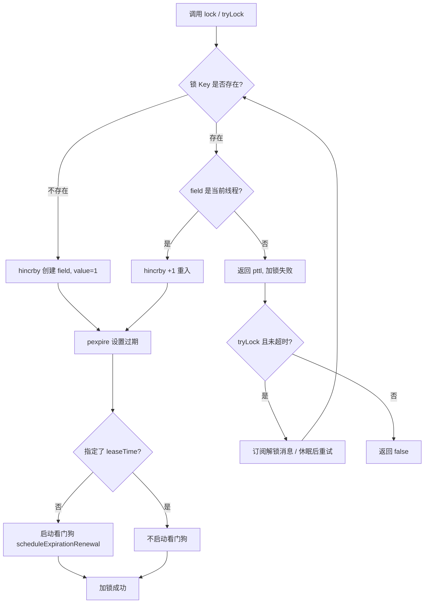

# Redisson 分布式锁详解

> 独立专题笔记，汇总入口见 [java学习笔记汇总](java学习笔记汇总.md)

---

## 一、为什么需要 Redisson？

手写 Redis 分布式锁（`SET key uuid NX EX` + Lua 释放）需要自行处理：

| 问题 | 手写方案 | Redisson |
|------|----------|----------|
| 原子加锁+过期 | 需 Lua 或 SET NX EX | 内置 Lua 原子操作 |
| 误删他人锁 | Lua 比对 value | 按 `UUID:threadId` 归属校验 |
| 业务超时锁过期 | 手动续期或估时 | **看门狗**自动续约 |
| 可重入 | 难以实现 | Hash + `hincrby` 计数 |
| 阻塞等待 | 自旋浪费 CPU | Pub/Sub 唤醒 + 超时等待 |

Redisson 的 `RLock` 在 Redis 单节点 / 主从 / 集群上均可使用，是 Java 生态最常用的分布式锁实现之一。

---

## 二、锁在 Redis 中的数据结构

Redisson 可重入锁使用 **Hash**，而非简单 String：

```
Key:   myLock                    （锁名称，即 RLock 的 name）
Type:  Hash
Field: 9b2f...-UUID:12345       （客户端 UUID + 线程 ID）
Value: 2                          （重入次数）
TTL:   30000ms                    （过期时间，默认 30s）
```

```
┌──────────────── myLock ────────────────┐
│  field: UUID:thread-1  →  value: 2     │  ← 同一线程重入 2 次
│  （同一锁 Key 下通常只有一个 field）      │
└────────────────────────────────────────┘
```

- **Field = 锁归属标识**：`RedissonClient` 实例 UUID + `Thread.getId()`
- **Value = 重入计数**：每 `lock()` 一次 +1，每 `unlock()` 一次 -1，归零才真正释放
- 不同 JVM / 不同线程的 field 不同，因此能区分「谁持有锁」

---

## 三、API 速览：lock vs tryLock

### 1. lock 系列（阻塞获取）

| 方法 | 等待行为 | 过期时间 | 看门狗 |
|------|----------|----------|--------|
| `lock()` | 一直阻塞直到拿到锁 | 默认 30s（自动续期） | ✅ 启用 |
| `lock(long leaseTime, TimeUnit unit)` | 一直阻塞 | 指定 leaseTime | ❌ 不启用 |
| `lockInterruptibly()` | 可响应中断的阻塞 | 默认 30s | ✅ 启用 |

```java
RLock lock = redisson.getLock("order:1001");
lock.lock();          // 阻塞等待，看门狗续期
try {
    // 业务逻辑
} finally {
    lock.unlock();    // 必须在 finally 中释放
}
```

### 2. tryLock 系列（非阻塞 / 限时等待）

| 方法 | 等待行为 | 过期时间 | 看门狗 |
|------|----------|----------|--------|
| `tryLock()` | 不等待，立即返回 true/false | 默认 30s | ✅ 启用 |
| `tryLock(long waitTime, TimeUnit unit)` | 最多等 waitTime | 默认 30s | ✅ 启用 |
| `tryLock(waitTime, leaseTime, unit)` | 最多等 waitTime | 指定 leaseTime | ❌ 不启用 |

```java
// 典型：限时抢锁，抢不到就降级
if (lock.tryLock(3, TimeUnit.SECONDS)) {
    try {
        // 拿到锁
    } finally {
        lock.unlock();
    }
} else {
    // 获取失败，快速失败 / 降级
}

// 指定 leaseTime：看门狗关闭，到期自动释放
boolean ok = lock.tryLock(3, 10, TimeUnit.SECONDS);
```

### 3. lock 与 tryLock 的核心区别

```
lock()     → 拿不到就阻塞（或中断），适合必须拿到锁的场景
tryLock()  → 拿不到就返回 false，适合可降级、可跳过的场景
```

**面试一句话**：`lock` 是「等到为止」；`tryLock` 是「试一下，不行就走」。

---

## 四、加锁流程（Lua 原子操作）

### 1. 加锁 Lua 脚本（简化）

```lua
-- KEYS[1] = 锁名
-- ARGV[1] = 过期时间（毫秒）
-- ARGV[2] = UUID:threadId

if (redis.call('exists', KEYS[1]) == 0) then
    -- 锁不存在：首次加锁
    redis.call('hincrby', KEYS[1], ARGV[2], 1)
    redis.call('pexpire', KEYS[1], ARGV[1])
    return nil                          -- nil = 加锁成功
end

if (redis.call('hexists', KEYS[1], ARGV[2]) == 1) then
    -- 锁存在且是当前线程持有：可重入
    redis.call('hincrby', KEYS[1], ARGV[2], 1)
    redis.call('pexpire', KEYS[1], ARGV[1])
    return nil                          -- nil = 重入成功
end

return redis.call('pttl', KEYS[1])      -- 他人持有，返回剩余 TTL（失败）
```

### 2. 流程图



### 3. 加锁失败时的等待（tryLock / lock 阻塞）

- 加锁失败返回剩余 TTL 后，客户端通过 **Redis Pub/Sub** 订阅锁释放频道
- 收到解锁消息或等待一小段时间后 **重试加锁**
- `tryLock(waitTime)` 在总等待时间耗尽前循环重试，超时返回 `false`
- `lock()` 无超时，一直重试直到成功

---

## 五、锁归属（Lock Ownership）

### 1. 归属标识怎么生成？

```java
// Redisson 内部
protected String getLockName(long threadId) {
    return id + ":" + threadId;   // id = 当前 RedissonClient 实例 UUID
}
```

| 组成部分 | 含义 |
|----------|------|
| UUID | 标识哪个 JVM 上的哪个 Redisson 客户端实例 |
| threadId | 标识该实例中的哪个线程 |

因此：
- **同一线程**多次 `lock()` → 同一 field，value 递增（可重入）
- **同 JVM 不同线程** → 不同 field，互斥
- **不同 JVM** → UUID 不同，互斥

### 2. 归属校验 API

```java
lock.isHeldByCurrentThread()   // 当前线程是否持有（含重入）
lock.isLocked()                // 锁是否被任意线程持有
lock.getHoldCount()            // 当前线程重入次数
```

### 3. 为什么必须校验归属？

若线程 A 加锁后，线程 B 直接 `DEL myLock`，会导致：
- A 仍以为持有锁，继续执行业务 → **互斥失效**
- 其他线程也能加锁 → **并发写**

Redisson 在 **解锁 Lua** 中强制 `hexists` 校验 field，非持有者解锁返回 `nil`，Java 层抛 `IllegalMonitorStateException`。

---

## 六、锁释放（unlock）

### 1. 解锁 Lua 脚本（简化）

```lua
-- KEYS[1] = 锁名
-- KEYS[2] = 解锁 Pub/Sub 频道
-- ARGV[1] = 解锁消息
-- ARGV[2] = 过期时间（毫秒，续期用）
-- ARGV[3] = UUID:threadId

if (redis.call('hexists', KEYS[1], ARGV[3]) == 0) then
    return nil                    -- 不是当前线程的锁，拒绝释放
end

local counter = redis.call('hincrby', KEYS[1], ARGV[3], -1)

if (counter > 0) then
    redis.call('pexpire', KEYS[1], ARGV[2])   -- 仍有重入，只减计数+续期
    return 0
else
    redis.call('del', KEYS[1])                -- 计数归零，删除锁
    redis.call('publish', KEYS[2], ARGV[1])   -- 通知等待线程来抢锁
    return 1
end
```

### 2. 释放流程

```
unlock()
   │
   ├─ 执行解锁 Lua（hexists 校验归属 → hincrby -1）
   │
   ├─ counter > 0 → 仅减少重入次数，锁仍持有
   │
   └─ counter == 0 → DEL 锁 Key + publish 唤醒等待者
         │
         └─ cancelExpirationRenewal()  取消看门狗定时任务
```

### 3. 使用注意

```java
// ✅ 正确：finally 中释放，且由加锁线程释放
lock.lock();
try {
    doWork();
} finally {
    if (lock.isHeldByCurrentThread()) {
        lock.unlock();
    }
}

// ❌ 错误：其他线程 unlock → IllegalMonitorStateException
// ❌ 错误：lock 3 次 unlock 1 次就不管了 → 锁泄漏，他人永远无法获取
// ❌ 错误：业务异常未 unlock 且未启用看门狗 → 依赖 TTL 过期，阻塞时间长
```

| 场景 | 后果 |
|------|------|
| 加锁线程未 unlock，看门狗启用 | 一直续期，**死锁**（需人工删 Key 或杀进程） |
| 加锁线程未 unlock，指定了 leaseTime | leaseTime 后自动释放，但阻塞期间他人无法获取 |
| unlock 次数 > lock 次数 | `IllegalMonitorStateException` |
| 非持有线程 unlock | `IllegalMonitorStateException` |

---

## 七、看门狗续约（Watchdog）

### 1. 什么时候启用？

```
未指定 leaseTime（leaseTime = -1）  →  看门狗启用，默认过期 30s，自动续期
指定了 leaseTime                    →  看门狗关闭，到期自动释放，不续期
```

适用方法：`lock()`、`tryLock()`、`tryLock(waitTime, unit)`  
不适用：`lock(leaseTime, unit)`、`tryLock(waitTime, leaseTime, unit)`

### 2. 续约机制

```
加锁成功（未指定 leaseTime）
        │
        ▼
scheduleExpirationRenewal(threadId)
  将 threadId 放入 EXPIRATION_RENEWAL_MAP
        │
        ▼
启动定时任务（Netty HashedWheelTimer）
  每隔 internalLockLeaseTime / 3 执行一次（默认 30s / 3 = 10s）
        │
        ▼
renewExpirationAsync() 执行续约 Lua：
  if hexists(KEY, UUID:threadId) == 1 then
      pexpire(KEY, 30000)    -- 重置为 30s
      return 1
  end
        │
        ├─ 成功 → 递归调度下一次 renewExpiration()
        └─ 失败 → 取消续约，从 MAP 移除
```

```
时间轴（默认配置）
0s        10s       20s       30s       40s
│ 加锁成功 │ 续约→30s │ 续约→30s │ 续约→30s │ ...
│ TTL=30s  │         │         │         │
└──────────┴─────────┴─────────┴─────────┘
  业务执行中，锁不会因 30s 到期而释放
```

### 3. 看门狗何时停止？

| 事件 | 行为 |
|------|------|
| `unlock()` 且重入计数归零 | `cancelExpirationRenewal()`，停止定时任务 |
| 进程宕机 / Redisson 实例关闭 | 定时任务消亡，不再续约，**最多 30s 后锁自动过期** |
| 续约 Lua 返回失败（锁已被删） | 停止续约，清理 MAP |

### 4. 自定义看门狗超时

```java
Config config = new Config();
config.setLockWatchdogTimeout(60000);  // 看门狗周期改为 60s，每 20s 续约一次
RedissonClient redisson = Redisson.create(config);
```

### 5. 看门狗解决什么问题？

```
问题：业务执行时间不确定，锁 TTL 设太短 → 业务未完成锁已过期 → 他人加锁 → 并发写
     设太长 → 进程崩溃后锁长期占着 → 阻塞他人

看门狗：持锁期间自动续期；进程死了不再续期 → 最多一个周期后自动释放
```

**面试要点**：
- 看门狗是 **Redisson 进程内** 的定时任务，不是 Redis 自带功能
- 指定 `leaseTime` 后看门狗 **一定不启用**
- 主从切换场景下看门狗仍可能遇到锁丢失问题（详见 [Redis RedLock 红锁详解](Redis-RedLock红锁详解.md)）

---

## 八、与手写 Redis 锁对比

| 维度 | SET NX EX + Lua | Redisson RLock |
|------|-----------------|----------------|
| 数据结构 | String（value=uuid） | Hash（field=UUID:threadId, value=重入次数） |
| 可重入 | 不支持 | 支持 |
| 自动续期 | 需自行实现 | 看门狗 |
| 阻塞等待 | 自旋 | Pub/Sub 唤醒 + 超时 |
| 释放校验 | Lua 比对 value | Lua hexists + hincrby |
| RedLock | 需自行实现 | `RedissonRedLock`（见 [红锁专题](Redis-RedLock红锁详解.md)） |

手写锁最小正确示例（对比理解）：

```java
// 加锁
SET lock_key unique_id NX EX 30

// 释放（Lua 原子）
if redis.call("get", KEYS[1]) == ARGV[1] then
    return redis.call("del", KEYS[1])
else
    return 0
end
```

---

## 九、其他锁类型（了解）

| 类型 | 类名 | 特点 |
|------|------|------|
| 可重入锁 | `RLock` | 最常用，本文重点 |
| 公平锁 | `RFairLock` | 按请求顺序获取，吞吐低 |
| 读锁 | `RReadWriteLock.readLock()` | 共享读 |
| 写锁 | `RReadWriteLock.writeLock()` | 独占写 |
| 红锁 | `RedissonRedLock` | 多独立 Master 过半加锁 → [专题详解](Redis-RedLock红锁详解.md) |

---

## 十、常见问题与最佳实践

### 1. 生产推荐写法

```java
@Autowired
private RedissonClient redisson;

public void processOrder(Long orderId) {
    RLock lock = redisson.getLock("order:lock:" + orderId);
    boolean acquired = false;
    try {
        // 等待 3s，不指定 leaseTime → 看门狗自动续期
        acquired = lock.tryLock(3, TimeUnit.SECONDS);
        if (!acquired) {
            throw new BizException("系统繁忙，请稍后重试");
        }
        // 业务逻辑
    } catch (InterruptedException e) {
        Thread.currentThread().interrupt();
        throw new BizException("获取锁被中断");
    } finally {
        if (acquired && lock.isHeldByCurrentThread()) {
            lock.unlock();
        }
    }
}
```

### 2. 锁粒度

- Key 带业务 ID：`order:lock:{orderId}`，避免全局大锁
- 锁范围尽量小，只包裹必要的临界区

### 3. 面试高频 Q&A

| 问题 | 答案要点 |
|------|----------|
| Redisson 锁是可重入的吗？ | 是，Hash field 的 value 为重入计数 |
| 看门狗默认多久续一次？ | 默认锁 30s，每 **10s**（1/3）续一次 |
| 指定 leaseTime 还会续期吗？ | **不会**，看门狗关闭 |
| 如何避免释放了别人的锁？ | 解锁 Lua 校验 `UUID:threadId`；Java 层校验 `isHeldByCurrentThread()` |
| 进程宕机锁能释放吗？ | 看门狗停止续期，最多约 30s 后 Key 过期自动释放 |
| lock 和 tryLock 怎么选？ | 必须拿到用 `lock`；可降级用 `tryLock` |
| Redisson 比 SET NX EX 强在哪？ | 可重入、看门狗、Pub/Sub 等待、归属校验一体化 |
| 主从切换会丢锁吗？ | 会（异步复制延迟），见 [RedLock 专题](Redis-RedLock红锁详解.md) |

---

## 十一、复习串联

```
API 选择
  lock() ────────── 阻塞 + 看门狗
  tryLock() ─────── 非阻塞 + 看门狗
  tryLock(w, l, u) ─ 限时等待 + 指定过期（无看门狗）

底层实现
  Hash(UUID:threadId → 重入次数)
  加锁/解锁/续约 全部 Lua 原子

锁归属
  field = 客户端UUID + 线程ID
  unlock 必须 hexists 校验

看门狗
  未指定 leaseTime 才启用
  每 TTL/3 续约，重置为 lockWatchdogTimeout（默认30s）
  unlock 或进程死亡后停止
```

---

> **关联阅读**  
> - [Redis RedLock 红锁详解](Redis-RedLock红锁详解.md) — 主从丢锁、过半加锁、争议与选型  
> - [java学习笔记汇总](java学习笔记汇总.md) — Redis 分布式锁速记入口
