# OpenFeign和Sentinel进阶应用完整笔记

# OpenFeign基础应用

## 概念

OpenFeign是一种声明式、模板化的HTTP客户端。在Spring Cloud中使用OpenFeign，可以做到使用HTTP请求访问远程服务，就像调用本地方法一样的，开发者完全感知不到这是在调用远程方法，更感知不到在访问HTTP请求，用法其实就是编写一个接口，在接口上添加注解即可。

可以简单理解它是借鉴Ribbon的基础之上，封装的一套服务接口+注解的方式的远程调用器。

## OpenFeign能干什么

它的宗旨是在编写Java Http客户端接口的时候变得更加容易，其底层整合了Ribbon，所以也支持负载均衡。

之前我们使用Ribbon的时候，利用RestTemplate对Http请求进行封装处理，但是在实际开发中，由于对服务依赖的调用不可能就一处，往往一个接口会被多处调用，所以通常都会针对每个微服务自行封装一些客户端类来包装这些依赖服务的调用。所以OpenFeign在此基础之上做了进一步的封装，由它来帮助我们定义和实现依赖服务接口的定义，我们只需创建一个接口并使用注解的方式来配置它，即可完成对微服务提供方的接口绑定，简化Ribbon的操作。

## 具体使用

 这里我们通过一个案例来演示，首先我们要明确使用OpenFeign是使用在消费者端去远程调用，就必须要是用FeignClient注解，来标注要调用的服务提供者名称，然后在通过一个接口来定义要调用的方法，所以我们首先新建一个Model：cloudalibaba-openFeign-consumer-8888


### pom

注意：需要在父级项目引入对应依赖坐标

```java
<dependency>
    <groupId>org.springframework.cloud</groupId>
    <artifactId>spring-cloud-starter-openfeign</artifactId>
    <version>${openfeign-version}</version>
</dependency>
```

```java
<?xml version="1.0" encoding="UTF-8"?>
<project xmlns="http://maven.apache.org/POM/4.0.0" xmlns:xsi="http://www.w3.org/2001/XMLSchema-instance"
         xsi:schemaLocation="http://maven.apache.org/POM/4.0.0 https://maven.apache.org/xsd/maven-4.0.0.xsd">
    <modelVersion>4.0.0</modelVersion>
    <parent>
        <groupId>com.mashibing</groupId>
        <artifactId>SpringAlibabaMSB</artifactId>
        <version>0.0.1-SNAPSHOT</version>
        <relativePath/> <!-- lookup parent from repository -->
    </parent>
    <groupId>com.mashibing</groupId>
    <artifactId>cloudalibaba-openFeign-consumer-8888</artifactId>
    <version>0.0.1-SNAPSHOT</version>
    <name>cloudalibaba-openFeign-consumer-8888</name>
    <description>cloudalibaba-openFeign-consumer-8888</description>
    <properties>
        <java.version>1.8</java.version>
    </properties>
    <dependencies>
        <dependency>
            <groupId>org.springframework.boot</groupId>
            <artifactId>spring-boot-starter</artifactId>
        </dependency>
        <dependency>
            <groupId>org.springframework.boot</groupId>
            <artifactId>spring-boot-starter-test</artifactId>
            <scope>test</scope>
        </dependency>
        <dependency>
            <groupId>com.alibaba.cloud</groupId>
            <artifactId>spring-cloud-starter-alibaba-nacos-discovery</artifactId>
        </dependency>
        <dependency>
            <groupId>org.springframework.cloud</groupId>
            <artifactId>spring-cloud-starter-openfeign</artifactId>
        </dependency>
        <dependency>
            <groupId>com.mashibing</groupId>
            <artifactId>cloudalibaba-commons</artifactId>
            <version>0.0.1-SNAPSHOT</version>
        </dependency>
    </dependencies>


    <build>
        <plugins>
            <plugin>
                <groupId>org.springframework.boot</groupId>
                <artifactId>spring-boot-maven-plugin</artifactId>
            </plugin>
        </plugins>
    </build>
</project>
```

### YML配置

```java
server:
  port: 8888
spring:
  application:
    name: nacos-consumer-openFeign
  cloud:
    nacos:
      discovery:
        server-addr: localhost:8848

management:
  endpoints:
    web:
      exposure:
        include: '*'
```

### 主启动中添加注解

```
@SpringBootApplication
@EnableDiscoveryClient
@EnableFeignClients//添加此注解
public class CloudalibabaOpenFeignConsumer8888Application {

    public static void main(String[] args) {
        SpringApplication.run(CloudalibabaOpenFeignConsumer8888Application.class, args);
    }

}
```

### 调用服务提供者对外提供接口

这里要调用的是服务提供者9003/9004

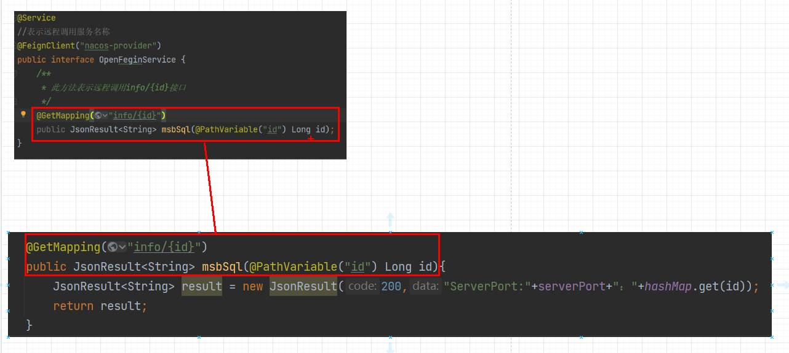

```java
package com.mashibing.cloudalibabaopenFeignconsumer8888.service;

import com.mashibing.cloudalibabacommons.entity.JsonResult;
import org.springframework.cloud.openfeign.FeignClient;
import org.springframework.stereotype.Service;
import org.springframework.web.bind.annotation.GetMapping;
import org.springframework.web.bind.annotation.PathVariable;

/**
 * 此接口就是配合使用OpenFeign的接口，
 * 在此接口中添加@FeignClient接口同时标注
 * 要调用的服务端名称，同时使用与服务提供者
 * 方法签名一致的抽象方法来表示远程调用的
 * 具体内容
 */
@Service
//表示远程调用服务名称
@FeignClient("nacos-provider")
public interface openFeignService {
    /**
     * 此方法表示远程调用info/{id}接口
     */
    @GetMapping("info/{id}")
    public JsonResult<String> msbSql(@PathVariable("id") Long id);
}

```

### 控制器

```java
package com.mashibing.cloudalibabaopenFeignconsumer8888.controller;

import com.mashibing.cloudalibabacommons.entity.JsonResult;
import com.mashibing.cloudalibabaopenFeignconsumer8888.service.OpenFeignService;
import org.springframework.beans.factory.annotation.Autowired;
import org.springframework.web.bind.annotation.GetMapping;
import org.springframework.web.bind.annotation.PathVariable;
import org.springframework.web.bind.annotation.RestController;

@RestController
public class OpenFeignController {

    @Autowired
    private OpenFeignService openFeignService;

    @GetMapping("getInfo/{id}")
    public JsonResult<String> getInfo(@PathVariable("id") Long id){
        return openFeignService.msbSql(id);
    }

}
```

## 测试结果

能够远程调用的同时还有负载均衡效果

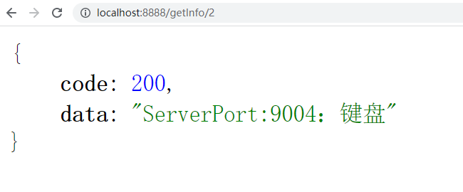
# OpenFeign超时时间控制

## 概念

OpenFeign 客户端默认等待1秒钟，但是如果服务端业务超过1秒，则会报错。为了避免这样的情况，我们需要设置feign客户端的超时控制。

## 解决办法

由于OpenFeign 底层是ribbon 。所以超时控制由ribbon来控制。在yml文件中配置

## 超时案例演示

首先演示超时效果，我们现在9003/9004上设置一个延迟3秒执行的方法，来模仿长业务线调用。

```java
@GetMapping("/timeOut")
public String timeOut() {
    try {
        System.out.println("延迟响应");
        TimeUnit.SECONDS.sleep(3);
    } catch (InterruptedException e) {
        e.printStackTrace();
    }
    return serverPort;
}
```

客户端8888通过OpenFeign来进行调用

```java
//OpenFeginController
@GetMapping("/testTimeout")
    public String TestTimeout(){
        return openFeginService.timeOut();
    }
}
```

### 测试结果

客户端报错：

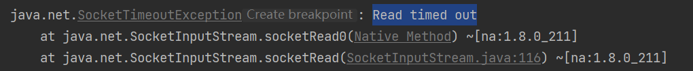

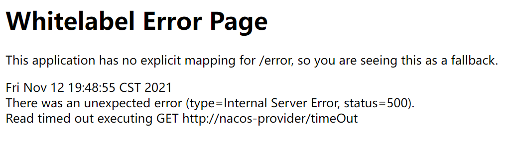

## 设置超时控制案例演示

首先我们需要在8888消费者端的yml文件中配置超时时间，因为OpenFeign本身整合了Ribbon所以，这里其实我们用的是Ribbon来配置

### YML

```java
server:
  port: 8888
spring:
  application:
    name: nacos-consumer-openfegin
  cloud:
    nacos:
      discovery:
        server-addr: localhost:8848

#设置feign客户端超时时间(OpenFeign默认支持ribbon)
ribbon:
  #指的是建立连接后从服务器读取到可用资源所用的时间
  ReadTimeout: 5000
  #指的是建立连接所用的时间，适用于网络状况正常的情况下,两端连接所用的时间
  ConnectTimeout: 5000

management:
  endpoints:
    web:
      exposure:
        include: '*'
```

### 测试结果

正常响应

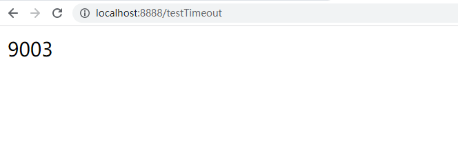
## OpenFeign日志打印

## 概念

Feign 提供了日志打印功能，我们可以通过配置来调整日志级别，从而了解 Feign 中 Http 请求的细节。
简单理解，就是对Feign接口的调用情况进行监控和输出

**日志级别：**

- NONE：默认的，不显示任何日志；

- BASIC：仅记录请求方法、URL、响应状态码及执行时间；

- HEADERS：除了 BASIC 中定义的信息之外，还有请求和响应的头信息；

- FULL：除了 HEADERS 中定义的信息之外，还有请求和响应的正文及元数据。

## 具体使用

需要在启动类中通过@Bean注解注入OpenFeign的日志功能

```java
@SpringBootApplication
@EnableFeignClients
public class CloudalibabaOpenFeginConsumer8888Application {

    public static void main(String[] args) {
        SpringApplication.run(CloudalibabaOpenFeginConsumer8888Application.class, args);
    }

    @Bean
    Logger.Level feignLoggerLevel(){
        //开启详细日志
        return Logger.Level.FULL;
    }
}

```

在yml中配置中配置

```java
server:
  port: 8888
spring:
  application:
    name: nacos-consumer-openfegin
  cloud:
    nacos:
      discovery:
        server-addr: localhost:8848

#设置feign客户端超时时间(OpenFeign默认支持ribbon)
ribbon:
  #指的是建立连接所用的时间，适用于网络状况正常的情况下,两端连接所用的时间
  ReadTimeout: 5000
  #指的是建立连接后从服务器读取到可用资源所用的时间
  ConnectTimeout: 5000

logging:
  level:
    # openfeign日志以什么级别监控哪个接口
    com.mashibing.cloudalibabaopenfeginconsumer8888.service.OpenFeginService: debug

management:
  endpoints:
    web:
      exposure:
        include: '*'
```

测试效果，发起一次调用以后的日志内容：

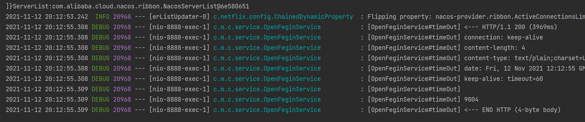
# Sentinel整合OpenFegin

根据之前的学习，我们已经学习过了包括Sentinel整合Ribbon，包括对OpenFegin的基本学习，那么这节课，我们就需要通过Sentinel来进行整合OpenFegin

## 引入OpenFegin

我们需要在当前的8084项目中引入对应的依赖

```java
<dependency>
    <groupId>org.springframework.cloud</groupId>
    <artifactId>spring-cloud-starter-openfeign</artifactId>
</dependency>
```

激活Sentinel对OpenFeign的支持，所以配置yml

```java
# 激活Sentinel对OpenFeign的支持
feign:
  sentinel:
    enabled: true
```

主启动类要添加@EnableFeignClients注解

```java
@SpringBootApplication
@EnableDiscoveryClient
@EnableFeignClients//注入Feign
public class CloudalibabaConsumer8084Application {

    public static void main(String[] args) {
        SpringApplication.run(CloudalibabaConsumer8084Application.class, args);
    }
    @Bean
    @LoadBalanced
    public RestTemplate getRestTemplate() {
        return new RestTemplate();
    }
}
```

## OpenFegin接口编写

这里我们的接口写法和之前保持一致，但是要注意，我们这里要多增加一个FeignClient的属性：

- fallback: 定义容错的处理类，当调用远程接口失败或超时时，会调用对应接口的容错逻辑，fallback指定的类必须实现@FeignClient标记的接口

```java
//当没有成功调用/info/{id}接口时会走fallback属性标注的类型的处理方法
@Service
@FeignClient(value = "nacos-provider",fallback = FeignServiceImpl.class)
public interface FeignService {
    /**
     * 远程调用对应方法
     */
    @GetMapping("info/{id}")
    public JsonResult<String> msbSql(@PathVariable("id") Long id);
}
```

实现类必须添加@Component注解，否则无法注入到容器中

```java
@Component
public class FeignServiceImpl implements FeignService{
    @Override
    public JsonResult<String> msbSql(Long id) {
        return new JsonResult<>(444,"服务降级返回！");
    }
}
```

这里完成后我们来编写控制器

```java
@Autowired
private FeignService feignService;

@GetMapping("getInfo/{id}")
public JsonResult<String> getInfo(@PathVariable("id") Long id){
    if(id > 3){
        throw new RuntimeException("没有该id");
    }
    return feignService.msbSql(id);
}
```

## 测试

此时如果我们访问http://localhost:8084/getInfo/1的地址，是没有问题的，但是如果此时我们人为结束9003/9004服务，这个时候就会触发fallback属性对应的处理类型，完成服务降级。

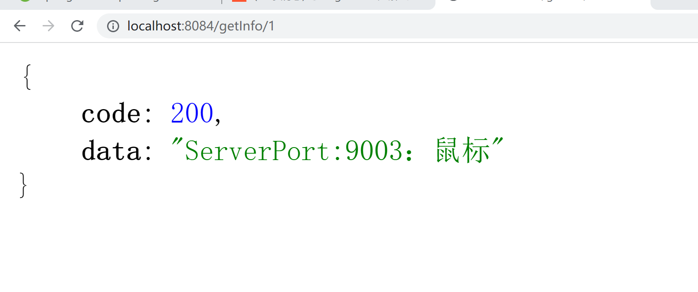

断开服务以后

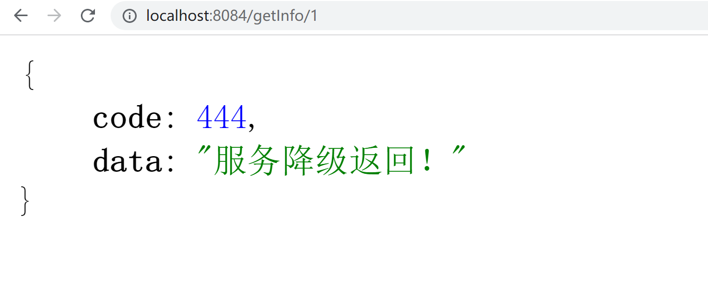
# Sentinel持久化配置

 我们首先需要知道：在Sentinel Dashboard中配置规则之后重启应用就会丢失，所以实际生产环境中需要配置规则的持久化实现，Sentinel提供多种不同的数据源来持久化规则配置，包括file，redis、nacos、zk。


## Sentinel规则持久化到Nacos

将限流规则持久化进Nacos保存，只要刷新8401某个接口地址，Sentinel控制台的流控规则就能感应到，同时只要Nacos里面的配置不删除，针对8401上Sentinel的流控规则就持续有效。

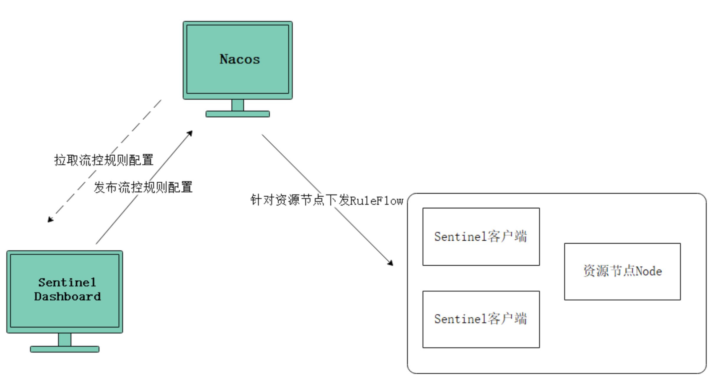

其实就是实现Sentinel Dashboard与Nacos之间的相互通信

通过Nacos配置文件修改流控规则---拉取--->Sentinel Dashboard界面显示最新的流控规则

**注意：**在Nacos控制台上修改流控制，虽然可以同步到Sentinel Dashboard，但是Nacos此时应该作为一个流控规则的持久化平台，所以正常操作过程应该是开发者在Sentinel Dashboard上修改流控规则后同步到Nacos，遗憾的是目前Sentinel Dashboard不支持该功能。

## 具体操作

第一件事情我们首先要引入依赖：

```java
<dependency>
    <groupId>com.alibaba.csp</groupId>
    <artifactId>sentinel-datasource-nacos</artifactId>
    <version>1.8.1</version>
</dependency>
```

第二件事情我们需要配置YML

```java
# 端口号
server:
  port: 8890
# 服务名
spring:
  application:
    name: order
  cloud:
    nacos:
      discovery:
        # nacos注册中心地址
        server-addr: localhost:8848
    sentinel:
      transport:
        dashboard: localhost:8080
      datasource: # 配置Sentinel的持久化
        nacos:
          nacos:
            serverAddr: localhost:8848
            groupId: DEFAULT_GROUP
            dataId: order-sentinel.json
            ruleType: flow
  profiles:
    active: dev


```

第三步我们需要进入到Nacos控制台，添加配置

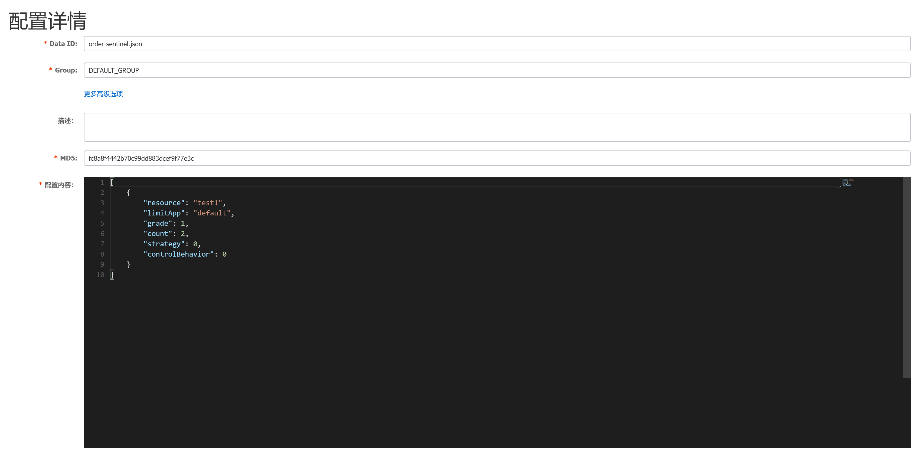

具体配置内容：

```java
[   
    {
        "resource": "test1",
        "limitApp": "default",
        "grade": 1,
        "count": 2,
        "strategy": 0,
        "controlBehavior": 0
        "clusterMode": false
    }
]
---------------具体内容含义-----------------
resource：资源名称；
limitApp：来源应用；
grade：阈值类型，0表示线程数，1表示QPS；
count：单机阈值；
strategy：流控模式，0表示直接，1表示关联，2表示链路；
controlBehavior：流控效果，0表示快速失败，1表示Warm Up，2表示排队等待；
clusterMode：是否集群。
```

控制器

```java
@RestController
public class OrderController {
    @GetMapping("/order/test1")
    @SentinelResource(value = "test1")
    public String test1() throws InterruptedException {
        return "test1 ";
    }
}
```


## 测试

当我们重启项目以后，我们访问对应接口http://localhost:8890/order/test1，就会在Sentinel界面上看到对应的限流规则：

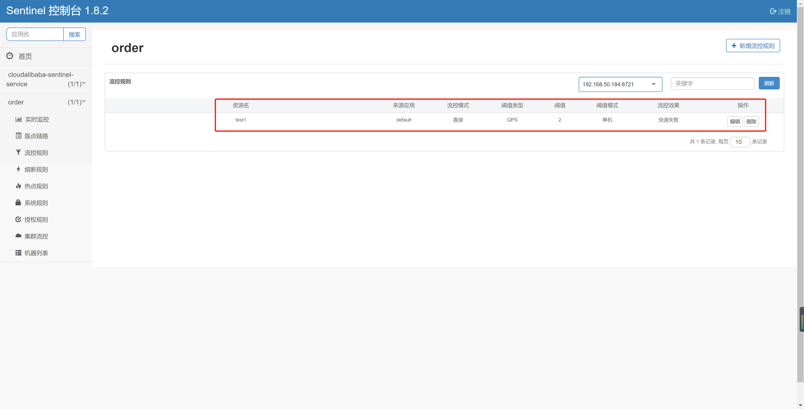
